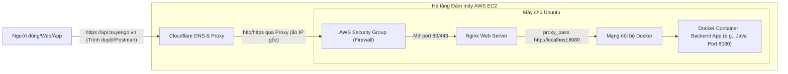

# TÀI LIỆU HƯỚNG DẪN TRIỂN KHAI HỆ THỐNG BACKEND (AWS EC2, NGINX & CLOUDFLARE)

 

Triển khai hệ thống backend cho người mới bắt đầu.
Những kiến thức cơ bản giúp bạn có thể triển khai một hệ thống backend lên server một cách hiệu quả.

> **Lưu ý:** Đây là tài liệu ghi chép, tổng hợp và tóm tắt lại kiến thức cá nhân của tôi trong quá trình học.

---

## Mục lục

- [Lời mở đầu](#lời-mở-đầu)
- [Giới thiệu](#giới-thiệu)
- [Chương 1: Tổng quan và Kiến trúc hệ thống](#chương-1-tổng-quan-và-kiến-trúc-hệ-thống)
  - [Mục tiêu tài liệu](#mục-tiêu-tài-liệu)
  - [Kiến trúc triển khai (Deployment Architecture)](#kiến-trúc-triển-khai-deployment-architecture)
  - [Yêu cầu tiên quyết (Prerequisites)](#yêu-cầu-tiên-quyết-prerequisites)
- [Chương 2: Đóng gói ứng dụng (Containerization)](#chương-2-đóng-gói-ứng-dụng-containerization)
  - [Chuẩn bị ứng dụng để đóng gói](#chuẩn-bị-ứng-dụng-để-đóng-gói)
  - [Xây dựng Dockerfile](#xây-dựng-dockerfile)
  - [Quản lý đa dịch vụ với Docker Compose](#quản-lý-đa-dịch-vụ-với-docker-compose)
  - [Lưu trữ Image trên Container Registry](#lưu-trữ-image-trên-container-registry)
- [Chương 3: Khởi tạo và Cấu hình Môi trường Đám mây (AWS EC2)](#chương-3-khởi-tạo-và-cấu-hình-môi-trường-đám-mây-aws-ec2)
  - [Khởi tạo máy chủ ảo (EC2 Instance)](#khởi-tạo-máy-chủ-ảo-ec2-instance)
  - [Cấu hình bảo mật mạng (Security Groups)](#cấu-hình-bảo-mật-mạng-security-groups)
  - [Cài đặt môi trường Runtime trên Linux](#cài-đặt-môi-trường-runtime-trên-linux)
- [Chương 4: Triển khai và Vận hành Ứng dụng](#chương-4-triển-khai-và-vận-hành-ứng-dụng)
  - [Khởi chạy hệ thống Container](#khởi-chạy-hệ-thống-container)
  - [Quản lý và Debug (Xử lý sự cố)](#quản-lý-và-debug-xử-lý-sự-cố)
- [Chương 5: Thiết lập Web Server và Reverse Proxy (Nginx)](#chương-5-thiết-lập-web-server-và-reverse-proxy-nginx)
  - [Cài đặt Nginx](#cài-đặt-nginx)
  - [Cấu hình Reverse Proxy](#cấu-hình-reverse-proxy)
- [Chương 6: Tên miền và Chống DDoS (Cloudflare)](#chương-6-tên-miền-và-chống-ddos-cloudflare)
  - [Thiết lập DNS Cơ bản](#thiết-lập-dns-cơ-bản)
  - [Kích hoạt lớp bảo vệ Cloudflare](#kích-hoạt-lớp-bảo-vệ-cloudflare)
- [Chương 7: Bảo mật SSL/TLS (Giao thức HTTPS)](#chương-7-bảo-mật-ssltls-giao-thức-https)
  - [Khởi tạo chứng chỉ số](#khởi-tạo-chứng-chỉ-số)
  - [Cấu hình chứng chỉ lên Server](#cấu-hình-chứng-chỉ-lên-server)
- [Chương 8: Kiểm thử và Vận hành (Testing & Operation)](#chương-8-kiểm-thử-và-vận-hành-testing--operation)
  - [Kiểm thử toàn diện](#kiểm-thử-toàn-diện)
  - [Bảo trì và Cập nhật (Hướng phát triển)](#bảo-trì-và-cập-nhật-hướng-phát-triển)

---

## Lời mở đầu
Trong quá trình theo học chuyên ngành Kỹ thuật Phần mềm và trực tiếp xây dựng các dự án thực tế (đặc biệt là các hệ thống sử dụng Spring Boot cho backend), tôi nhận ra có một khoảng cách rất lớn giữa việc ứng dụng chạy mượt mà trên `localhost` và việc vận hành nó trên môi trường internet thực tế. Đơn cử như khi bạn cần một public endpoint ổn định, bảo mật để nhận webhook thanh toán từ các dịch vụ bên thứ ba thay vì phải bật các công cụ tunnel tạm thời như ngrok mỗi ngày, việc tự chủ hạ tầng deploy trở thành một kỹ năng bắt buộc.

Tài liệu này được tôi viết lại như một cuốn "nhật ký kỹ thuật" nhằm hệ thống hóa kiến thức và chuẩn bị một hành trang thực tế vững chắc nhất trên con đường theo đuổi vị trí một Backend Developer chuyên nghiệp. Tài liệu ghi lại toàn bộ quy trình chuẩn mực: từ khâu đóng gói ứng dụng, khởi tạo máy chủ, cho đến lúc ứng dụng chính thức chạy online với tên miền riêng và chứng chỉ bảo mật. 

Hy vọng những ghi chép này không chỉ giúp ích cho bản thân tôi trong việc tra cứu, ôn tập sau này mà còn có thể trở thành một nguồn tham khảo hữu ích, trực quan cho những ai đang gặp khó khăn ở những bước đầu tiên trên con đường đưa sản phẩm lên "mây".

## Giới thiệu
Triển khai (Deploy) một hệ thống backend không chỉ đơn thuần là thao tác copy mã nguồn lên một cái máy tính khác có kết nối mạng. Để hệ thống chạy ổn định, an toàn và dễ dàng bảo trì hoặc mở rộng sau này, chúng ta cần sự kết hợp của nhiều tầng công nghệ khác nhau.

Trong tài liệu này, tôi lựa chọn sử dụng một "tech stack" cực kỳ phổ biến và mang tính tiêu chuẩn trong thực tế ngành phần mềm hiện nay:

* **[Docker](https://www.docker.com/) (Containerization):** Công cụ đóng gói ứng dụng. Docker giải quyết triệt để bài toán "code chạy được trên máy tôi nhưng lỗi trên server". Mọi thứ từ môi trường chạy (runtime), thư viện, cấu hình đều được đóng gói thành một Image duy nhất.
* **[AWS EC2](https://aws.amazon.com/ec2/) (Elastic Compute Cloud):** Dịch vụ cung cấp máy chủ ảo (VPS) mạnh mẽ và uy tín từ Amazon Web Services. Đây sẽ là "mảnh đất" chạy hệ điều hành Linux (Ubuntu) để host các container của chúng ta.
* **[Nginx](https://nginx.org/en/) (Web Server & Reverse Proxy):** Đóng vai trò là "người gác cổng". Nginx sẽ đứng ở vòng ngoài, tiếp nhận các luồng giao thông (traffic) từ internet và điều phối chúng một cách an toàn vào đúng các dịch vụ đang chạy ngầm bên trong server.
* **[Cloudflare](https://www.cloudflare.com/) (DNS & Security):** Dịch vụ phân giải tên miền (DNS) kiêm luôn vai trò làm khiên chắn bảo vệ hệ thống khỏi các đợt tấn công DDoS. Đồng thời, Cloudflare cũng hỗ trợ cấp phát chứng chỉ SSL/TLS, giúp các API endpoint của chúng ta được truyền tải qua giao thức HTTPS (ổ khóa xanh) an toàn tuyệt đối.

---

## Chương 1: Tổng quan và Kiến trúc hệ thống

### Mục tiêu tài liệu
Mục tiêu cốt lõi của tài liệu này là ghi chép lại một lộ trình thực thi (Action Plan) rõ ràng và chuẩn mực để đưa một ứng dụng backend (ví dụ: các hệ thống Spring Boot/Java) từ môi trường phát triển cục bộ (Local Development) lên môi trường triển khai thực tế (Production).

Sau khi hoàn thành các bước trong tài liệu này, hệ thống backend phải đạt được các tiêu chuẩn sau:

- Tính sẵn sàng cao (High Availability): Ứng dụng chạy 24/7 trên hạ tầng đám mây (Cloud), cho phép người dùng hoặc các dịch vụ bên thứ ba (ví dụ: test nhận request từ các dịch vụ ngân hàng/cổng thanh toán) truy cập bất cứ lúc nào qua public endpoint ổn định.

- Tính bảo mật (Security): Toàn bộ đường truyền dữ liệu phải được mã hóa qua giao thức HTTPS (ổ khóa xanh). Địa chỉ IP thật của máy chủ chủ (origin server) được ẩn giấu để chống lại các đợt tấn công dò quét mạng hoặc từ chối dịch vụ (DDoS).

- Tính đóng gói và di động (Portability): Tận dụng tối đa công nghệ Docker để đóng gói ứng dụng, đảm bảo tuyệt đối rằng "code chạy được trên máy developer thì cũng sẽ chạy được trên server", loại bỏ rủi ro do xung đột thư viện hay phiên bản hệ điều hành.

### Kiến trúc triển khai (Deployment Architecture)

Mô hình triển khai này sử dụng cấu trúc đa tầng để tối ưu hóa giữa hiệu năng và bảo mật. Dưới đây là sơ đồ luồng dữ liệu (Request Flow) từ người dùng đến ứng dụng.

Sơ đồ luồng (ASCII Flow):

Giải thích vai trò các thành phần trong luồng:

1. Người dùng (Client): Gửi yêu cầu qua tên miền chính thức.

2. Cloudflare (Entry Point & Security):

    - Tiếp nhận yêu cầu đầu tiên.

    - Làm nhiệm vụ phân giải tên miền (DNS).

    - Hỗ trợ chế độ Proxy ("đám mây màu cam") để ẩn IP Public thật của máy chủ AWS.

    - Giải mã SSL (HTTPS) đầu vào và quản lý chứng chỉ bảo mật.

    - Tự động ngăn chặn các đợt tấn công DDoS cơ bản.

3. AWS Security Group (Cloud Firewall): Tường lửa cấp hạ tầng của AWS. Chỉ mở các cổng cần thiết (Port 22 cho SSH, 80 cho HTTP và 443 cho HTTPS) và chỉ cho phép các dải IP của Cloudflare truy cập vào (nếu cần cấu hình chặt chẽ).

4. Nginx (Web Server & Reverse Proxy): Đứng ở tầng hệ điều hành của EC2. Nginx nhận request từ cổng 80/443 và thực hiện điều phối dữ liệu (proxy_pass) vào port nội bộ của Docker Container đang chạy backend.

5. Docker Container (Backend Layer): Nơi chứa mã nguồn ứng dụng (ví dụ: file .jar của Spring Boot) đã được đóng gói hoàn chỉnh. Ứng dụng xử lý logic và trả kết quả ngược lại theo đúng quy trình trên.

### Yêu cầu tiên quyết (Prerequisites)

Để đảm bảo quá trình thực hành theo tài liệu diễn ra suôn sẻ, bạn cần chuẩn bị sẵn các thành phần sau:

Về phía Mã nguồn & Công cụ (Local Machine):

- Ứng dụng Backend: Đã hoàn thiện tính năng cơ bản, đã được viết sẵn Dockerfile và docker-compose.yml.

- SSH Client: Công cụ để điều khiển server từ xa (Terminal trên Linux/macOS, hoặc MobaXterm, PuTTY trên Windows).

Về phía Tài khoản & Hạ tầng (Cloud Services):

- Tài khoản Docker Hub: Kho chứa Image để vận chuyển ứng dụng từ máy local lên server.

- Tài khoản AWS: Đã kích hoạt và có quyền tạo mới máy chủ ảo EC2 (Gói Free Tier là đủ cho việc học).

- Tên miền (Domain Name): Một tên miền đã sở hữu (Ví dụ: .vn, .com mua từ bất kỳ nhà đăng ký nào).

- Tài khoản Cloudflare: Đã sẵn sàng và tên miền đã được chuyển Nameserver về Cloudflare để quản lý.

---

## Chương 2: Đóng gói ứng dụng (Containerization)

### Chuẩn bị ứng dụng để đóng gói
*(Ví dụ: Cấu hình biến môi trường, build ra file thực thi như `.jar` đối với Spring Boot)*

### Xây dựng Dockerfile
*(Các bước viết file `Dockerfile` để tạo Image)*

### Quản lý đa dịch vụ với Docker Compose
*(Cấu hình `docker-compose.yml` để chạy nhiều service cùng lúc như Backend và Database)*

### Lưu trữ Image trên Container Registry
*(Lệnh `docker push` lên Docker Hub)*

---

## Chương 3: Khởi tạo và Cấu hình Môi trường Đám mây (AWS EC2)

### Khởi tạo máy chủ ảo (EC2 Instance)
*(Hướng dẫn chọn OS Ubuntu, tạo Key Pair `.pem`)*

### Cấu hình bảo mật mạng (Security Groups)
*(Mở port 22, 80, 443)*

### Cài đặt môi trường Runtime trên Linux
*(Các lệnh cài đặt Docker, Docker Compose trên Ubuntu)*

---

## Chương 4: Triển khai và Vận hành Ứng dụng

### Khởi chạy hệ thống Container
*(Sử dụng lệnh `docker-compose up -d`)*

### Quản lý và Debug (Xử lý sự cố)
*(Cách xem log bằng `docker logs` và truy cập container bằng `docker exec`)*

---

## Chương 5: Thiết lập Web Server và Reverse Proxy (Nginx)

### Cài đặt Nginx
*(Lệnh `sudo apt install nginx`)*

### Cấu hình Reverse Proxy
*(Điều hướng traffic từ port 80/443 vào port của Container đang chạy ứng dụng)*

---

## Chương 6: Tên miền và Chống DDoS (Cloudflare)

### Thiết lập DNS Cơ bản
*(Trỏ bản ghi `A record` về IP của EC2)*

### Kích hoạt lớp bảo vệ Cloudflare
*(Bật đám mây màu cam)*

---

## Chương 7: Bảo mật SSL/TLS (Giao thức HTTPS)

### Khởi tạo chứng chỉ số
*(Cách tạo Origin Certificate trên Cloudflare)*

### Cấu hình chứng chỉ lên Server
*(Cấu hình Nginx đọc file `.pem` và `.key`, thiết lập ép buộc HTTPS)*

---

## Chương 8: Kiểm thử và Vận hành (Testing & Operation)

### Kiểm thử toàn diện
*(Test gọi API qua Postman, test các luồng nhận Webhook thanh toán (ví dụ: Tingee) qua mạng public)*

### Bảo trì và Cập nhật (Hướng phát triển)
*(Cách update phiên bản mới, định hướng dùng GitHub Actions)*