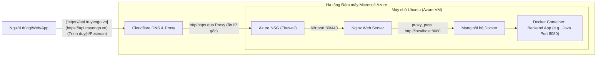

# TÀI LIỆU HƯỚNG DẪN TRIỂN KHAI HỆ THỐNG BACKEND (AZURE VM, NGINX & CLOUDFLARE)

 

Triển khai hệ thống backend cho người mới bắt đầu.
Những kiến thức cơ bản giúp bạn có thể triển khai một hệ thống backend lên server một cách hiệu quả.

> **Lưu ý:** Đây là tài liệu ghi chép, tổng hợp và tóm tắt lại kiến thức cá nhân của tôi trong quá trình học.

---

## Mục lục

- [Lời mở đầu](#lời-mở-đầu)
- [Giới thiệu](#giới-thiệu)
- [Chương 1: Tổng quan và Kiến trúc hệ thống](#chương-1-tổng-quan-và-kiến-trúc-hệ-thống)
  - [Mục tiêu tài liệu](#mục-tiêu-tài-liệu)
  - [Kiến trúc triển khai (Deployment Architecture)](#kiến-trúc-triển-khai-deployment-architecture)
  - [Yêu cầu tiên quyết (Prerequisites)](#yêu-cầu-tiên-quyết-prerequisites)
- [Chương 2: Đóng gói ứng dụng (Containerization)](#chương-2-đóng-gói-ứng-dụng-containerization)
  - [Chuẩn bị ứng dụng để đóng gói](#chuẩn-bị-ứng-dụng-để-đóng-gói)
  - [Xây dựng Dockerfile](#xây-dựng-dockerfile)
  - [Quản lý đa dịch vụ với Docker Compose](#quản-lý-đa-dịch-vụ-với-docker-compose)
  - [Lưu trữ Image trên Container Registry](#lưu-trữ-image-trên-container-registry)
- [Chương 3: Khởi tạo và Cấu hình Môi trường Đám mây (Azure VM)](#chương-3-khởi-tạo-và-cấu-hình-môi-trường-đám-mây-azure-vm)
  - [Khởi tạo máy chủ ảo (Azure Virtual Machine)](#khởi-tạo-máy-chủ-ảo-azure-virtual-machine)
  - [Cấu hình bảo mật mạng (Network Security Group)](#cấu-hình-bảo-mật-mạng-network-security-group)
  - [Cài đặt môi trường Runtime trên Linux](#cài-đặt-môi-trường-runtime-trên-linux)
- [Chương 4: Triển khai và Vận hành Ứng dụng](#chương-4-triển-khai-và-vận-hành-ứng-dụng)
  - [Khởi chạy hệ thống Container](#khởi-chạy-hệ-thống-container)
  - [Quản lý và Debug (Xử lý sự cố)](#quản-lý-và-debug-xử-lý-sự-cố)
- [Chương 5: Thiết lập Web Server và Reverse Proxy (Nginx)](#chương-5-thiết-lập-web-server-và-reverse-proxy-nginx)
  - [Cài đặt Nginx](#cài-đặt-nginx)
  - [Cấu hình Reverse Proxy](#cấu-hình-reverse-proxy)
- [Chương 6: Tên miền và Chống DDoS (Cloudflare)](#chương-6-tên-miền-và-chống-ddos-cloudflare)
  - [Thiết lập DNS Cơ bản](#thiết-lập-dns-cơ-bản)
  - [Kích hoạt lớp bảo vệ Cloudflare](#kích-hoạt-lớp-bảo-vệ-cloudflare)
- [Chương 7: Bảo mật SSL/TLS (Giao thức HTTPS)](#chương-7-bảo-mật-ssltls-giao-thức-https)
  - [Khởi tạo chứng chỉ số](#khởi-tạo-chứng-chỉ-số)
  - [Cấu hình chứng chỉ lên Server](#cấu-hình-chứng-chỉ-lên-server)
- [Chương 8: Kiểm thử và Vận hành (Testing & Operation)](#chương-8-kiểm-thử-và-vận-hành-testing--operation)
  - [Kiểm thử toàn diện](#kiểm-thử-toàn-diện)
  - [Bảo trì và Cập nhật (Hướng phát triển)](#bảo-trì-và-cập-nhật-hướng-phát-triển)

---

## Lời mở đầu

Trong quá trình theo học chuyên ngành Kỹ thuật Phần mềm và trực tiếp xây dựng các dự án thực tế (đặc biệt là các hệ thống sử dụng Spring Boot cho backend), tôi nhận ra có một khoảng cách rất lớn giữa việc ứng dụng chạy mượt mà trên `localhost` và việc vận hành nó trên môi trường internet thực tế. Đơn cử như khi bạn cần một public endpoint ổn định, bảo mật để nhận webhook thanh toán từ các dịch vụ bên thứ ba thay vì phải bật các công cụ tunnel tạm thời như ngrok mỗi ngày, việc tự chủ hạ tầng deploy trở thành một kỹ năng bắt buộc.

Tài liệu này được tôi viết lại như một cuốn "nhật ký kỹ thuật" nhằm hệ thống hóa kiến thức và chuẩn bị một hành trang thực tế vững chắc nhất trên con đường theo đuổi vị trí một Backend Developer chuyên nghiệp. Tài liệu ghi lại toàn bộ quy trình chuẩn mực: từ khâu đóng gói ứng dụng, khởi tạo máy chủ, cho đến lúc ứng dụng chính thức chạy online với tên miền riêng và chứng chỉ bảo mật. 

Hy vọng những ghi chép này không chỉ giúp ích cho bản thân tôi trong việc tra cứu, ôn tập sau này mà còn có thể trở thành một nguồn tham khảo hữu ích, trực quan cho những ai đang gặp khó khăn ở những bước đầu tiên trên con đường đưa sản phẩm lên "mây".

## Giới thiệu

Triển khai (Deploy) một hệ thống backend không chỉ đơn thuần là thao tác copy mã nguồn lên một cái máy tính khác có kết nối mạng. Để hệ thống chạy ổn định, an toàn và dễ dàng bảo trì hoặc mở rộng sau này, chúng ta cần sự kết hợp của nhiều tầng công nghệ khác nhau.

Trong tài liệu này, tôi lựa chọn sử dụng một "tech stack" cực kỳ phổ biến và mang tính tiêu chuẩn trong thực tế ngành phần mềm hiện nay:

* **[Docker](https://www.docker.com/) (Containerization):** Công cụ đóng gói ứng dụng. Docker giải quyết triệt để bài toán "code chạy được trên máy tôi nhưng lỗi trên server". Mọi thứ từ môi trường chạy (runtime), thư viện, cấu hình đều được đóng gói thành một Image duy nhất.
* **[Azure VM](https://azure.microsoft.com/en-us/products/virtual-machines/) (Virtual Machines):** Dịch vụ cung cấp máy chủ ảo (VPS) mạnh mẽ và uy tín từ Microsoft. Đây sẽ là "mảnh đất" chạy hệ điều hành Linux (Ubuntu) để host các container của chúng ta.
* **[Nginx](https://nginx.org/en/) (Web Server & Reverse Proxy):** Đóng vai trò là "người gác cổng". Nginx sẽ đứng ở vòng ngoài, tiếp nhận các luồng giao thông (traffic) từ internet và điều phối chúng một cách an toàn vào đúng các dịch vụ đang chạy ngầm bên trong server.
* **[Cloudflare](https://www.cloudflare.com/) (DNS & Security):** Dịch vụ phân giải tên miền (DNS) kiêm luôn vai trò làm khiên chắn bảo vệ hệ thống khỏi các đợt tấn công DDoS. Đồng thời, Cloudflare cũng hỗ trợ cấp phát chứng chỉ SSL/TLS, giúp các API endpoint của chúng ta được truyền tải qua giao thức HTTPS (ổ khóa xanh) an toàn tuyệt đối.

---

## Chương 1: Tổng quan và Kiến trúc hệ thống

### Mục tiêu tài liệu

Mục tiêu cốt lõi của tài liệu này là ghi chép lại một lộ trình thực thi (Action Plan) rõ ràng và chuẩn mực để đưa một ứng dụng backend (ví dụ: các hệ thống Spring Boot/Java) từ môi trường phát triển cục bộ (Local Development) lên môi trường triển khai thực tế (Production).

Sau khi hoàn thành các bước trong tài liệu này, hệ thống backend phải đạt được các tiêu chuẩn sau:

- **Tính sẵn sàng cao (High Availability):** Ứng dụng chạy 24/7 trên hạ tầng đám mây (Cloud), cho phép người dùng hoặc các dịch vụ bên thứ ba (ví dụ: test nhận request từ các cổng thanh toán) truy cập bất cứ lúc nào qua public endpoint ổn định.
- **Tính bảo mật (Security):** Toàn bộ đường truyền dữ liệu phải được mã hóa qua giao thức HTTPS (ổ khóa xanh). Địa chỉ IP thật của máy chủ (origin server) được ẩn giấu để chống lại các đợt tấn công dò quét mạng hoặc từ chối dịch vụ (DDoS).
- **Tính đóng gói và di động (Portability):** Tận dụng tối đa công nghệ Docker để đóng gói ứng dụng, đảm bảo tuyệt đối rằng "code chạy được trên máy developer thì cũng sẽ chạy được trên server".

---

### Kiến trúc triển khai (Deployment Architecture)

Mô hình triển khai này sử dụng cấu trúc đa tầng để tối ưu hóa giữa hiệu năng và bảo mật. Dưới đây là sơ đồ luồng dữ liệu (Request Flow) từ người dùng đến ứng dụng.

Sơ đồ luồng (ASCII Flow):



Giải thích vai trò các thành phần trong luồng:

1. **Người dùng (Client)**: Gửi yêu cầu qua tên miền chính thức.

2. **Cloudflare (Entry Point & Security)**:

    - Tiếp nhận yêu cầu đầu tiên.

    - Làm nhiệm vụ phân giải tên miền (DNS).

    - Hỗ trợ chế độ Proxy ("đám mây màu cam") để ẩn IP Public thật của máy chủ Azure VM.

    - Giải mã SSL (HTTPS) đầu vào và quản lý chứng chỉ bảo mật.

    - Tự động ngăn chặn các đợt tấn công DDoS cơ bản.

3. **Azure NSG (Network Security Group)**: Tường lửa cấp hạ tầng của Azure. Chỉ mở các cổng cần thiết (Port 22 cho SSH, 80 cho HTTP và 443 cho HTTPS).

4. **Nginx (Web Server & Reverse Proxy)**: Đứng ở tầng hệ điều hành của VM. Nginx nhận request từ cổng 80/443 và thực hiện điều phối dữ liệu (proxy_pass) vào port nội bộ của Docker Container đang chạy backend.

5. **Docker Container (Backend Layer)**: Nơi chứa mã nguồn ứng dụng (ví dụ: file .jar của Spring Boot) đã được đóng gói hoàn chỉnh. Ứng dụng xử lý logic và trả kết quả ngược lại theo đúng quy trình trên.

---

### Yêu cầu tiên quyết (Prerequisites)

Để đảm bảo quá trình thực hành theo tài liệu diễn ra suôn sẻ, bạn cần chuẩn bị sẵn các thành phần sau:

Về phía Mã nguồn & Công cụ (Local Machine):

- Ứng dụng Backend: Đã hoàn thiện tính năng cơ bản, đã được viết sẵn `Dockerfile` và `docker-compose.yml`.

- **SSH Client**: Công cụ để điều khiển server từ xa (Terminal trên Linux/macOS, hoặc MobaXterm, PuTTY trên Windows).

Về phía Tài khoản & Hạ tầng (Cloud Services):

- Tài khoản **Docker Hub**: Kho chứa Image để vận chuyển ứng dụng từ máy local lên server.

- Tài khoản **Azure for Students**: Đăng ký bằng email đuôi .edu của trường để kích hoạt credit miễn phí mà không cần thẻ VISA.

- Tên miền (Domain Name): Một tên miền đã sở hữu (Ví dụ: `.vn`, `.com` mua từ bất kỳ nhà đăng ký nào).

- Tài khoản **Cloudflare**: Đã sẵn sàng và tên miền đã được chuyển Nameserver về Cloudflare để quản lý.

---

## Chương 2: Đóng gói ứng dụng (Containerization)

Đóng gói (Containerization) là bước chuyển giao mã nguồn từ dạng "code thô" thành một khối (Image) có thể tự chạy độc lập ở bất kỳ đâu. Phần này sử dụng Docker làm công cụ cốt lõi.

### Chuẩn bị ứng dụng để đóng gói

Trước khi đưa ứng dụng vào **Docker**, mã nguồn cần được cấu hình lại để tách biệt giữa môi trường phát triển (Local) và môi trường thực tế (Production).

**Bước 1: Thiết lập dự án cơ bản**

Tạo nhiều file cấu hình (**Profiles**) trong thư mục `src/main/resources`:

- `application.yml` / `application.properties` (Cấu hình chung mặc định).

- `application-dev.yml` / `application-dev.properties` (Dùng cho local, kết nối database ở localhost).

- `application-prod.yml` / `application-prod.properties` (Dùng cho server thực tế).

**Bước 2: Thiết lập biến môi trường (Environment Variables) cho từng file**

Tuyệt đối không hardcode (viết cứng) thông tin nhạy cảm như `username`, `password` của Database hay `Secret Key` trực tiếp vào mã nguồn hoặc file `application.yml` rồi push lên Git. Thay vào đó nên sử dụng biến môi trường và ứng dụng sẽ đọc các cấu hình này từ hệ điều hành (hoặc từ Docker) khi khởi chạy.

- `application.yml` / `application.properties`: Đây là file sẽ cấu hình các thông số chung cho toàn bộ dự án như: server port, enable các service bên ngoài, các biến chung mặc định,...

- `application-dev.yml` / `application-dev.properties`: Đây là file dùng để cấu hình cho việc lập trình trên chính máy của dev. Ở đây các đường dẫn thường chứa `localhost` và sẽ sử dụng file .env để inject các cấu hình vào biến môi trường.

- `application-prod.yml` / `application-prod.properties`: Cuối cùng là file chứa các cấu hình hoàn chỉnh cho một production sẵn sàng chạy trên server. Thường thì file này sẽ lấy cấu hình từ các biến môi trường được define ở `docker-compose.yml`.

Ví dụ: `${TÊN_BIẾN:giá_trị_mặc_định}`

```properties
spring.datasource.url=jdbc:mysql://${DB_HOST:localhost}:${DB_PORT:3306}/${DB_NAME:mydb}
spring.datasource.username=${DB_USER:root}
spring.datasource.password=${DB_PASS:}
```

**Bước 3: Đóng gói ứng dụng thành file thực thi `.jar` bằng Maven:**

  ```bash
  mvn clean package -DskipTests
  ```

Kết quả: File `.jar` sẽ được tạo ra trong thư mục `target/`.

---

### Xây dựng Dockerfile

`Dockerfile` là một bản hướng dẫn (recipe) để **Docker** biết cách xây dựng **Image** cho ứng dụng của bạn.

> Tài liệu tham khảo: [Spring Boot with Docker](https://spring.io/guides/gs/spring-boot-docker)

Hướng dẫn và Lưu ý thường gặp:

- Thứ tự **Layer**: Docker build image theo từng lớp (layer) từ trên xuống. Lệnh nào ít thay đổi (như tải thư viện) nên để ở trên, lệnh nào hay thay đổi (như copy mã nguồn) nên để ở dưới để tận dụng Cache, giúp build nhanh hơn.

- Lưu ý: Không nên dùng các base image quá nặng (như ubuntu ~70MB) để chạy Java. Hãy dùng các bản rút gọn.

**Bước 1: Thiết lập cơ bản**

Một `Dockerfile` tiêu chuẩn nằm ở thư mục gốc của dự án sau khi bạn đã tự build ra file `.jar`:

```Dockerfile
# Sử dụng base image có sẵn Java 21
FROM maven:3.9.6-eclipse-temurin-21 AS build

# Thư mục làm việc bên trong container
WORKDIR /app

# Copy file jar từ local vào container
COPY target/*.jar app.jar

# Mở port (chỉ mang tính document, thực tế map port lúc chạy, thường mình sẽ để 8081)
EXPOSE 8080

# Lệnh khởi chạy ứng dụng
ENTRYPOINT ["java", "-jar", "app.jar"]
```

**Bước 2: Tối ưu và nâng cao**

Phương pháp cơ bản trên yêu cầu máy tính/server của bạn phải cài sẵn **Maven** để build ra file `.jar` trước. Với Multi-stage build, ta dùng chính Docker để build code, sau đó chỉ lấy file `.jar` kết quả bỏ sang một Image siêu nhẹ để chạy. Cực kỳ hữu ích cho CI/CD!

```Dockerfile
# Lớp 1: Build mã nguồn (Có chứa Maven)
FROM maven:3.9.6-eclipse-temurin-21 AS build
WORKDIR /app

# Sao chép file pom chứa cấu hình và thư viện dự án
COPY pom.xml . 

# Tải trước thư viện để cache (nếu pom.xml không đổi)
RUN mvn dependency:go-offline
COPY src ./src

# Build ra file jar
RUN mvn clean package -DskipTests

# Lớp 2: Chạy ứng dụng (Chỉ chứa JRE siêu nhẹ)
FROM openjdk:21-ea-21-jdk-slim
WORKDIR /app

# Lấy file jar từ Lớp 1 (builder) sang
COPY --from=builder /app/target/*.jar app.jar
EXPOSE 8081
ENTRYPOINT ["java", "-jar", "app.jar"]
```

Nên sử dụng cách này sẽ tạo được Image cuối cùng rất nhẹ.

---

### Quản lý đa dịch vụ với Docker Compose

Một backend thực tế hiếm khi đứng một mình, nó cần Database, Redis, Kafka,... để chạy đồng thời trong dự án. Ngoài ra nếu xây dựng hệ thống Microservices thì sẽ cần chạy các service gateway, cloud và các service khác liên quan chạy đồng thời. `docker-compose.yml` giúp khởi chạy toàn bộ cụm này bằng 1 câu lệnh.

> Tài liệu tham khảo: [Docker Compose File Reference](https://docs.docker.com/reference/compose-file/)

**Bước 1: Thiết lập cơ bản**

File `docker-compose.yml` định nghĩa 2 service: app và database.

```YAML
version: '3.9'
services:
  mysql:
    image: mysql:8.0
    container_name: mysql-db
    # Nếu bạn muốn ứng dụng chạy local của mình có thể kết nối một service (ví dụ là database) đang chạy trên docker thì có thể dùng mapping port
    # Ở đây mình sử dụng 3307 để phân biệt với cổng mặc định của MySQL là 3306, từ đó ứng dụng bên ngoài có thể kết nối chính xác đến database đang chạy ở trong docker. Tương tự với các service khác. Còn 3306 (Internal) nghĩa là port dùng để các container khác trong cùng một file docker-compose.yml kết nối.
    ports:
      - "3307:3306" # External:Internal
    # Môi trường sẽ sử dụng biến được lấy ở trong file môi trường của dự án.
    environment:
      MYSQL_ROOT_PASSWORD: ${MYSQL_ROOT_PASSWORD}
      MYSQL_DATABASE: ${MYSQL_DATABASE}

  backend-app:
    build: .
    container_name: my-app
    ports:
      - "8080:8080"
    env_file:
      - .env # Đọc cấu hình từ file .env ẩn
    environment:
      - SPRING_DATASOURCE_URL=jdbc:mysql://mysql:3306/${MYSQL_DATABASE}
      - SPRING_DATASOURCE_USERNAME=root
      - SPRING_DATASOURCE_PASSWORD=${MYSQL_ROOT_PASSWORD}
    # Trước khi ứng dụng được chạy ta cần đảm bảo container database đã được chạy, từ đó tránh việc database chưa chạy xong mà ứng dụng đã query tới, gây lỗi ứng dụng.
    depends_on:
      - mysql-db
```

**Bước 2: Tối ưu và nâng cao**

Bổ sung **Volumes** (để không mất dữ liệu DB khi xóa container) và thêm **Healthcheck** (để Backend đợi DB khởi động xong mới chạy).

```YAML
version: '3.9'
services:
  mysql:
    image: mysql:8.0
    container_name: mysql-db
    ports:
      - "3307:3306"
    environment:
      MYSQL_ROOT_PASSWORD: ${MYSQL_ROOT_PASSWORD}
      MYSQL_DATABASE: ${MYSQL_DATABASE}
    volumes:
      - db_data:/var/lib/mysql # Lưu trữ dữ liệu vĩnh viễn
    healthcheck:
      test: [ "CMD-SHELL", "mysqladmin ping -h localhost -u root -p${MYSQL_ROOT_PASSWORD} || exit 1" ]
      interval: 10s
      timeout: 5s
      retries: 5
      start_period: 30s
    networks:
      - my_network

  backend-app:
    build: .
    container_name: my-app
    ports:
      - "8080:8080"
    env_file:
      - .env # Đọc cấu hình từ file .env ẩn
    environment:
      SPRING_PROFILES_ACTIVE: prod # Chỉ định cho docker dùng file application-prod.yml / application-prod.properties
    depends_on:
      mysql-db:
        condition: service_healthy # Đợi DB thực sự ping được mới chạy App
    networks:
      - my_network

volumes:
  db_data:

# Network dùng để các container có thể giao tiếp qua lại với nhau
networks:
  my_network:
    driver: bridge
```

---

### Lưu trữ Image trên Container Registry

Khi **Image** đã được đóng gói thành công ở máy local, ta cần đưa nó lên một kho lưu trữ đám mây (Registry) để lát nữa máy chủ **Azure VM** có thể kéo (Pull) về.

> Tài liệu tham khảo: [Docker Hub Quickstart](https://docs.docker.com/docker-hub/quickstart/)

Hướng dẫn chi tiết 2 cách thực hiện:

**Cách 1: Sử dụng Docker Desktop**

Cách này rất tiện lợi khi bạn đang làm việc trên máy tính cá nhân (Windows/macOS) và muốn thao tác nhanh bằng chuột.

- Khởi động ứng dụng **Docker Desktop** và đảm bảo bạn đã đăng nhập tài khoản Docker Hub ở góc trên bên phải giao diện.
- Điều hướng sang tab **Images** ở thanh menu bên trái.
- Trong danh sách "Local", tìm đến Image bạn vừa build (ví dụ: `my-backend-app`).
- Nhấn vào biểu tượng **dấu ba chấm** (More Options) ở cuối dòng của Image đó -> Chọn **Push to Hub**.
- Một cửa sổ hiện ra, bạn điền **Namespace** (chính là username Docker Hub của bạn) và **Repository** (tên kho chứa). Bổ sung thêm tag (ví dụ: `v1.0`).
- Nhấn **Push** và theo dõi thanh tiến trình chạy đến khi hoàn tất.

**Cách 2: Sử dụng Docker CLI (Dòng lệnh - Khuyên dùng)**

Dù dùng giao diện rất trực quan, bạn bắt buộc phải thành thạo cách dùng dòng lệnh. Lý do là vì máy chủ **VPS (Ubuntu/Azure VM)** hay các hệ thống tự động cấu hình (CI/CD) hoàn toàn không có giao diện chuột để bạn click.

- Đăng nhập (hoặc đăng kí) tài khoản trên [Docker Hub](https://hub.docker.com/)

- Đăng nhập Docker trên máy tính: Mở **Terminal/CMD** (Ở thư mục dự án có chứa Dockerfile) và gõ lệnh sau. Hệ thống sẽ yêu cầu bạn nhập **Username** và **Password** (hoặc Access Token nếu tài khoản bật bảo mật 2 lớp).

```bash
docker login
```

  - Trường hợp 1 (Build mới hoàn toàn): Build image với tên đúng chuẩn `<username>/<repository>:<tag>`:

```bash
docker build -t your_docker_username/backend-api:v1.0 .
```

  - Trường hợp 2 (Đã có sẵn Image ở local): Dùng lệnh tag để đổi tên Image cũ sang tên mới đúng chuẩn:

```bash
docker tag backend-api:latest your_docker_username/backend-api:v1.0
```

- Đẩy lên kho lưu trữ:

```bash
docker push your_docker_username/backend-api:v1.0
```

**Tối ưu và nâng cao**

- Sử dụng Tag động: Push đồng thời 2 tag: một tag version cụ thể (v1.0, v1.1) để lưu trữ lịch sử, và một tag latest để lát nữa khi kéo code trên server **Azure VM**, hệ thống tự động nhận bản mới nhất mà không cần bạn phải vào sửa lại file script.

- Registry bảo mật (Private Registry): Thay vì dùng Docker Hub (nơi repo public bị lộ code), hãy chuyển sang sử dụng GitHub Container Registry (ghcr.io). Nó hoàn toàn miễn phí cho repository private và tích hợp cực tốt với GitHub Actions trong giai đoạn CI/CD tự động.

**Lưu ý**

- Bảo mật: Không bao giờ push .env file hoặc image có chứa mật khẩu thật lên Docker Hub public.

- Tagging: Hạn chế sử dụng duy nhất tag latest. Nếu bản latest bị lỗi, bạn sẽ không biết quay về (rollback) bản nào.

---

## Chương 3: Khởi tạo và Cấu hình Môi trường Đám mây (Azure VM)

Sau khi mã nguồn đã được đóng gói gọn gàng thành **Docker Image**, chúng ta cần một "mảnh đất" trên internet để chạy nó. Trong tài liệu này, **Azure Virtual Machines** được lựa chọn cùng gói **Azure for Students** cực kỳ phù hợp để học tập và làm dự án vì không yêu cầu khai báo thẻ tín dụng.

### Khởi tạo máy chủ ảo (Azure Virtual Machine)

Đây là bước đi thuê một chiếc máy tính ảo (VPS) chạy hệ điều hành **Linux** và đặt nó tại trung tâm dữ liệu của **Microsoft**.

> Tài liệu tham khảo: [Tạo Virtual Machine trên nền tảng Azure Portal](https://learn.microsoft.com/en-us/azure/virtual-machines/linux/quick-create-portal?tabs=ubuntu)

1. Truy cập vào [Azure Portal](https://portal.azure.com/) và đăng nhập bằng tài khoản sinh viên của bạn.

2. Tại thanh tìm kiếm, gõ **Virtual Machines** và chọn dịch vụ này.

3. Nhấn vào nút **Create** -> Chọn **Azure virtual machine**.

4. Bắt đầu thiết lập các thông số cơ bản (tab **Basics**):

- **Subscription**: Đảm bảo đang chọn gói **Azure for Students**.

- **Resource group**: Bấm **Create new** và đặt tên (ví dụ: `backend-rg`) để dễ quản lý tài nguyên.

- **Virtual machine name**: Đặt tên cho server (ví dụ: `my-backend-server`).

- **Region**: Chọn khu vực gần nhất là **Southeast Asia (Singapore)** để tối ưu độ trễ.

- **Image**: Chọn hệ điều hành **Ubuntu Server 24.04 LTS** (hoặc 22.04 LTS).

- **Size**: Chọn gói **Standard_B1s** (Gói này cấp 1 vCPU, 1GB RAM và nằm trong danh mục miễn phí cho sinh viên).

5. Thiết lập quyền truy cập (Administrator account):

- **Authentication type**: Bắt buộc chọn **SSH public key** để bảo mật (không dùng Password).

- **Username**: Mặc định hệ thống sẽ để là `azureuser`.

- **SSH public key source**: Chọn **Generate new key pair**.

- **Key pair name**: Đặt tên cho chìa khóa (ví dụ: `azure-vm-key`).

6. Nhấn nút **Review + create** ở dưới cùng. Đợi hệ thống kiểm tra hợp lệ rồi nhấn **Create**.

7. Một bảng thông báo hiện ra, bắt buộc nhấn **Download private key and create resource**. Máy tính sẽ tải về một file định dạng `.pem`. **Lưu ý**: Cất giữ file này thật cẩn thận vì Azure chỉ cho phép tải 1 lần duy nhất, mất file này đồng nghĩa với việc mất quyền truy cập vào server.

Đợi khoảng 1-2 phút để Azure cấp phát xong máy chủ.

---

### Cấu hình bảo mật mạng (Security Groups)

Mặc định, Azure đóng cửa toàn bộ các cổng mạng để bảo vệ server. Chúng ta phải chủ động mở "cửa" cho những luồng giao thông (traffic) cần thiết đi vào thông qua tường lửa NSG.

1. Tại giao diện báo tạo VM thành công, nhấn **Go to resource** để vào trang quản lý máy chủ ảo.

2. Ở thanh menu bên trái, tìm và chọn mục **Networking**.

3. Bạn sẽ thấy bảng **Inbound port rules**. Nhấn vào nút **Add inbound port rule** để mở thêm cổng.

4. Thêm lần lượt 3 rule sau (những cấu hình khác giữ nguyên mặc định, chỉ đổi dòng `Destination port ranges` và `Protocol`):
   * **Port 22 (SSH)**: Mở cửa để bạn có thể remote điều khiển server. (Priority: 300).
   * **Port 80 (HTTP)**: Mở cửa cho Web server Nginx tiếp nhận luồng không mã hóa. (Priority: 310).
   * **Port 443 (HTTPS)**: Mở cửa cho kết nối an toàn có SSL. (Priority: 320).

**Lưu ý bảo mật (Nguyên tắc Least Privilege):** Nhiều bạn có thói quen mở luôn Port 8080 (cổng chạy Spring Boot) ra ngoài internet. Điều này là **KHÔNG NÊN**. Chúng ta sẽ dùng Nginx (ở Port 80) làm proxy hứng traffic rồi đẩy ngầm vào Port 8080 bên trong. Port 8080 của ứng dụng chỉ nên được cô lập ở mạng nội bộ (localhost).

---

### Cài đặt môi trường Runtime trên Linux

Bây giờ chúng ta sẽ đăng nhập vào server và cài đặt "đồ nghề" (Docker & Docker Compose).

**Bước 1: Kết nối vào Server qua SSH**

- Mở trang tổng quan (Overview) của VM trên **Azure** để copy địa chỉ `Public IP address`.

- Mở `Terminal/CMD` trên máy tính của bạn (tại thư mục đang lưu file `.pem`).

- Nếu dùng Mac/Linux, bạn cần cấp quyền đọc cho file `.pem` trước:

```bash
chmod 400 azure-vm-key.pem
```

- Chạy lệnh SSH (Thay `<Public-IP>` bằng địa chỉ IP bạn vừa copy):

```bash
ssh -i "azure-vm-key.pem" azureuser@<Public-IP>
```

- Gõ yes khi được hỏi để xác nhận kết nối. Lúc này màn hình Terminal sẽ chuyển sang giao diện điều khiển của máy chủ Ubuntu.

**Bước 2: Cài đặt Docker & Docker Compose**

- Chạy lần lượt các lệnh sau trên server Ubuntu để làm sạch hệ thống và cài đặt Docker:

```bash
# Cập nhật danh sách gói phần mềm của hệ điều hành
sudo apt update && sudo apt upgrade -y

# Cài đặt Docker và Docker Compose bản chuẩn của Ubuntu
sudo apt install docker.io docker-compose -y

# Khởi động dịch vụ Docker và cho phép nó chạy cùng hệ thống khi reboot
sudo systemctl enable --now docker
```

**Tối ưu và nâng cao**

Mặc định, mỗi lần dùng lệnh Docker bạn đều phải gõ chữ sudo (quyền quản trị cao nhất) ở đằng trước, rất mất thời gian (ví dụ: sudo docker ps). Để khắc phục, hãy cấp quyền chạy Docker cho user hiện tại (user `azureuser`):

```bash
sudo usermod -aG docker azureuser
```

Lưu ý: Sau khi chạy lệnh này, bạn cần thoát khỏi server (gõ exit) và SSH vào lại để quyền mới có hiệu lực. Từ giờ bạn chỉ cần gõ docker ps là lệnh sẽ chạy mượt mà.

---

## Chương 4: Triển khai và Vận hành Ứng dụng

Lúc này, máy chủ Azure VM của chúng ta đã được cài đặt đầy đủ môi trường (Docker). Bước tiếp theo là đưa các file cấu hình lên server và chính thức khởi chạy toàn bộ cụm dịch vụ.

### Khởi chạy hệ thống Container

Khác với máy tính local của bạn (nơi chứa toàn bộ mã nguồn), trên server thực tế, chúng ta không mang mã nguồn thô lên. Chúng ta chỉ mang file `docker-compose.yml`, file biến môi trường `.env` và để Docker tự động lên Docker Hub kéo (pull) Image về chạy.

**Bước 1: Tạo thư mục dự án trên server**

Đang ở trong Terminal (SSH) của Azure VM, bạn tạo một thư mục để chứa các file cấu hình và di chuyển vào đó:

```bash
mkdir my-backend-project
cd my-backend-project
```

**Bước 2: Tạo file biến môi trường (.env)**

Sử dụng trình soạn thảo `nano` (được tích hợp sẵn trên Ubuntu) để tạo file `.env`:

```bash
nano .env
```

- Copy nội dung file `.env` từ máy local của bạn (chứa mật khẩu DB, JWT Secret,...) và dán (paste) vào đây.

- Nhấn Ctrl + O rồi Enter để lưu file.

- Nhấn Ctrl + X để thoát cửa sổ nano.

**Bước 3: Tạo file docker-compose.yml**

Tương tự, tạo file `docker-compose.yml`:

```bash
nano docker-compose.yml
```

- Dán nội dung file compose của bạn vào.

- Lưu ý cực kỳ quan trọng: Trong file docker-compose.yml trên server, ở phần backend-app, bạn bắt buộc phải chỉ định image: `<tên_username_của_bạn>/backend-api:v1.0`(trỏ về Docker Hub) chứ KHÔNG dùng thuộc tính build: . như khi code ở dưới local (vì trên server không có mã nguồn thô để build).

- Lưu và thoát nano.

**Bước 4: Đăng nhập Docker Hub (Dành cho Private Repository)**

Nếu Image trên Docker Hub của bạn đang để chế độ Private (Riêng tư), máy chủ Azure cần được cấp quyền để kéo code:

```bash
docker login
```

**Bước 5: Khởi chạy toàn bộ hệ thống**

Chạy câu lệnh quyền lực sau để Docker tải Image về và khởi động Database cùng Backend:

```bash
docker-compose up -d
```

*Giải thích*: Cờ -d (detached) là chỉ thị cực kỳ quan trọng. Nó giúp các container chạy ngầm (background). Nhờ vậy, dù bạn có tắt Terminal hay tắt máy tính cá nhân đi ngủ, ứng dụng trên server vẫn tiếp tục chạy 24/7.

---

### Quản lý và Debug (Xử lý sự cố)

Khi ứng dụng đã chạy thực tế, sẽ có lúc bị lỗi (bug) hoặc bị sập (crash). Việc quản lý vòng đời của container và đọc log là kỹ năng sống còn của mọi Backend Developer.

1. Kiểm tra trạng thái hệ thống: Để xem có những container nào đang chạy và port nào đang được mở:

```bash
docker ps
```

*(Mẹo: Cột STATUS sẽ cho bạn biết container đang Up (đang chạy khỏe mạnh), Restarting (đang bị lỗi sập và đang cố khởi động lại) hay Exited (đã sập hẳn))*.

2. Đọc Log để tìm nguyên nhân lỗi (Debug): Đây là câu lệnh bạn sẽ dùng nhiều nhất. Nếu frontend gọi API báo lỗi 500, hãy xem log của container backend ngay lập tức:

```bash
docker logs my-app
```

Hoặc để xem log chạy theo thời gian thực (giống hệt cửa sổ console trên IDE của bạn):

```bash
docker logs -f my-app
```

*(Thay my-app bằng tên được cấu hình trong container_name của file docker-compose)*.

3. Truy cập vào bên trong Container: Đôi khi bạn cần vào hẳn bên trong một container đang chạy để kiểm tra xem file đã được copy đúng chưa, hoặc vào thẳng MySQL để gõ lệnh query kiểm tra dữ liệu:

```bash
# Truy cập vào container backend (sử dụng shell)
docker exec -it my-app sh

# Truy cập vào container database (ví dụ MySQL) và đăng nhập
docker exec -it mysql-db bash
mysql -u root -p
```

4. Dừng hoặc Cập nhật hệ thống

- Dừng toàn bộ các dịch vụ nhưng **giữ lại** dữ liệu (vì đã bọc volumes):

```bash
docker-compose down
```

- Quy trình update phiên bản mới: Khi bạn có code mới (đã đóng gói và push lên Docker Hub), bạn chỉ cần gõ 2 lệnh sau trên server để cập nhật:

```bash
docker-compose pull   # Kéo các Image mới nhất từ Docker Hub về

docker-compose up -d  # Khởi động lại các container bằng Image mới
```

---

## Chương 5: Thiết lập Web Server và Reverse Proxy (Nginx)

Lúc này, ứng dụng Backend của bạn đang chạy ở bên trong một Container (ví dụ ở cổng 8080). Thay vì mở toang cổng 8080 này ra internet (rất kém an toàn), chúng ta sẽ dùng Nginx đứng ở ngoài cùng (chạy thẳng trên hệ điều hành Ubuntu của Azure VM). Nginx sẽ hứng toàn bộ traffic ở cổng 80 (HTTP) và cổng 443 (HTTPS), sau đó âm thầm chuyển tiếp (proxy_pass) vào cổng tương ứng bên trong.

### Cài đặt Nginx

**Bước 1: Cài đặt phần mềm**

Đang ở màn hình Terminal (SSH) của máy chủ Azure VM, bạn chạy lệnh sau để tải và cài đặt Nginx:

```bash
sudo apt install nginx -y
```

**Bước 2: Kiểm tra trạng thái**

Đảm bảo Nginx đã được khởi động và tự động chạy khi máy chủ khởi động lại:

```bash
sudo systemctl enable --now nginx
sudo systemctl status nginx
```

*(Nếu bạn thấy dòng chữ `active (running)` màu xanh lá cây là thành công. Bấm phím `q` trên bàn phím để thoát khỏi màn hình xem trạng thái).*

Lúc này, nếu bạn gõ địa chỉ Public IP của máy chủ Azure lên trình duyệt web, bạn sẽ thấy trang "Welcome to nginx!".

---

### Cấu hình Reverse Proxy

Bây giờ chúng ta sẽ dạy Nginx cách điều hướng các request nhận được vào đúng container đang chạy Spring Boot.

**Bước 1: Xóa cấu hình mặc định (Tùy chọn nhưng khuyên dùng)**

Để tránh xung đột ở cổng 80, bạn nên vô hiệu hóa trang "Welcome" mặc định của Nginx:

```bash
sudo rm /etc/nginx/sites-enabled/default
```

**Bước 2: Tạo file cấu hình mới**

Sử dụng trình soạn thảo `nano` để tạo một file cấu hình riêng cho dự án của bạn (ví dụ đặt tên là `backend-api`):

```bash
sudo nano /etc/nginx/sites-available/backend-api
```

**Bước 3: Viết luật điều hướng (Routing rules)**

Copy và dán đoạn cấu hình sau vào file `nano`. Thay `api.domain.com` bằng tên miền thực tế của bạn (hoặc tạm thời để IP Public nếu chưa có tên miền), và đảm bảo `localhost:8080` khớp với port bạn đã map ra ngoài trong file `docker-compose.yml`:

```bash
server {
    listen 80;
    server_name api.domain.com; # Thay bằng tên miền của bạn (vd: api.truyengo.vn)

    location / {
        proxy_pass http://localhost:8080; # Chuyển tiếp vào cổng 8080 của Docker
        proxy_set_header Host $host;
        proxy_set_header X-Real-IP $remote_addr;
        proxy_set_header X-Forwarded-For $proxy_add_x_forwarded_for;
        proxy_set_header X-Forwarded-Proto $scheme;
    }
}
```

*Giải thích*: Các dòng `proxy_set_header` vô cùng quan trọng. Nó giúp ứng dụng backend (Spring Boot) nhận biết được IP thật của người dùng thay vì lầm tưởng request đó xuất phát từ chính thằng Nginx.

*(Lưu file bằng cách bấm `Ctrl + O` -> `Enter` -> `Ctrl + X`).*

**Bước 4: Kích hoạt cấu hình**

Tạo một "đường dẫn ảo" (symlink) từ thư mục `sites-available` sang thư mục `sites-enabled `để Nginx bắt đầu đọc cấu hình này:

```bash
sudo ln -s /etc/nginx/sites-available/backend-api /etc/nginx/sites-enabled/
```

**Bước 5: Kiểm tra lỗi cú pháp và Khởi động lại**

Trước khi áp dụng, hãy bảo **Nginx** kiểm tra xem bạn có gõ sai cú pháp hay thiếu dấu chấm phẩy nào trong file cấu hình không:

```bash
sudo nginx -t
```

*(Nếu kết quả trả về `syntax is ok` và `test is successful` thì bạn đã làm đúng).*

Cuối cùng, khởi động lại **Nginx** để áp dụng thay đổi:

```bash
sudo systemctl reload nginx
```

---

## Chương 6: Tên miền và Chống DDoS (Cloudflare)

Việc trỏ trực tiếp tên miền về IP của máy chủ **Azure VM** tiềm ẩn rất nhiều rủi ro bảo mật (ví dụ: dễ bị lộ IP gốc và trở thành mục tiêu của các cuộc tấn công từ chối dịch vụ). Giải pháp tiêu chuẩn hiện nay là sử dụng **Cloudflare** làm lớp trung gian. Toàn bộ traffic sẽ đi qua mạng lưới toàn cầu của Cloudflare để được sàng lọc kỹ càng trước khi đến máy chủ của bạn.

### Thiết lập DNS Cơ bản

**Bước 1: Thêm tên miền và thay đổi Nameservers**

- Đăng nhập vào [Cloudflare](https://dash.cloudflare.com/) và chọn **Add a Site**. Nhập tên miền bạn đã sở hữu (ví dụ: `domain.com`) và chọn gói **Free** (Miễn phí).

- Cloudflare sẽ quét các bản ghi hiện tại và cung cấp cho bạn 2 địa chỉ **Nameservers** (ví dụ: `ns1.cloudflare.com`, `ns2.cloudflare.com`).

- Quay lại trang quản trị của nhà cung cấp tên miền (nơi bạn đã mua tên miền ban đầu), tìm đến phần cấu hình DNS và thay đổi Nameservers mặc định thành 2 địa chỉ mà Cloudflare vừa cấp. Việc chuyển đổi này có thể mất từ vài phút đến vài giờ để đồng bộ trên toàn cầu.

**Bước 2: Trỏ bản ghi A (A Record) về Azure VM**

Sau khi tên miền đã được Cloudflare tiếp nhận, chúng ta cần định tuyến nó về đúng máy chủ chứa mã nguồn.

Trong giao diện bảng điều khiển Cloudflare, chọn tên miền của bạn và chuyển đến tab **DNS** -> **Records**.

- Bấm **Add record** để tạo bản ghi định tuyến mới với các thông số sau:

  - **Type (Loại):** Chọn `A`.

  - **Name (Tên):** Điền `@` (nếu bạn muốn trỏ tên miền chính `domain.com`) hoặc điền tên subdomain (ví dụ: `api` nếu bạn muốn trỏ `api.domain.com`).

  - **IPv4 address (Địa chỉ đích):** Dán địa chỉ **Public IP** của máy chủ Azure VM của bạn vào đây.

---

### Kích hoạt lớp bảo vệ Cloudflare

Đây là thao tác cực kỳ đơn giản nhưng lại là bước "ăn tiền" nhất khi sử dụng **Cloudflare**, giúp hệ thống backend của bạn ẩn danh hoàn toàn trên internet.

**Bật đám mây màu cam (Proxied)**

- Ngay tại hàng cấu hình bản ghi `A record` vừa tạo ở bước trên, hãy nhìn sang cột **Proxy status**. 

- Đảm bảo nút gạt đang được bật ở trạng thái **Proxied** (Biểu tượng đám mây phát sáng màu cam) thay vì *DNS only* (Đám mây màu xám).

- Bấm **Save** để lưu lại toàn bộ cấu hình.

**Tác dụng của "Đám mây màu cam":**

1. **Ẩn danh IP gốc:** Bất kỳ ai dùng công cụ để truy vết (ping) tên miền của bạn sẽ chỉ nhận lại các dải IP ảo thuộc về Cloudflare. IP thật của chiếc máy chủ Azure VM được giấu kín hoàn toàn, chặn đứng các thủ đoạn tấn công dò quét cổng (port scanning) trực tiếp vào máy chủ.

2. **Chống DDoS tự động:** Khi có lượng yêu cầu (request) đổ về tăng đột biến và bất thường, Cloudflare sẽ tự động đánh giá mức độ nguy hiểm, bật chế độ xác nhận (Captcha), hoặc vứt bỏ (drop) các luồng traffic rác trước khi chúng kịp chạm đến server của bạn.

3. **Tăng tốc phản hồi (CDN):** Cloudflare sẽ điều phối người dùng truy cập vào máy chủ biên (Edge Server) có vị trí địa lý gần họ nhất, giúp giảm đáng kể độ trễ mạng (latency) khi gọi API.

---

## Chương 7: Bảo mật SSL/TLS (Giao thức HTTPS)

Ở thời điểm hiện tại, giao thức HTTP thông thường (cổng 80) truyền tải dữ liệu dưới dạng văn bản thuần túy (plaintext), rất dễ bị đánh cắp (Man-in-the-middle attack). Để mã hóa đường truyền, chúng ta cần cài đặt chứng chỉ SSL/TLS và ép buộc toàn bộ traffic phải đi qua cổng 443 (HTTPS - Ổ khóa xanh). 

Việc kết hợp với Cloudflare giúp quá trình này trở nên cực kỳ dễ dàng và hoàn toàn miễn phí.

### Khởi tạo chứng chỉ số

Cloudflare cung cấp một tính năng gọi là **Origin Certificate** (Chứng chỉ gốc). Đây là chứng chỉ được cài đặt trên máy chủ Azure VM của bạn để đảm bảo luồng giao tiếp giữa Cloudflare và máy chủ của bạn cũng được mã hóa tuyệt đối (Chế độ **Full Strict**).

**Bước 1: Thiết lập chế độ mã hóa trên Cloudflare**

- Đăng nhập vào Cloudflare, chọn tên miền của bạn.

- Ở menu bên trái, chọn **SSL/TLS** -> **Overview**.

- Chuyển chế độ mã hóa sang **Full (strict)**. Đây là chế độ bảo mật cao nhất, yêu cầu máy chủ gốc (Azure VM) phải có chứng chỉ hợp lệ.

**Bước 2: Tạo Origin Certificate**

- Vẫn ở menu **SSL/TLS**, bạn chuyển sang tab **Origin Server**.

- Nhấn nút **Create Certificate**.

- Giữ nguyên các thông số mặc định (RSA, thời hạn 15 năm) và nhấn **Create**.

- Lúc này, Cloudflare sẽ hiển thị cho bạn 2 đoạn mã:
  1. **Origin Certificate** (Nội dung chứng chỉ - Public Key).
  2. **Private Key** (Chìa khóa bí mật).

**Lưu ý cực kỳ quan trọng:** Đừng đóng tab trình duyệt này vội, vì Private Key sẽ không bao giờ hiển thị lại lần thứ hai. Bạn cần copy hai đoạn mã này để dán vào máy chủ ở bước tiếp theo.

---

### Cấu hình chứng chỉ lên Server

Bây giờ chúng ta sẽ quay lại màn hình Terminal (SSH) của máy chủ Azure VM để đưa chứng chỉ này vào cấu hình của Nginx.

**Bước 1: Lưu file chứng chỉ trên Linux**

Tạo thư mục chứa chứng chỉ (nếu chưa có) và dùng `nano` để tạo file:

```bash
# Tạo và dán nội dung Origin Certificate
sudo nano /etc/ssl/certs/cloudflare.pem
# (Paste nội dung đoạn Origin Certificate vào đây, nhấn Ctrl+O -> Enter -> Ctrl+X để lưu)

# Tạo và dán nội dung Private Key
sudo nano /etc/ssl/private/cloudflare.key
# (Paste nội dung đoạn Private Key vào đây, nhấn Ctrl+O -> Enter -> Ctrl+X để lưu)
```

**Bước 2: Cập nhật cấu hình Nginx**

Mở lại file cấu hình dự án của bạn trong Nginx:

```bash
sudo nano /etc/nginx/sites-available/backend-api
```

Xóa toàn bộ nội dung cũ và thay thế bằng cấu hình dưới đây (nhớ đổi `api.domain.com` thành tên miền thật của bạn). Cấu hình này sẽ thực hiện 2 việc: Lắng nghe ở cổng 443 với chứng chỉ SSL, và tự động chuyển hướng (Redirect) ai đó nếu họ cố tình truy cập bằng cổng 80.

```bash
# Khối 1: Tự động chuyển hướng HTTP (Port 80) sang HTTPS (Port 443)
server {
    listen 80;
    server_name api.domain.com; # Thay bằng tên miền của bạn
    return 301 https://$host$request_uri;
}

# Khối 2: Cấu hình giao thức HTTPS (Port 443)
server {
    listen 443 ssl;
    server_name api.domain.com; # Thay bằng tên miền của bạn

    # Đường dẫn trỏ tới 2 file chứng chỉ vừa tạo
    ssl_certificate /etc/ssl/certs/cloudflare.pem;
    ssl_certificate_key /etc/ssl/private/cloudflare.key;

    # Cấu hình Proxy Pass trỏ vào container Backend
    location / {
        proxy_pass http://localhost:8080; # Chuyển tiếp vào cổng 8080 của Docker
        proxy_set_header Host $host;
        proxy_set_header X-Real-IP $remote_addr;
        proxy_set_header X-Forwarded-For $proxy_add_x_forwarded_for;
        proxy_set_header X-Forwarded-Proto $scheme;
    }
}
```

*(Lưu file bằng cách bấm `Ctrl + O` -> `Enter` -> `Ctrl + X`).*

**Bước 3: Kiểm tra và Khởi động lại Nginx**

```bash
sudo nginx -t
```

Nếu màn hình báo `syntax is ok` và `test is successful`, hãy ra lệnh khởi động lại Nginx:

```bash
sudo systemctl reload nginx
```

---

## Chương 8: Kiểm thử và Vận hành (Testing & Operation)

### Kiểm thử toàn diện
*(Test gọi API qua Postman, test các luồng nhận Webhook thanh toán (ví dụ: Tingee) qua mạng public)*

### Bảo trì và Cập nhật (Hướng phát triển)
*(Cách update phiên bản mới, định hướng dùng GitHub Actions)*