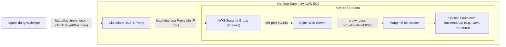

# TÀI LIỆU HƯỚNG DẪN TRIỂN KHAI HỆ THỐNG BACKEND (AWS EC2, NGINX & CLOUDFLARE)

 

Triển khai hệ thống backend cho người mới bắt đầu.
Những kiến thức cơ bản giúp bạn có thể triển khai một hệ thống backend lên server một cách hiệu quả.

> **Lưu ý:** Đây là tài liệu ghi chép, tổng hợp và tóm tắt lại kiến thức cá nhân của tôi trong quá trình học.

---

## Mục lục

- [Lời mở đầu](#lời-mở-đầu)
- [Giới thiệu](#giới-thiệu)
- [Chương 1: Tổng quan và Kiến trúc hệ thống](#chương-1-tổng-quan-và-kiến-trúc-hệ-thống)
  - [Mục tiêu tài liệu](#mục-tiêu-tài-liệu)
  - [Kiến trúc triển khai (Deployment Architecture)](#kiến-trúc-triển-khai-deployment-architecture)
  - [Yêu cầu tiên quyết (Prerequisites)](#yêu-cầu-tiên-quyết-prerequisites)
- [Chương 2: Đóng gói ứng dụng (Containerization)](#chương-2-đóng-gói-ứng-dụng-containerization)
  - [Chuẩn bị ứng dụng để đóng gói](#chuẩn-bị-ứng-dụng-để-đóng-gói)
  - [Xây dựng Dockerfile](#xây-dựng-dockerfile)
  - [Quản lý đa dịch vụ với Docker Compose](#quản-lý-đa-dịch-vụ-với-docker-compose)
  - [Lưu trữ Image trên Container Registry](#lưu-trữ-image-trên-container-registry)
- [Chương 3: Khởi tạo và Cấu hình Môi trường Đám mây (AWS EC2)](#chương-3-khởi-tạo-và-cấu-hình-môi-trường-đám-mây-aws-ec2)
  - [Khởi tạo máy chủ ảo (EC2 Instance)](#khởi-tạo-máy-chủ-ảo-ec2-instance)
  - [Cấu hình bảo mật mạng (Security Groups)](#cấu-hình-bảo-mật-mạng-security-groups)
  - [Cài đặt môi trường Runtime trên Linux](#cài-đặt-môi-trường-runtime-trên-linux)
- [Chương 4: Triển khai và Vận hành Ứng dụng](#chương-4-triển-khai-và-vận-hành-ứng-dụng)
  - [Khởi chạy hệ thống Container](#khởi-chạy-hệ-thống-container)
  - [Quản lý và Debug (Xử lý sự cố)](#quản-lý-và-debug-xử-lý-sự-cố)
- [Chương 5: Thiết lập Web Server và Reverse Proxy (Nginx)](#chương-5-thiết-lập-web-server-và-reverse-proxy-nginx)
  - [Cài đặt Nginx](#cài-đặt-nginx)
  - [Cấu hình Reverse Proxy](#cấu-hình-reverse-proxy)
- [Chương 6: Tên miền và Chống DDoS (Cloudflare)](#chương-6-tên-miền-và-chống-ddos-cloudflare)
  - [Thiết lập DNS Cơ bản](#thiết-lập-dns-cơ-bản)
  - [Kích hoạt lớp bảo vệ Cloudflare](#kích-hoạt-lớp-bảo-vệ-cloudflare)
- [Chương 7: Bảo mật SSL/TLS (Giao thức HTTPS)](#chương-7-bảo-mật-ssltls-giao-thức-https)
  - [Khởi tạo chứng chỉ số](#khởi-tạo-chứng-chỉ-số)
  - [Cấu hình chứng chỉ lên Server](#cấu-hình-chứng-chỉ-lên-server)
- [Chương 8: Kiểm thử và Vận hành (Testing & Operation)](#chương-8-kiểm-thử-và-vận-hành-testing--operation)
  - [Kiểm thử toàn diện](#kiểm-thử-toàn-diện)
  - [Bảo trì và Cập nhật (Hướng phát triển)](#bảo-trì-và-cập-nhật-hướng-phát-triển)

---

## Lời mở đầu
Trong quá trình theo học chuyên ngành Kỹ thuật Phần mềm và trực tiếp xây dựng các dự án thực tế (đặc biệt là các hệ thống sử dụng Spring Boot cho backend), tôi nhận ra có một khoảng cách rất lớn giữa việc ứng dụng chạy mượt mà trên `localhost` và việc vận hành nó trên môi trường internet thực tế. Đơn cử như khi bạn cần một public endpoint ổn định, bảo mật để nhận webhook thanh toán từ các dịch vụ bên thứ ba thay vì phải bật các công cụ tunnel tạm thời như ngrok mỗi ngày, việc tự chủ hạ tầng deploy trở thành một kỹ năng bắt buộc.

Tài liệu này được tôi viết lại như một cuốn "nhật ký kỹ thuật" nhằm hệ thống hóa kiến thức và chuẩn bị một hành trang thực tế vững chắc nhất trên con đường theo đuổi vị trí một Backend Developer chuyên nghiệp. Tài liệu ghi lại toàn bộ quy trình chuẩn mực: từ khâu đóng gói ứng dụng, khởi tạo máy chủ, cho đến lúc ứng dụng chính thức chạy online với tên miền riêng và chứng chỉ bảo mật. 

Hy vọng những ghi chép này không chỉ giúp ích cho bản thân tôi trong việc tra cứu, ôn tập sau này mà còn có thể trở thành một nguồn tham khảo hữu ích, trực quan cho những ai đang gặp khó khăn ở những bước đầu tiên trên con đường đưa sản phẩm lên "mây".

## Giới thiệu
Triển khai (Deploy) một hệ thống backend không chỉ đơn thuần là thao tác copy mã nguồn lên một cái máy tính khác có kết nối mạng. Để hệ thống chạy ổn định, an toàn và dễ dàng bảo trì hoặc mở rộng sau này, chúng ta cần sự kết hợp của nhiều tầng công nghệ khác nhau.

Trong tài liệu này, tôi lựa chọn sử dụng một "tech stack" cực kỳ phổ biến và mang tính tiêu chuẩn trong thực tế ngành phần mềm hiện nay:

* **[Docker](https://www.docker.com/) (Containerization):** Công cụ đóng gói ứng dụng. Docker giải quyết triệt để bài toán "code chạy được trên máy tôi nhưng lỗi trên server". Mọi thứ từ môi trường chạy (runtime), thư viện, cấu hình đều được đóng gói thành một Image duy nhất.
* **[AWS EC2](https://aws.amazon.com/ec2/) (Elastic Compute Cloud):** Dịch vụ cung cấp máy chủ ảo (VPS) mạnh mẽ và uy tín từ Amazon Web Services. Đây sẽ là "mảnh đất" chạy hệ điều hành Linux (Ubuntu) để host các container của chúng ta.
* **[Nginx](https://nginx.org/en/) (Web Server & Reverse Proxy):** Đóng vai trò là "người gác cổng". Nginx sẽ đứng ở vòng ngoài, tiếp nhận các luồng giao thông (traffic) từ internet và điều phối chúng một cách an toàn vào đúng các dịch vụ đang chạy ngầm bên trong server.
* **[Cloudflare](https://www.cloudflare.com/) (DNS & Security):** Dịch vụ phân giải tên miền (DNS) kiêm luôn vai trò làm khiên chắn bảo vệ hệ thống khỏi các đợt tấn công DDoS. Đồng thời, Cloudflare cũng hỗ trợ cấp phát chứng chỉ SSL/TLS, giúp các API endpoint của chúng ta được truyền tải qua giao thức HTTPS (ổ khóa xanh) an toàn tuyệt đối.

---

## Chương 1: Tổng quan và Kiến trúc hệ thống

### Mục tiêu tài liệu
Mục tiêu cốt lõi của tài liệu này là ghi chép lại một lộ trình thực thi (Action Plan) rõ ràng và chuẩn mực để đưa một ứng dụng backend (ví dụ: các hệ thống Spring Boot/Java) từ môi trường phát triển cục bộ (Local Development) lên môi trường triển khai thực tế (Production).

Sau khi hoàn thành các bước trong tài liệu này, hệ thống backend phải đạt được các tiêu chuẩn sau:

- Tính sẵn sàng cao (High Availability): Ứng dụng chạy 24/7 trên hạ tầng đám mây (Cloud), cho phép người dùng hoặc các dịch vụ bên thứ ba (ví dụ: test nhận request từ các dịch vụ ngân hàng/cổng thanh toán) truy cập bất cứ lúc nào qua public endpoint ổn định.

- Tính bảo mật (Security): Toàn bộ đường truyền dữ liệu phải được mã hóa qua giao thức HTTPS (ổ khóa xanh). Địa chỉ IP thật của máy chủ chủ (origin server) được ẩn giấu để chống lại các đợt tấn công dò quét mạng hoặc từ chối dịch vụ (DDoS).

- Tính đóng gói và di động (Portability): Tận dụng tối đa công nghệ Docker để đóng gói ứng dụng, đảm bảo tuyệt đối rằng "code chạy được trên máy developer thì cũng sẽ chạy được trên server", loại bỏ rủi ro do xung đột thư viện hay phiên bản hệ điều hành.

---

### Kiến trúc triển khai (Deployment Architecture)

Mô hình triển khai này sử dụng cấu trúc đa tầng để tối ưu hóa giữa hiệu năng và bảo mật. Dưới đây là sơ đồ luồng dữ liệu (Request Flow) từ người dùng đến ứng dụng.

Sơ đồ luồng (ASCII Flow):



Giải thích vai trò các thành phần trong luồng:

1. **Người dùng (Client)**: Gửi yêu cầu qua tên miền chính thức.

2. **Cloudflare (Entry Point & Security)**:

    - Tiếp nhận yêu cầu đầu tiên.

    - Làm nhiệm vụ phân giải tên miền (DNS).

    - Hỗ trợ chế độ Proxy ("đám mây màu cam") để ẩn IP Public thật của máy chủ AWS.

    - Giải mã SSL (HTTPS) đầu vào và quản lý chứng chỉ bảo mật.

    - Tự động ngăn chặn các đợt tấn công DDoS cơ bản.

3. **AWS Security Group (Cloud Firewall)**: Tường lửa cấp hạ tầng của AWS. Chỉ mở các cổng cần thiết (Port 22 cho SSH, 80 cho HTTP và 443 cho HTTPS) và chỉ cho phép các dải IP của Cloudflare truy cập vào (nếu cần cấu hình chặt chẽ).

4. **Nginx (Web Server & Reverse Proxy)**: Đứng ở tầng hệ điều hành của EC2. Nginx nhận request từ cổng 80/443 và thực hiện điều phối dữ liệu (proxy_pass) vào port nội bộ của Docker Container đang chạy backend.

5. **Docker Container (Backend Layer)**: Nơi chứa mã nguồn ứng dụng (ví dụ: file .jar của Spring Boot) đã được đóng gói hoàn chỉnh. Ứng dụng xử lý logic và trả kết quả ngược lại theo đúng quy trình trên.

---

### Yêu cầu tiên quyết (Prerequisites)

Để đảm bảo quá trình thực hành theo tài liệu diễn ra suôn sẻ, bạn cần chuẩn bị sẵn các thành phần sau:

Về phía Mã nguồn & Công cụ (Local Machine):

- Ứng dụng Backend: Đã hoàn thiện tính năng cơ bản, đã được viết sẵn `Dockerfile` và `docker-compose.yml`.

- **SSH Client**: Công cụ để điều khiển server từ xa (Terminal trên Linux/macOS, hoặc MobaXterm, PuTTY trên Windows).

Về phía Tài khoản & Hạ tầng (Cloud Services):

- Tài khoản **Docker Hub**: Kho chứa Image để vận chuyển ứng dụng từ máy local lên server.

- Tài khoản **AWS**: Đã kích hoạt và có quyền tạo mới máy chủ ảo **EC2** (Gói Free Tier là đủ cho việc học).

- Tên miền (Domain Name): Một tên miền đã sở hữu (Ví dụ: `.vn`, `.com` mua từ bất kỳ nhà đăng ký nào).

- Tài khoản **Cloudflare**: Đã sẵn sàng và tên miền đã được chuyển Nameserver về Cloudflare để quản lý.

---

## Chương 2: Đóng gói ứng dụng (Containerization)

Đóng gói (Containerization) là bước chuyển giao mã nguồn từ dạng "code thô" thành một khối (Image) có thể tự chạy độc lập ở bất kỳ đâu. Phần này sử dụng Docker làm công cụ cốt lõi.

### Chuẩn bị ứng dụng để đóng gói

Trước khi đưa ứng dụng vào **Docker**, mã nguồn cần được cấu hình lại để tách biệt giữa môi trường phát triển (Local) và môi trường thực tế (Production).

1. Thiết lập dự án cơ bản

Tạo nhiều file cấu hình (**Profiles**) trong thư mục `src/main/resources`:

- `application.yml` / `application.properties` (Cấu hình chung mặc định).

- `application-dev.yml` / `application-dev.properties` (Dùng cho local, kết nối database ở localhost).

- `application-prod.yml` / `application-prod.properties` (Dùng cho server thực tế).

2. Thiết lập biến môi trường (Environment Variables) cho từng file

Tuyệt đối không hardcode (viết cứng) thông tin nhạy cảm như `username`, `password` của Database hay `Secret Key` trực tiếp vào mã nguồn hoặc file `application.yml` rồi push lên Git. Thay vào đó nên sử dụng biến môi trường và ứng dụng sẽ đọc các cấu hình này từ hệ điều hành (hoặc từ Docker) khi khởi chạy.

- `application.yml` / `application.properties`: Đây là file sẽ cấu hình các thông số chung cho toàn bộ dự án như: server port, enable các service bên ngoài, các biến chung mặc định,...

- `application-dev.yml` / `application-dev.properties`: Đây là file dùng để cấu hình cho việc lập trình trên chính máy của dev. Ở đây các đường dẫn thường chứa `localhost` và sẽ sử dụng file .env để inject các cấu hình vào biến môi trường.

- `application-prod.yml` / `application-prod.properties`: Cuối cùng là file chứa các cấu hình hoàn chỉnh cho một production sẵn sàng chạy trên server. Thường thì file này sẽ lấy cấu hình từ các biến môi trường được define ở `docker-compose.yml`.

Ví dụ: `${TÊN_BIẾN:giá_trị_mặc_định}`

```properties
spring.datasource.url=jdbc:mysql://${DB_HOST:localhost}:${DB_PORT:3306}/${DB_NAME:mydb}
spring.datasource.username=${DB_USER:root}
spring.datasource.password=${DB_PASS:}
```

3. Đóng gói ứng dụng thành file thực thi `.jar` bằng Maven:

  ```bash
  mvn clean package -DskipTests
  ```

Kết quả: File `.jar` sẽ được tạo ra trong thư mục `target/`.

---

### Xây dựng Dockerfile

`Dockerfile` là một bản hướng dẫn (recipe) để **Docker** biết cách xây dựng **Image** cho ứng dụng của bạn.

> Tài liệu tham khảo: [Spring Boot with Docker](https://spring.io/guides/gs/spring-boot-docker)

Hướng dẫn và Lưu ý thường gặp:

- Thứ tự **Layer**: Docker build image theo từng lớp (layer) từ trên xuống. Lệnh nào ít thay đổi (như tải thư viện) nên để ở trên, lệnh nào hay thay đổi (như copy mã nguồn) nên để ở dưới để tận dụng Cache, giúp build nhanh hơn.

- Lưu ý: Không nên dùng các base image quá nặng (như ubuntu ~70MB) để chạy Java. Hãy dùng các bản rút gọn.

1. Thiết lập cơ bản

Một `Dockerfile` tiêu chuẩn nằm ở thư mục gốc của dự án sau khi bạn đã tự build ra file `.jar`:

```Dockerfile
# Sử dụng base image có sẵn Java 21
FROM maven:3.9.6-eclipse-temurin-21 AS build

# Thư mục làm việc bên trong container
WORKDIR /app

# Copy file jar từ local vào container
COPY target/*.jar app.jar

# Mở port (chỉ mang tính document, thực tế map port lúc chạy, thường mình sẽ để 8081)
EXPOSE 8080

# Lệnh khởi chạy ứng dụng
ENTRYPOINT ["java", "-jar", "app.jar"]
```

2. Tối ưu và nâng cao

Phương pháp cơ bản trên yêu cầu máy tính/server của bạn phải cài sẵn **Maven** để build ra file `.jar` trước. Với Multi-stage build, ta dùng chính Docker để build code, sau đó chỉ lấy file `.jar` kết quả bỏ sang một Image siêu nhẹ để chạy. Cực kỳ hữu ích cho CI/CD!

```Dockerfile
# Lớp 1: Build mã nguồn (Có chứa Maven)
FROM maven:3.9.6-eclipse-temurin-21 AS build
WORKDIR /app

# Sao chép file pom chứa cấu hình và thư viện dự án
COPY pom.xml . 

# Tải trước thư viện để cache (nếu pom.xml không đổi)
RUN mvn dependency:go-offline
COPY src ./src

# Build ra file jar
RUN mvn clean package -DskipTests

# Lớp 2: Chạy ứng dụng (Chỉ chứa JRE siêu nhẹ)
FROM openjdk:21-ea-21-jdk-slim
WORKDIR /app

# Lấy file jar từ Lớp 1 (builder) sang
COPY --from=builder /app/target/*.jar app.jar
EXPOSE 8081
ENTRYPOINT ["java", "-jar", "app.jar"]
```

Nên sử dụng cách này sẽ tạo được Image cuối cùng rất nhẹ.

---

### Quản lý đa dịch vụ với Docker Compose

Một backend thực tế hiếm khi đứng một mình, nó cần Database, Redis, Kafka,... để chạy đồng thời trong dự án. Ngoài ra nếu xây dựng hệ thống Microservices thì sẽ cần chạy các service gateway, cloud và các service khác liên quan chạy đồng thời. `docker-compose.yml` giúp khởi chạy toàn bộ cụm này bằng 1 câu lệnh.

> Tài liệu tham khảo: [Docker Compose File Reference](https://docs.docker.com/reference/compose-file/)

1. Thiết lập cơ bản

File `docker-compose.yml` định nghĩa 2 service: app và database.

```YAML
version: '3.9'
services:
  mysql:
    image: mysql:8.0
    container_name: mysql-db
    # Nếu bạn muốn ứng dụng chạy local của mình có thể kết nối một service (ví dụ là database) đang chạy trên docker thì có thể dùng mapping port
    # Ở đây mình sử dụng 3307 để phân biệt với cổng mặc định của MySQL là 3306, từ đó ứng dụng bên ngoài có thể kết nối chính xác đến database đang chạy ở trong docker. Tương tự với các service khác. Còn 3306 (Internal) nghĩa là port dùng để các container khác trong cùng một file docker-compose.yml kết nối.
    ports:
      - "3307:3306" # External:Internal
    # Môi trường sẽ sử dụng biến được lấy ở trong file môi trường của dự án.
    environment:
      MYSQL_ROOT_PASSWORD: ${MYSQL_ROOT_PASSWORD}
      MYSQL_DATABASE: ${MYSQL_DATABASE}

  backend-app:
    build: .
    container_name: my-app
    ports:
      - "8080:8080"
    env_file:
      - .env # Đọc cấu hình từ file .env ẩn
    environment:
      - SPRING_DATASOURCE_URL=jdbc:mysql://mysql:3306/${MYSQL_DATABASE}
      - SPRING_DATASOURCE_USERNAME=root
      - SPRING_DATASOURCE_PASSWORD=${MYSQL_ROOT_PASSWORD}
    # Trước khi ứng dụng được chạy ta cần đảm bảo container database đã được chạy, từ đó tránh việc database chưa chạy xong mà ứng dụng đã query tới, gây lỗi ứng dụng.
    depends_on:
      - mysql-db
```

2. Tối ưu và nâng cao

Bổ sung **Volumes** (để không mất dữ liệu DB khi xóa container) và thêm **Healthcheck** (để Backend đợi DB khởi động xong mới chạy).

```YAML
version: '3.9'
services:
  mysql:
    image: mysql:8.0
    container_name: mysql-db
    ports:
      - "3307:3306"
    environment:
      MYSQL_ROOT_PASSWORD: ${MYSQL_ROOT_PASSWORD}
      MYSQL_DATABASE: ${MYSQL_DATABASE}
    volumes:
      - db_data:/var/lib/mysql # Lưu trữ dữ liệu vĩnh viễn
    healthcheck:
      test: [ "CMD-SHELL", "mysqladmin ping -h localhost -u root -p${MYSQL_ROOT_PASSWORD} || exit 1" ]
      interval: 10s
      timeout: 5s
      retries: 5
      start_period: 30s
    networks:
      - my_network

  backend-app:
    build: .
    container_name: my-app
    ports:
      - "8080:8080"
    env_file:
      - .env # Đọc cấu hình từ file .env ẩn
    depends_on:
      mysql-db:
        condition: service_healthy # Đợi DB thực sự ping được mới chạy App
    networks:
      - my_network

volumes:
  db_data:

# Network dùng để các container có thể giao tiếp qua lại với nhau
networks:
  my_network:
    driver: bridge
```

---

### Lưu trữ Image trên Container Registry

Khi **Image** đã được đóng gói thành công ở máy local, ta cần đưa nó lên một kho lưu trữ đám mây (Registry) để lát nữa máy chủ **AWS EC2** có thể kéo (Pull) về.

> Tài liệu tham khảo: [Docker Hub Quickstart](https://docs.docker.com/docker-hub/quickstart/)

Hướng dẫn chi tiết 2 cách thực hiện:

1. Sử dụng **Docker Desktop**

Cách này rất tiện lợi khi bạn đang làm việc trên máy tính cá nhân (Windows/macOS) và muốn thao tác nhanh bằng chuột.

- Khởi động ứng dụng **Docker Desktop** và đảm bảo bạn đã đăng nhập tài khoản Docker Hub ở góc trên bên phải giao diện.
- Điều hướng sang tab **Images** ở thanh menu bên trái.
- Trong danh sách "Local", tìm đến Image bạn vừa build (ví dụ: `my-backend-app`).
- Nhấn vào biểu tượng **dấu ba chấm** (More Options) ở cuối dòng của Image đó -> Chọn **Push to Hub**.
- Một cửa sổ hiện ra, bạn điền **Namespace** (chính là username Docker Hub của bạn) và **Repository** (tên kho chứa). Bổ sung thêm tag (ví dụ: `v1.0`).
- Nhấn **Push** và theo dõi thanh tiến trình chạy đến khi hoàn tất.

2. Sử dụng **Docker CLI** (Dòng lệnh - Khuyên dùng)

Dù dùng giao diện rất trực quan, bạn bắt buộc phải thành thạo cách dùng dòng lệnh. Lý do là vì máy chủ **VPS (Ubuntu/EC2)** hay các hệ thống tự động cấu hình (CI/CD) hoàn toàn không có giao diện chuột để bạn click.

- Đăng nhập (hoặc đăng kí) tài khoản trên [Docker Hub](https://hub.docker.com/)

- Đăng nhập Docker trên máy tính: Mở **Terminal/CMD** (Ở thư mục dự án có chứa Dockerfile) và gõ lệnh sau. Hệ thống sẽ yêu cầu bạn nhập **Username** và **Password** (hoặc Access Token nếu tài khoản bật bảo mật 2 lớp).

```bash
docker login
```

  - Trường hợp 1 (Build mới hoàn toàn): Build image với tên đúng chuẩn `<username>/<repository>:<tag>`:

```bash
docker build -t your_docker_username/backend-api:v1.0 .
```

  - Trường hợp 2 (Đã có sẵn Image ở local): Dùng lệnh tag để đổi tên Image cũ sang tên mới đúng chuẩn:

```bash
docker tag backend-api:latest your_docker_username/backend-api:v1.0
```

- Đẩy lên kho lưu trữ:

```bash
docker push your_docker_username/backend-api:v1.0
```

3. Tối ưu và nâng cao

- Sử dụng Tag động: Push đồng thời 2 tag: một tag version cụ thể (v1.0, v1.1) để lưu trữ lịch sử, và một tag latest để lát nữa khi kéo code trên server EC2, hệ thống tự động nhận bản mới nhất mà không cần bạn phải vào sửa lại file script.

- Registry bảo mật (Private Registry): Thay vì dùng Docker Hub (nơi repo public bị lộ code), hãy chuyển sang sử dụng GitHub Container Registry (ghcr.io) hoặc AWS ECR. Nó hoàn toàn miễn phí cho repository private và tích hợp cực tốt với GitHub Actions trong giai đoạn CI/CD tự động.

4. Lưu ý

- Bảo mật: Không bao giờ push .env file hoặc image có chứa mật khẩu thật lên Docker Hub public.

- Tagging: Hạn chế sử dụng duy nhất tag latest. Nếu bản latest bị lỗi, bạn sẽ không biết quay về (rollback) bản nào.

---

## Chương 3: Khởi tạo và Cấu hình Môi trường Đám mây (AWS EC2)

Sau khi mã nguồn đã được đóng gói gọn gàng thành Docker Image, chúng ta cần một "mảnh đất" trên internet để chạy nó. Trong tài liệu này, AWS EC2 (Elastic Compute Cloud) được lựa chọn vì tính ổn định và có gói Free Tier (miễn phí 1 năm) rất phù hợp để học tập và làm dự án nhỏ.

### Khởi tạo máy chủ ảo (EC2 Instance)

Đây là bước đi thuê một chiếc máy tính ảo (VPS) chạy hệ điều hành Linux và đặt nó tại trung tâm dữ liệu của Amazon.

> Tài liệu tham khảo: [Hướng dẫn tạo EC2 Instance từ AWS](https://docs.aws.amazon.com/AWSEC2/latest/UserGuide/EC2_GetStarted.html)

1. Đăng nhập vào [AWS Management Console](https://console.aws.amazon.com/).
2. Chuyển vùng (Region) ở góc trên bên phải về khu vực gần người dùng nhất để tối ưu tốc độ (Ví dụ: `ap-southeast-1` - Singapore).
3. Tìm kiếm dịch vụ **EC2** và chọn **Launch Instance** (Khởi tạo máy chủ mới).
4. **Name:** Đặt tên cho server (ví dụ: `my-backend-server`).
5. **Amazon Machine Image (AMI):** Chọn hệ điều hành **Ubuntu**. Nên chọn phiên bản `Ubuntu Server 24.04 LTS` hoặc `22.04 LTS` (có gắn mác *Free tier eligible*).
6. **Instance type:** Chọn `t2.micro` (đây là gói được miễn phí, có 1 vCPU và 1GB RAM, đủ để chạy 1 backend cơ bản).
7. **Key pair (Cực kỳ quan trọng):** * Chọn **Create new key pair**.
   * Đặt tên (ví dụ: `aws-ec2-key`), định dạng `.pem` (cho Mac/Linux) hoặc `.ppk` (nếu dùng PuTTY trên Windows).
   * Nhấn **Create** và tải file này về. **Lưu ý:** Cất giữ file này thật cẩn thận vì AWS chỉ cho tải 1 lần duy nhất, mất file này đồng nghĩa với việc mất quyền truy cập vào server.
8. Nhấn **Launch Instance** và đợi khoảng 1-2 phút để máy chủ khởi động.

---

### Cấu hình bảo mật mạng (Security Groups)

Mặc định, AWS đóng cửa toàn bộ các cổng mạng để bảo vệ server. Chúng ta phải chủ động mở "cửa" cho những luồng giao thông (traffic) cần thiết đi vào.

1. Trong màn hình quản lý EC2, chọn Instance bạn vừa tạo.
2. Chuyển sang tab **Security** ở nửa dưới màn hình -> Bấm vào link của **Security groups**.
3. Chọn **Edit inbound rules** (Chỉnh sửa quy tắc đầu vào) và thêm các cổng sau:
   * **Type: SSH | Port: 22 | Source: Anywhere-IPv4 (`0.0.0.0/0`)** -> Mở cửa để bạn có thể remote điều khiển server. *(Tối ưu: Nếu IP nhà mạng của bạn là IP tĩnh, hãy chọn "My IP" thay vì Anywhere để bảo mật tuyệt đối).*
   * **Type: HTTP | Port: 80 | Source: Anywhere-IPv4** -> Mở cửa cho Web server (Nginx).
   * **Type: HTTPS | Port: 443 | Source: Anywhere-IPv4** -> Mở cửa cho kết nối an toàn có SSL.

**Lưu ý bảo mật (Nguyên tắc Least Privilege):** Nhiều bạn có thói quen mở luôn Port 8080 (cổng chạy Spring Boot) ra ngoài internet. Điều này là **KHÔNG NÊN**. Chúng ta sẽ dùng Nginx (ở Port 80) làm proxy hứng traffic rồi đẩy ngầm vào Port 8080 bên trong. Port 8080 của ứng dụng chỉ nên được cô lập ở mạng nội bộ (localhost).

---

### Cài đặt môi trường Runtime trên Linux

---

## Chương 4: Triển khai và Vận hành Ứng dụng

### Khởi chạy hệ thống Container
*(Sử dụng lệnh `docker-compose up -d`)*

### Quản lý và Debug (Xử lý sự cố)
*(Cách xem log bằng `docker logs` và truy cập container bằng `docker exec`)*

---

## Chương 5: Thiết lập Web Server và Reverse Proxy (Nginx)

### Cài đặt Nginx
*(Lệnh `sudo apt install nginx`)*

### Cấu hình Reverse Proxy
*(Điều hướng traffic từ port 80/443 vào port của Container đang chạy ứng dụng)*

---

## Chương 6: Tên miền và Chống DDoS (Cloudflare)

### Thiết lập DNS Cơ bản
*(Trỏ bản ghi `A record` về IP của EC2)*

### Kích hoạt lớp bảo vệ Cloudflare
*(Bật đám mây màu cam)*

---

## Chương 7: Bảo mật SSL/TLS (Giao thức HTTPS)

### Khởi tạo chứng chỉ số
*(Cách tạo Origin Certificate trên Cloudflare)*

### Cấu hình chứng chỉ lên Server
*(Cấu hình Nginx đọc file `.pem` và `.key`, thiết lập ép buộc HTTPS)*

---

## Chương 8: Kiểm thử và Vận hành (Testing & Operation)

### Kiểm thử toàn diện
*(Test gọi API qua Postman, test các luồng nhận Webhook thanh toán (ví dụ: Tingee) qua mạng public)*

### Bảo trì và Cập nhật (Hướng phát triển)
*(Cách update phiên bản mới, định hướng dùng GitHub Actions)*