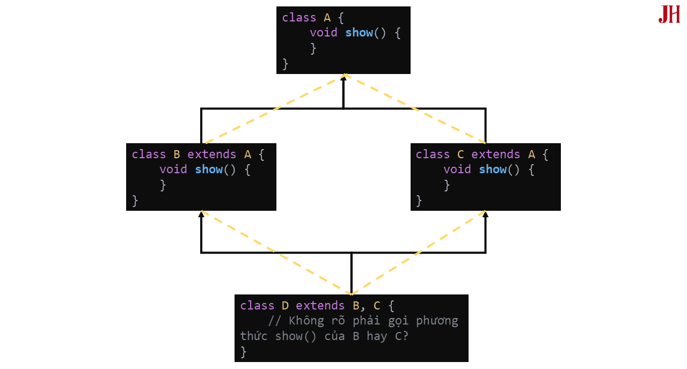
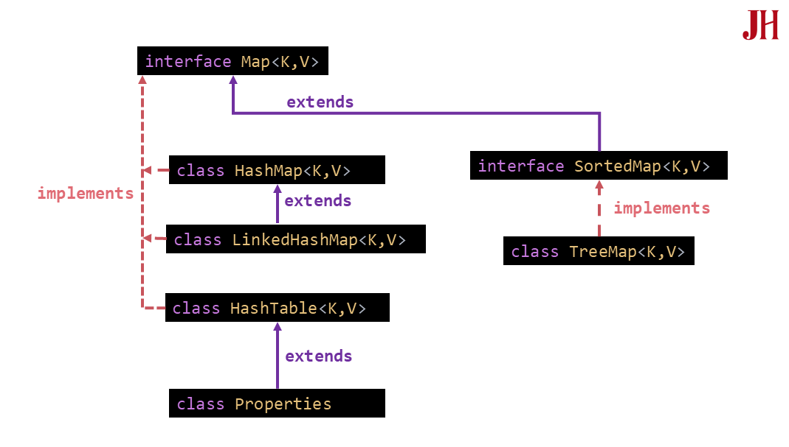

# JAVA CORE

 

## 4 Tính Chất Quan Trọng Của OOP

> Nguồn: [JavaHighlight](https://javahighlight.com/java/lap-trinh-huong-doi-tuong-trong-java)

### 1. Tính đóng gói (Encapsulation)

Là việc đóng gói dữ liệu (các biến) và các phương thức thao tác trên dữ liệu đó trong một lớp, nhằm che giấu thông tin bên trong lớp và chỉ cung cấp những gì cần thiết thông qua các phương thức công khai (public methods).

---

### 2. Tính kế thừa (Inheritance)

Kế thừa trong java là sự liên quan giữa hai class với nhau, trong đó có class cha (superclass) và class con (subclass). Khi kế thừa class con được hưởng tất cả các phương thức và thuộc tính của class cha. Tuy nhiên, nó chỉ được truy cập các thành viên **public** và **protected** của class cha. Nó không được phép truy cập đến thành viên **private** của class cha.

#### Các kiểu kế thừa trong java

- Các kiểu kế thừa theo lớp

    - *Đơn kế thừa (Single Inheritance)*: Một lớp chỉ có thể kế thừa từ một lớp cha duy nhất. Đây là kiểu kế thừa phổ biến nhất trong Java.

    - *Kế thừa đa cấp (Multilevel Inheritance)*: Một lớp kế thừa từ một lớp cha, lớp cha này lại kế thừa từ một lớp cha khác và cứ thế. Tạo thành một chuỗi kế thừa nhiều cấp.

    - *Kế thừa thứ bậc (Hierarchical Inheritance)*: Nhiều lớp con kế thừa từ cùng một lớp cha.

#### Tại sao Java không hỗ trợ đa kế thừa trực tiếp qua lớp?

Một trong những vấn đề nổi bật nhất là "Diamond Problem" (Vấn đề kim cương):

- Giả sử bạn có 4 lớp: A, B, C, và D.

- Lớp B và C đều kế thừa từ lớp A.

- Lớp D kế thừa cả lớp B và lớp C.

Trong trường hợp này, lớp D sẽ có hai bản sao của tất cả các phương thức và biến từ lớp A (thông qua lớp B và lớp C). Nếu lớp A có một phương thức, lớp D sẽ không biết chính xác phải sử dụng phiên bản nào của phương thức đó - phiên bản từ B hay từ C? Điều này dẫn đến sự mơ hồ và xung đột.



**=> Giải pháp:** 

- Đa kế thừa qua Interface

- Sử dụng các lớp trừu tượng

---

### 3. Tính đa hình (Polymorphism)

Tính đa hình cho phép một đối tượng có thể thực hiện các hành động (phương thức) theo nhiều cách khác nhau. Điều này có nghĩa là cùng một giao diện hoặc phương thức, nhưng các đối tượng khác nhau có thể triển khai và thực hiện hành động đó theo cách riêng của mình.

---

### 4. Tính trừu tượng (Abstraction)

Trừu tượng (Abstraction) là quá trình ẩn đi chi tiết triển khai và chỉ hiển thị chức năng cho người dùng. Nói cách khác, nó chỉ cho người dùng thấy những phần quan trọng và giấu đi các chi tiết bên trong. Trừu tượng giúp bạn tập trung vào những gì đối tượng làm thay vì cách nó làm.

---

## String Class

> Nguồn: [JavaHighlight](https://javahighlight.com/java/lop-string-trong-java)

### StringBuffer

`StringBuffer` là một lớp trong Java đại diện cho một chuỗi ký tự có thể thay đổi. Khác với lớp String là bất biến (không thể thay đổi), `StringBuffer` cho phép bạn sửa đổi nội dung của chuỗi mà không cần tạo ra một đối tượng mới mỗi lần.

#### Đặc điểm

- An toàn cho đa luồng: Các phương thức của `StringBuffer` được đồng bộ hóa, đảm bảo rằng các hoạt động trên cùng một đối tượng `StringBuffer` từ nhiều luồng khác nhau diễn ra theo một thứ tự nhất quán.

- Có thể thay đổi: Bạn có thể thêm, xóa hoặc thay thế các ký tự trong một đối tượng `StringBuffer`.

- Có dung lượng: Mỗi `StringBuffer` có một dung lượng. Nếu chuỗi vượt quá dung lượng, bộ nhớ sẽ tự động được mở rộng.

#### So sánh `String` & `StringBuffer`

| Tiêu chí | `String` | `StringBuffer` |
|-------|-----------|------------|
| **Tính chất** | Bất biến (immutable) | Có thể thay đổi (mutable) |
| **Hiệu suất thay đổi** |Kém hiệu quả với các thao tác thay đổi nhiều lần vì tạo ra đối tượng mới mỗi lần thay đổi. | Hiệu quả hơn với các thao tác thay đổi nhiều lần vì thay đổi trực tiếp trên đối tượng hiện tại. |
| **An toàn trong đa luồng** | An toàn (thread-safe) vì là bất biến. | An toàn (thread-safe) vì các phương thức được đồng bộ hóa. |
| **Khả năng mở rộng** | Không mở rộng kích thước (đối tượng không thay đổi). | Tự động mở rộng kích thước khi cần. |
| **Phương thức thay đổi** | Không có phương thức để thay đổi nội dung. | Cung cấp các phương thức như append(), insert(), delete(), replace(). |
| **Sử dụng trong đa luồng** | Thích hợp khi làm việc với chuỗi không thay đổi. | Thích hợp khi làm việc với chuỗi thay đổi trong môi trường đa luồng. |
| **Khả năng tối ưu hóa** | Tối ưu cho các thao tác với chuỗi bất biến. | Tối ưu cho các thao tác thay đổi chuỗi. |
| **Khả năng điều chỉnh kích thước** | Không hỗ trợ điều chỉnh kích thước. | Hỗ trợ điều chỉnh kích thước tự động. |
| **Tạo đối tượng mới** | 	Tạo đối tượng mới khi thực hiện thao tác thay đổi. | Không tạo đối tượng mới khi thay đổi nội dung. |

#### Các phương thức của `StringBuffer`

- `append()`: thêm dữ liệu vào cuối chuỗi của lớp `StringBuffer`.

- `delete()`: xóa ký tự hoặc chuỗi của lớp `StringBuffer`.

- `insert()`: chèn dữ liệu vào một vị trí cụ thể của lớp `StringBuffer`.

- `replace(startIndex, endIndex, replacement)` / `setCharAt(int index, char ch)`: thay đổi đoạn / kí tự.

- `reverse()`: Đảo ngược toàn bộ thứ tự các ký tự trong chuỗi `StringBuffer`.

---

### StringBuilder

`StringBuilder` là một lớp trong Java đại diện cho một chuỗi ký tự có thể thay đổi. Nó tương tự như `StringBuffer` nhưng **không đảm bảo tính đồng bộ**, điều này làm cho nó **nhanh hơn** trong môi trường đơn luồng.

#### Đặc điểm

- Có thể thay đổi: Bạn có thể thêm, xóa hoặc thay thế các ký tự trong một đối tượng `StringBuilder`.

- Không an toàn cho đa luồng: Các phương thức của `StringBuilder` không được đồng bộ hóa, vì vậy không nên sử dụng nó trong môi trường đa luồng.

- Có dung lượng: Mỗi `StringBuilder` có một dung lượng. Nếu chuỗi vượt quá dung lượng, bộ nhớ sẽ tự động được mở rộng.

#### So sánh `StringBuffer` & `StringBuilder`

**Đồng bộ hóa (Synchronization):**

- `StringBuffer`: Là một lớp đồng bộ hóa (synchronized). Điều này có nghĩa là các phương thức của `StringBuffer` được thiết kế để an toàn khi sử dụng trong môi trường đa luồng. Khi nhiều luồng cùng truy cập và sửa đổi một đối tượng `StringBuffer`, các phương thức sẽ được thực thi một cách tuần tự, tránh xung đột dữ liệu.

- `StringBuilder`: Không đồng bộ. Điều này làm cho `StringBuilder` hiệu quả hơn `StringBuffer` trong các môi trường đơn luồng, nhưng không an toàn khi sử dụng trong môi trường đa luồng. Nếu nhiều luồng cùng truy cập và sửa đổi một đối tượng `StringBuilder`, có thể dẫn đến các vấn đề về đồng bộ hóa và lỗi không mong muốn.

## Phương Thức `equals()` & `hashCode()` trong Java

> Nguồn: [Viblo](https://viblo.asia/p/phuong-thuc-equals-hashcode-trong-java-tim-hieu-chi-tiet-K9Vy8XyaLQR)

Trong lập trình **Java**, phương thức `equals()` và phương thức `hashCode()` là hai phương thức quan trọng thuộc lớp **Object**, đóng vai trò thiết yếu trong việc so sánh các đối tượng và quản lý dữ liệu trong các cấu trúc như `HashMap`, `HashSet`, hay `Hashtable`.

---

### Phương thức `equals()` trong Java là gì?

Phương thức `equals()` được định nghĩa trong lớp Object và được sử dụng để so sánh xem hai đối tượng có "bằng nhau" hay không. 

Theo mặc định, `equals()` trong lớp Object so sánh **tham chiếu (reference)** của hai đối tượng, tức là kiểm tra xem chúng có cùng **địa chỉ bộ nhớ** hay không.

Tuy nhiên, trong thực tế, bạn thường cần **ghi đè (override)** phương thức `equals()` để so sánh dựa trên nội dung của đối tượng thay vì tham chiếu. 

Ví dụ:

```java
public class Student {
    private int id;
    private String name;

    public Student(int id, String name) {
        this.id = id;
        this.name = name;
    }

    @Override
    public boolean equals(Object obj) {
        if (this == obj) return true;
        if (obj == null || getClass() != obj.getClass()) return false;
        Student student = (Student) obj;    // Ép kiểu cho obj về Student
        return id == student.id && name.equals(student.name);
    }
}
```

---

### Phương thức `hashCode()` trong Java là gì?

Phương thức `hashCode()` cũng thuộc lớp Object và mặc định trả về một giá trị *số nguyên* (hash code) đại diện cho đối tượng. Giá trị này thường được sử dụng trong các cấu trúc dữ liệu dựa trên bảng băm như `HashMap` hay `HashSet` để xác định vị trí lưu trữ của đối tượng.

Cú pháp: `public native int hashCode();` 

Khi bạn ghi đè `equals()`, bạn cũng cần ghi đè `hashCode()` để đảm bảo tính nhất quán theo **hợp đồng hashCode-equals** trong Java:

- Nếu hai đối tượng được coi là bằng nhau qua `equals()`, thì chúng phải có cùng giá trị `hashCode()`.

- Nếu hai đối tượng có cùng `hashCode()`, chúng không nhất thiết phải bằng nhau qua `equals()`.

- `hashCode()` nên trả về giá trị cố định cho một đối tượng không thay đổi trong suốt vòng đời của nó.

Ví dụ:

```java
@Override
public int hashCode() {
    int result = 17; // Số nguyên tố ban đầu
    result = 31 * result + id; // Kết hợp id
    result = 31 * result + name.hashCode(); // Kết hợp name
    return result;
}
```

---

### Tại sao cần ghi đè `equals()` và `hashCode()`?

Việc ghi đè hai phương thức này là cần thiết khi bạn sử dụng các đối tượng trong các cấu trúc dữ liệu như `HashMap`, `HashSet`, hoặc khi bạn muốn so sánh các đối tượng dựa trên nội dung thay vì tham chiếu. Nếu không ghi đè:

- `equals()` chỉ so sánh tham chiếu, dẫn đến kết quả không mong muốn.

- `hashCode()` không nhất quán với `equals()`, gây ra lỗi khi sử dụng `HashMap` hoặc `HashSet`.

Ví dụ, nếu bạn không ghi đè `hashCode()` mà chỉ ghi đè `equals()`, hai đối tượng bằng nhau theo `equals()` có thể được lưu ở các vị trí khác nhau trong `HashMap`, làm mất dữ liệu hoặc gây lỗi truy xuất.

---

### Cách triển khai `equals()` và `hashCode()` hiệu quả

- Kiểm tra tham chiếu trong `equals()`: Sử dụng `this == obj` để tăng hiệu suất khi hai đối tượng cùng trỏ đến một địa chỉ bộ nhớ.

    ```java
    if (this == obj) return true;
    ```

- Kiểm tra `null` và kiểu đối tượng: Đảm bảo đối tượng không null và thuộc cùng lớp trước khi so sánh.

    ```java
    if (obj == null || getClass() != obj.getClass()) return false;
    ```
    
- Sử dụng **số nguyên tố** trong `hashCode()`: Sử dụng các số nguyên tố như **17** và **31** để giảm xung đột hash. Tận dụng thư viện: Sử dụng `Objects.hash()` (Java 7 trở lên) để tạo `hashCode()` nhanh chóng:

    ```java
    @Override
    public int hashCode() {
        return Objects.hash(id, name);
    }
    ```

---

### Các lỗi phổ biến khi triển khai `equals()` và `hashCode()`

- Quên ghi đè cả hai phương thức: Nếu chỉ ghi đè `equals()` mà không ghi đè `hashCode()`, bạn sẽ vi phạm hợp đồng **hashCode-equals**.

- Sử dụng thuộc tính thay đổi trong `hashCode()`: Nếu sử dụng các thuộc tính có thể thay đổi (như `List` hoặc `Array`), giá trị `hashCode()` sẽ thay đổi, gây lỗi trong **HashMap**.

- Hiệu suất kém: Tạo `hashCode()` phức tạp hoặc sử dụng thuật toán không tối ưu có thể làm giảm hiệu suất.

---

### Ứng dụng thực tế của `equals()` và `hashCode()` 

- `HashMap`/`HashSet`: Hai phương thức này được sử dụng để xác định khóa (key) hoặc phần tử duy nhất.

- So sánh đối tượng: Dùng trong các ứng dụng cần kiểm tra sự giống nhau của dữ liệu, như kiểm tra thông tin người dùng.

- Tối ưu hóa hiệu suất: Một `hashCode()` tốt giúp giảm xung đột trong bảng băm, cải thiện tốc độ truy xuất.

---

## Collections

> Nguồn: [JavaHighlight](https://javahighlight.com/java/collection-trong-java)

### Interface Iterable<T>

Interface này cho phép các đối tượng của lớp triển khai nó có thể được duyệt qua trong một vòng lặp "for-each".

#### Các phương thức của Interface Iterable<T>

1. Phương thức `Iterator<T> iterator()`

- Mô tả: Phương thức này trả về một đối tượng `Iterator`.

- Ví dụ:

    ```java
    List<String> fruits = new ArrayList<>();
    fruits.add("Apple");
    fruits.add("Banana");

    Iterator<String> it = fruits.iterator();
    while (it.hasNext()) {
        System.out.println(it.next());
    }
    // Output:
    // Apple
    // Banana
    ```

2. Phương thức default `void forEach(Consumer<? super T> action)`

- Mô tả: Nó thực hiện một hành động của mỗi phần tử trong tập hợp cho đến khi tất cả các phần tử đã được xử lý hoặc có một ngoại lệ được ném ra (`NullPointerException`).

- Ví dụ:

    ```java
    List<Integer> numbers = Arrays.asList(1, 2, 3, 4, 5);
    numbers.forEach(number -> System.out.println("Number: " + number));
    // Output:
    // Number: 1
    // Number: 2
    // Number: 3
    // Number: 4
    // Number: 5
    ```

3. Phương thức default `Spliterator<T> spliterator()`

- Mô tả: Đây cũng là một phương thức được sử dụng để tạo một đối tượng `Spliterator`. `Spliterator` là một phiên bản nâng cao của `Iterator`, được thiết kế đặc biệt để hỗ trợ việc xử lý song song (parallel processing) và chia nhỏ tập dữ liệu hiệu quả hơn.

- Lưu ý triển khai: Mặc dù có một triển khai mặc định, nhưng nhà phát triển thường nên ghi đè phương thức này. Triển khai mặc định thường có khả năng chia nhỏ kém, không xác định kích thước và không báo cáo bất kỳ đặc tính nào của spliterator, dẫn đến hiệu suất không tối ưu cho các thao tác song song.

    ```java
    List<String> items = Arrays.asList("A", "B", "C", "D");
    Spliterator<String> spliterator = items.spliterator();
    // Spliterator có thể được chia nhỏ để xử lý song song
    Spliterator<String> anotherSpliterator = spliterator.trySplit();
    ```
    
- `Spliterator` thường được sử dụng nội bộ bởi các **Stream API** trong Java để xử lý dữ liệu song song. Bạn ít khi gọi trực tiếp phương thức này, nhưng nó là nền tảng cho cách các stream hoạt động.

---

### Interface Set<E>

`Set` là một collection không chứa các phần tử trùng lặp. Hơn nữa, tập hợp có thể chứa tối đa một phần tử null.

#### Đặc điểm

- Không chứa phần tử trùng lặp.

- Tối đa một phần tử null.

- Đặc điểm không duy trì thứ tự.

#### Các phương thức của `Interface Set<E>`

- `void clear()`: Xóa tất cả các phần tử khỏi set.

- `boolean contains(Object o)`: Trả về **true** nếu set này chứa phần tử o.

- `boolean containsAll(Collection<?> c):` Trả về **true** nếu set này chứa tất cả các phần tử trong collection c.

- `boolean equals(Object o)`: So sánh đối tượng đã cho với set này để kiểm tra xem chúng có bằng nhau hay không.

- `int hashCode()`: Trả về giá trị mã băm cho set này.

- `boolean isEmpty()`: Trả về true nếu set này không chứa phần tử nào.

- `Iterator<E> iterator()`: Trả về một iterator duyệt qua các phần tử trong set.

- `boolean remove(Object o)`: Xóa phần tử o khỏi set này nếu nó tồn tại.

- `boolean removeAll(Collection<?> c)`: Xóa tất cả các phần tử của set này cũng có trong collection c.

- `boolean retainAll(Collection<?> c)`: Giữ lại chỉ những phần tử trong set này cũng có trong collection c.

- `int size()`: Trả về số lượng phần tử trong set này.

- `default Spliterator<E> spliterator()`: Tạo một Spliterator duyệt qua các phần tử trong set này.

- `Object[] toArray()`: Trả về một mảng chứa tất cả các phần tử trong set này.

-` <T> T[] toArray(T[] a)`: Trả về một mảng chứa tất cả các phần tử trong set này; kiểu thời gian chạy của mảng được trả về là kiểu của mảng đã cho.

---

### Class HashSet<E>

`HashSet` sử dụng một bảng băm (hash table) dưới dạng một thể hiện của `HashMap` để lưu trữ các phần tử. Điều này có nghĩa là các phần tử trong `HashSet` được lưu trữ dựa trên giá trị băm của chúng, và vì thế không đảm bảo thứ tự của các phần tử khi duyệt qua.

#### Đặc điểm

- `HashSet` lưu trữ các phần tử bằng cách sử dụng cơ chế hashing (băm).

- `HashSet` chỉ chứa các phần tử duy nhất.

- `HashSet` cho phép một giá trị null duy nhất.

- `HashSet` không đồng bộ.

- `HashSet` không duy trì thứ tự chèn.

- `HashSet` là phương pháp tốt nhất cho các thao tác tìm kiếm. Vì sử dụng bảng băm, các thao tác tìm kiếm trong HashSet có hiệu suất cao.

- Dung lượng mặc định ban đầu của `HashSet` là `16` và hệ số tải (load factor) là `0.75`. Hệ số tải quyết định khi nào HashSet sẽ tăng dung lượng.

    > Hệ số tải (Load factor) là 0.75:
    > - Ý nghĩa: Nếu số phần tử đạt 75% so với dung lượng của bảng băm, bảng băm sẽ tự động gấp đôi kích thước.
    > - 0.75 là hệ số cân bằng: Nếu quá thấp thì sẽ có nhiều khoảng trống, nếu quá cao sẽ dẫn đến va chạm (collision).
    > - Khi Load factor đạt 0.75: Bảng băm sẽ thực hiện rehashing.

---

### Class TreeSet<E>

`TreeSet` trong Java là một triển khai của `SortedSet interface`.TreeSet sử dụng một cấu trúc dữ liệu cây đặc biệt, thường là cây đỏ đen (Red-Black Tree).

Cây đỏ-đen là một loại **cây nhị phân** tự cân bằng, nghĩa là cây sẽ tự động duy trì trạng thái cân bằng để đảm bảo các thao tác như tìm kiếm, thêm, hoặc xóa một phần tử đều diễn ra trong thời gian **O(log n)**.

### Interface Map<K,V>

Map<K,V> đại diện cho một cấu trúc dữ liệu lưu trữ các cặp khóa-giá trị (key-value pairs). Mỗi khóa là duy nhất và ánh xạ đến một giá trị duy nhất. Map không cho phép tồn tại các khóa trùng lặp.

#### Đặc điểm

- Quản lý các cặp khóa-giá trị (Key-Value Pairs):

    - Map lưu trữ dữ liệu dưới dạng các cặp khóa-giá trị, mỗi khóa (key) tương ứng với một giá trị (value).

    - Khóa phải là duy nhất, không thể có hai khóa trùng nhau trong một Map. Mỗi khóa chỉ ánh xạ đến một giá trị duy nhất.

    - Không chứa các khóa trùng lặp: Nếu bạn cố gắng chèn một phần tử mới với khóa đã tồn tại, giá trị cũ sẽ bị ghi đè bởi giá trị mới.

- Map cung cấp ba dạng chế độ xem:

    - Tập hợp các khóa (`Set<K> keySet()`).

    - Tập hợp các giá trị (`Collection<V> values()`).

    - Tập hợp các cặp khóa-giá trị (`Set<Map.Entry<K,V>> entrySet()`), cho phép duyệt qua toàn bộ các cặp khóa-giá trị.

- Có nhiều lớp triển khai của `Map` với các đặc tính khác nhau như:

    - `HashMap`: Không duy trì thứ tự các phần tử.

    - `TreeMap`: Duy trì thứ tự sắp xếp của các khóa.

    - `LinkedHashMap`: Duy trì thứ tự chèn các phần tử.

    - Hỗ trợ thao tác nhanh chóng: Các thao tác như chèn, xóa và tìm kiếm thường diễn ra nhanh chóng trong các triển khai `Map` như `HashMap` nhờ sử dụng mã băm (hashing).



#### Phương thức static interface Map.Entry<K,V>

`Map.Entry<K,V>` cung cấp các phương thức để truy cập và thiết lập khóa và giá trị của một cặp.

Lưu ý: 

- Các đối tượng `Map.Entry` chỉ hợp lệ khi bạn đang duyệt `Map` với một `iterator`.

- Nếu `Map` bị thay đổi (ví dụ, thêm hoặc xóa phần tử) trong khi bạn đang duyệt `Map`, các đối tượng `Map.Entry` có thể trở nên không hợp lệ, dẫn đến hành vi không xác định.

#### Các phương thức chính trong interface `Map<K,V>`

- `void clear()`: Xóa tất cả các ánh xạ khỏi map.

- `boolean containsKey(Object key)`: Trả về true nếu map này chứa một ánh xạ cho khóa đã cho.

- `boolean containsValue(Object value)`: Trả về true nếu map này ánh xạ một hoặc nhiều khóa đến giá trị đã cho.

- `Set<Map.Entry<K,V>> entrySet()`: Trả về một view Set của các ánh xạ có trong map này.

- `boolean equals(Object o)`: So sánh đối tượng đã cho với map này để kiểm tra xem chúng có bằng nhau hay không.

- `default void forEach(Consumer<? super K, ? super V> action)`: Thực hiện hành động đã cho cho mỗi mục nhập trong map này.

- `E get(Object key)`: Trả về giá trị mà khóa đã cho được ánh xạ đến.

- `default getOrDefault(Object key, V defaultValue)`: Trả về giá trị mà khóa đã cho được ánh xạ đến, hoặc `defaultValue` nếu map này không chứa ánh xạ nào cho khóa.

- `boolean isEmpty()`: Trả về true nếu map này không chứa ánh xạ khóa-giá trị nào.

- `Set<K> keySet()`: Trả về một view Set của các khóa có trong map này.

- `default V merge(K key, V value, Function<? super K, ? super V, ? extends V> remappingFunction)`: Nếu khóa đã cho chưa được liên kết với một giá trị hoặc được ánh xạ đến null, liên kết nó với giá trị không null đã cho.

- `E put(K key, V value)`: Liên kết giá trị đã cho với khóa đã cho trong map này (Thêm phần tử vào map).

- `void putAll(Map<? extends K, ? extends V> m)`: Sao chép tất cả các ánh xạ từ map đã cho vào map này.

- `default V putIfAbsent(K key, V value)`: Nếu khóa đã cho chưa được liên kết với một giá trị (hoặc được ánh xạ đến null), liên kết nó với giá trị đã cho và trả về null, nếu không thì trả về giá trị hiện tại.

- `V remove(Object key)`: Xóa ánh xạ cho một khóa khỏi bản đồ này nếu nó có mặt.

- `default boolean remove(Object key, Object value)`: Xóa mục nhập cho khóa đã cho chỉ khi nó hiện đang được ánh xạ đến giá trị đã cho.

- `default V replace(K key, V value)`: Thay thế mục nhập cho khóa đã cho chỉ khi nó hiện đang được ánh xạ đến một số giá trị.

- `int size()`: Trả về số lượng ánh xạ khóa-giá trị trong map này.

- `Collection<V> values()`: Trả về một view Collection của các giá trị có trong bản đồ này.

Dưới đây là một ví dụ về cách sử dụng một số phương thức quan trọng của giao diện Map trong một lớp Java duy nhất. Ví dụ này sẽ minh họa các phương thức như put(), get(), remove(), containsKey(), containsValue(), size(), isEmpty(), keySet(), values(), và entrySet().

```java
import java.util.Collection;
import java.util.HashMap;
import java.util.Map;
import java.util.Set;

public class Example {
    public static void main(String[] args) {
        // Tạo một HashMap với các cặp khóa-giá trị
        Map<String, Integer> map = new HashMap<>();

        // 1. put(K key, V value) - Thêm một cặp khóa-giá trị vào Map
        map.put("Apple", 10);
        map.put("Banana", 20);
        map.put("Orange", 30);
        map.put("Mango", 40);

        // 2. get(Object key) - Truy xuất giá trị dựa trên khóa
        Integer appleValue = map.get("Apple");
        System.out.println("Giá trị liên kết với 'Apple': " + appleValue);

        // 3. remove(Object key) - Loại bỏ một cặp khóa-giá trị khỏi Map
        map.remove("Banana");
        System.out.println("Map sau khi xóa 'Banana': " + map);

        // 4. containsKey(Object key) - Kiểm tra xem khóa có tồn tại trong Map hay không
        boolean containsOrange = map.containsKey("Orange");
        System.out.println("Map chứa 'Orange': " + containsOrange);

        // 5. containsValue(Object value) - Kiểm tra xem giá trị có tồn tại trong Map hay không
        boolean contains30 = map.containsValue(30);
        System.out.println("Map chứa giá trị 30: " + contains30);

        // 6. size() - Trả về số lượng cặp khóa-giá trị trong Map
        int size = map.size();
        System.out.println("Kích thước của map: " + size);

        // 7. isEmpty() - Kiểm tra xem Map có rỗng không
        boolean isEmpty = map.isEmpty();
        System.out.println("Map trống: " + isEmpty);

        // 8. keySet() - Trả về một tập hợp các khóa trong Map
        Set<String> keys = map.keySet();
        System.out.println("Keys trong map: " + keys);

        // 9. values() - Trả về một Collection các giá trị trong Map
        Collection<Integer> values = map.values();
        System.out.println("Values trong map: " + values);

        // 10. entrySet() - Trả về một tập hợp các cặp Map.Entry trong Map
        Set<Map.Entry<String, Integer>> entries = map.entrySet();
        System.out.println("Entries trong map:");
        for (Map.Entry<String, Integer> entry : entries) {
            System.out.println(entry.getKey() + " => " + entry.getValue());
        }
    }
}
```

Kết quả:

```
Giá trị liên kết với 'Apple': 10
Map sau khi xóa 'Banana': {Apple=10, Mango=40, Orange=30}
Map chứa 'Orange': true
Map chứa giá trị 30: true
Kích thước của map: 3
Map trống: false
Keys trong map: [Apple, Mango, Orange]
Values trong map: [10, 40, 30]
Entries trong map:
Apple => 10
Mango => 40
Orange => 30
```

---

### Class HashMap<K,V>

`HashMap<K,V>` là một lớp triển khai của giao diện Map trong Java, sử dụng bảng băm (hash table) để lưu trữ các cặp khóa-giá trị, giúp việc truy xuất giá trị theo khóa diễn ra nhanh chóng, thường có thời gian truy xuất hằng số (constant-time) cho các hoạt động cơ bản như **get** và **put**.

#### Đặc điểm

- Bảng Băm: `HashMap` sử dụng bảng băm để lưu trữ các cặp khóa-giá trị.

- Cho phép null: `HashMap` chỉ cho phép một khóa null duy nhất và nhiều giá trị null.

- Không đảm bảo thứ tự: `HashMap` không đảm bảo rằng thứ tự của các phần tử sẽ được giữ nguyên qua thời gian.

- Hiệu suất: Hiệu suất của `HashMap` phụ thuộc vào số lượng phần tử và số lượng các bucket (thùng) trong bảng băm. HashMap có hai tham số chính ảnh hưởng đến hiệu suất là initial capacity (dung lượng ban đầu) và load factor (hệ số tải).

- Tự động rehashing: Khi số phần tử trong `HashMap` vượt quá một ngưỡng nhất định (dựa trên load factor), bảng băm sẽ tự động được "rehash" (tái lập bảng băm) để tăng kích thước, giúp duy trì hiệu suất.

- Không đồng bộ (Not Synchronized): `HashMap` không được thiết kế để đồng bộ hóa,  có thể dẫn đến các vấn đề như `ConcurrentModificationException` hoặc hành vi không xác định.

- Đồng bộ hóa bằng cách bao bọc (wrap) `HashMap`: Có thể sử dụng phương thức `Collections.synchronizedMap` để bao bọc HashMap nhằm đảm bảo rằng tất cả các thao tác trên HashMap đều được đồng bộ hóa, ví dụ:

    ```java
    Map m = Collections.synchronizedMap(new HashMap(...));
    ```
    Việc này nên được thực hiện ngay khi tạo HashMap để tránh việc vô tình truy cập không đồng bộ vào bản đồ sau này.

- Iterator Fail-Fast: Các `iterator` trả về từ các phương thức "collection view" của HashMap (như keySet, entrySet, values) là **"fail-fast"**. Điều này có nghĩa là nếu `HashMap` bị thay đổi cấu trúc sau khi iterator được tạo, ngoại trừ thay đổi thông qua phương thức remove của chính iterator, iterator sẽ ném ra ngoại lệ `ConcurrentModificationException`. Cơ chế này giúp iterator phát hiện thay đổi đồng thời (concurrent modification) nhanh chóng và trả về lỗi một cách rõ ràng, thay vì dẫn đến hành vi không xác định hoặc khó đoán trước.

- Phương thức `hashCode()`: Khi bạn thêm một cặp key-value vào HashMap bằng phương thức put(key, value), HashMap sẽ gọi phương thức `hashCode()` của đối tượng key để tính toán giá trị băm. Giá trị băm này sẽ xác định bucket (vị trí trong bảng băm) nơi cặp key-value sẽ được lưu trữ. Khi bạn truy xuất giá trị bằng phương thức get(key), HashMap cũng sử dụng giá trị băm của key để tìm đến đúng bucket chứa giá trị đó.

- Phương thức `equals()`: Trong trường hợp xảy ra xung đột băm (hash collision), khi nhiều key khác nhau có cùng một giá trị băm và được lưu trữ trong cùng một bucket, HashMap sẽ sử dụng phương thức `equals()` để so sánh các key và tìm ra đúng giá trị tương ứng. Phương thức `equals()` đảm bảo rằng, ngay cả khi nhiều key có cùng giá trị băm, HashMap vẫn có thể tìm ra đúng cặp key-value.