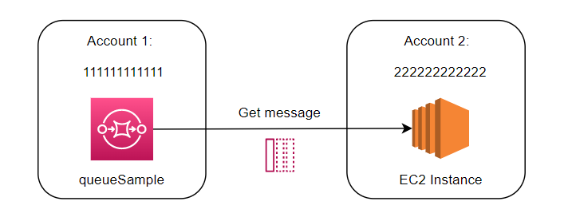
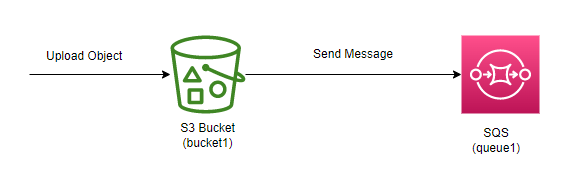
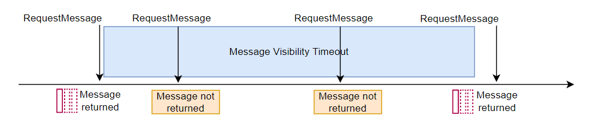
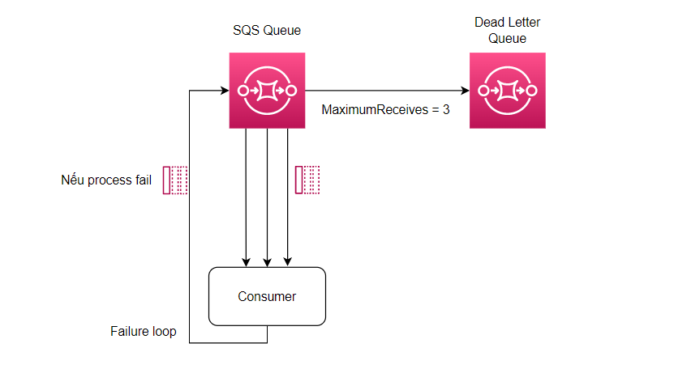
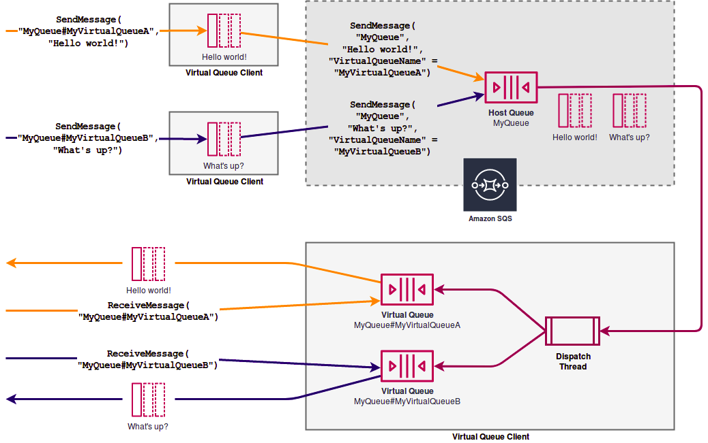

# AWS SQS

 

## Giới thiệu Amazon SQS - Standard Queues

### Amazon SQS là gì

Amazon Simple Queue Service (SQS) là một dịch vụ hàng đợi (queue) lưu trữ message nhanh chóng, đáng tin cậy, có khả năng mở rộng và quản lý một cách đầy đủ. Với SQS, bạn có thể gửi, nhận và lưu trữ message giữa các thành phần trong một phần mềm.

Attributes:

- Không giới hạn số lượng messages trong queue.
- Mặc định message có thể tồn tại trong 4 ngày, tối đa là 14 ngày.
- Độ trễ thấp khi gửi và nhận message.
- Mỗi message dung lượng tối đa là 256KB.

### Producing message trong SQS

- Sử dụng SDK để tạo mới message và gửi message đó đến SQS (SendMessage API).
- Message sẽ nằm trong SQS cho đến khi consumer nhận, xử lý và xóa nó đi khỏi queue.
- Message có thể nằm trong SQS 4 ngày và tối đa là 14 ngày.

### Consuming message trong SQS

- Consumers (EC2 instance, server, Lambda function...).
- Receive message từ SQS (có thể nhận tối đa 10 message từ SQS).
- Xử lý message nhận được.
- Xóa message sử dụng DeleteMessage API.

### SQS Multiple EC2 consumer

- Consumers nhận message parallel.
- Mỗi message chỉ được process một lần duy nhất.
- Consumers sẽ xóa message sau khi message đó được process.

### Bảo mật trong SQS

- **Encryption**:
  - In-flight encryption bằng cách sử dụng HTTPS.
  - Sử dụng KMS keys.
  - Client-side encryption.
- **Access Controls**: sử dụng IAM policies
- **SQS Access Policies** (tương tự như S3 bucket policies)

## Access Policy trong SQS Queue

### Cross Account Access là gì



Khi Account 2 muốn lấy message từ SQS của Account 1 thì cần config Policy như sau:

```json
{
  "Version": "2026-04-28",
  "Statement": [
    {
      "Sid": "Queue1_AllActions",
      "Effect": "Allow",
      "Principal": {
        "AWS": ["222222222222"]
      },
      "Action": "sqs:ReceiveMessage",
      "Resource": "arn:aws:sqs:us-east-1:111111111111"
    }
  ]
}
```

### Publish S3 Event Notifications



```json
{
  "Version": "2026-04-28",
  "Statement": [
    {
      "Sid": "example-statement-ID",
      "Effect": "Allow",
      "Principal": {
        "AWS": "*"
      },
      "Action": ["SQS:SendMessage"],
      "Resource": "arn:aws:sqs:<region>:<account-id></account-id>:queue1",
      "Condition": {
        "ArnLike": {
          "aws:SourceArn": "arn:aws:s3:*:*:bucket1"
        },
        "StringEquals": {
          "aws:SourceAccount": "<bucket-owner-account-id>"
        }
      }
    }
  ]
}
```

## Những thuộc tính của SQS Queue

### SQS Message Visibility Timeout là gì

- Một message sau khi được polled bởi một consumer, nó trở nên invisible với các consumers khác.
- Đó gọi là "Message Visibility Timeout", mặc định là 30 giây (có thể chỉnh sửa).
- Sau thời gian timeout đó, message quay trở lại visible.



### SQS Dead Letter Queue là gì

- Mỗi message sẽ có một "Visibility Timeout" sau khi được polled, trong thời gian đó, message được process. Tại đây, sẽ có hai trường hợp xảy ra:
  - Message được process thành công: => Xóa message ra khỏi queue.
  - Message process thất bại: => Message sẽ quay trở lại Queue và nằm chờ ở đó.
- Như vậy sẽ có trường hợp vòng lặp vô tận khi:
  - Message process bị lỗi => Quay trở lại Queue => Process lại message...
- Chúng ta có thể config "MaximumReceives", hiểu đơn giản là số lần message sau khi process và vẫn quay trở lại Queue. Nếu vượt quá "MaximumReceives", message bị lỗi đó sẽ tự động gửi đến một Queue khác là **Dead Letter Queue (DLQ)**.



### SQS Delay Queue là gì

- Mặc định thời gian delay là 0s (message được nhận ngay lập tức).
- Chúng ta có thể config thời gian delay để nhận được message (tối đa là 15 phút).

### SQS Long Polling là gì

- Mục đích của Long Polling là giảm thiểu những response empty từ phía Queue.
- Khi có một request nhận message, nếu trong Queue không có message nào, SQS sẽ chờ đến khi có message để response lại.
- **WaitTimeSeconds** có thể từ 1s-20s.

### SQS Request-Response Pattern (Virtual queues) là gì

- Đây là pattern mà Requester và Responser giao tiếp với nhau bẳng message qua một Virtual Queue.
- Để có thể implement pattern này cần sử dụng: **SQS Temporary Queue Client**.

