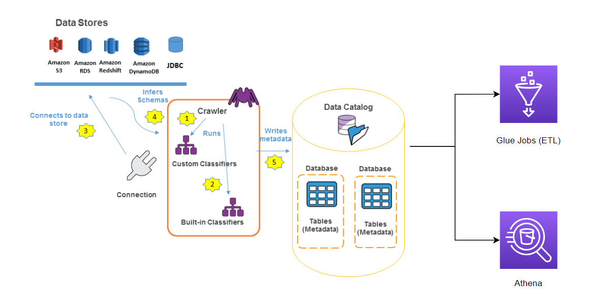

# AWS GLUE

 

## Mục lục

- [AWS Glue là gì](#aws-glue-là-gì)
- [Glue Data Catalog trong AWS](#glue-data-catalog-trong-aws)
- [Glue Crawler](#glue-crawler)
- [Usecases](#usecases)

## AWS Glue là gì

Là dịch vụ Serverless giúp quản lý: Extract, Transform và Load (ETL) dữ liệu. Hữu ích với việc chuẩn bị, transform dữ liệu phục vụ cho analytics.

Dịch vụ này tự động khám phá và lập hồ sơ dữ liệu thông qua **Glue Data Catalog**, recommend và tạo code để chuyển data hiện tại sang target schemas. Chỉ cần trỏ AWS Glue đến dữ liệu của bạn được lưu trữ trên AWS và AWS Glue sẽ khám phá dữ liệu và lưu trữ metadata liên quan (ví dụ: định nghĩa table hoặc schema) trong AWS Glue Data Catalog. AWS Glue bao gồm Data Catalog, là kho lưu trữ metadata trung tâm, một công cụ ETL có thể tự động tạo mã Scala hoặc Python và một trình lập lịch linh hoạt xử lý giải quyết sự phụ thuộc, giám sát công việc và thử lại.

## Glue Data Catalog trong AWS

Glue Data Catalog là nơi lưu trữ metadata của data nguồn. Ví dụ bạn muốn transform dữ liệu từ Amazon RDS:

- Step 1: Crawler sẽ thực hiện crawl dữ liệu của  Database trên RDS, crawler sẽ lấy được dữ liệu như (schema, định nghĩa của table, các table...)
- Sau khi crawl, thông tin metadata sẽ được lưu vào Data Catalog theo dạng bảng.
- Dữ liệu trên Catalog này sẽ được sử dụng bởi: Glue Jobs (ETL), hay Amazon Athena...

## Glue Crawler

Bạn có thể sử dụng Crawler để thêm bảng vào AWS Glue Data Catalog. Trình thu thập dữ liệu có thể thu thập nhiều kho dữ liệu trong một lần chạy. Sau khi hoàn tất, trình thu thập dữ liệu sẽ tạo hoặc cập nhật một hoặc nhiều bảng trong Data Catalog của bạn. Các tác vụ trích xuất, chuyển đổi và tải (ETL) mà bạn xác định trong AWS Glue sử dụng các bảng Data Catalog này làm nguồn và đích. Công việc ETL sẽ đọc và ghi vào kho dữ liệu được chỉ định trong các bảng Data Catalog nguồn và đích.

Bạn có thể chạy trình thu thập thông tin theo schedule, on-demand, hoặc trigger chúng dựa trên sự kiện để đảm bảo metadata của bạn được cập nhật.

## Usecases

- Sử dụng AWS Glue để khám phá các thuộc tính của dữ liệu, chuyển đổi dữ liệu và chuẩn bị dữ liệu cho mục đích phân tích.
- Glue có thể tự động phát hiện cả dữ liệu có cấu trúc và bán cấu trúc được lưu trữ trong các hồ dữ liệu trên Amazon S3, kho dữ liệu trong Amazon Redshift và nhiều cơ sở dữ liệu khác nhau chạy trên AWS.
- Nó cung cấp chế độ xem dữ liệu thống nhất thông qua Glue Data Catalog có sẵn cho ETL, truy vấn và báo cáo bằng các dịch vụ như Amazon Athena, Amazon EMR và Amazon Redshift Spectrum.
- AWS Glue là dịch vụ serverless, do đó không cần cấu hình và quản lý tài nguyên tính toán.
- Glue tự động tạo mã Scala hoặc Python cho các công việc ETL mà bạn có thể tùy chỉnh thêm bằng các công cụ mà bạn đã quen thuộc.
