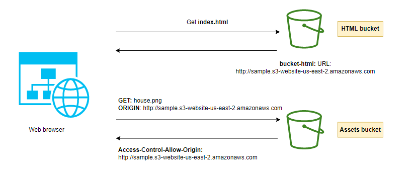
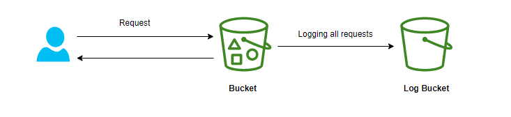

# AWS S3

 

## Mục lục

* [Giới thiệu về AWS S3](#giới-thiệu-về-aws-s3)
  * [S3 Buckets và Object trong AWS](#s3-buckets-và-object-trong-aws)
* [Mã hóa dữ liệu trong S3](#mã-hóa-dữ-liệu-trong-s3)
  * [S3 Encryption trong AWS](#s3-encryption-trong-aws)
    * [SSE-S3 trong AWS](#sse-s3-trong-aws)
    * [SSE-KMS trong AWS](#sse-kms-trong-aws)
    * [SSE-C trong AWS](#sse-c-trong-aws)
    * [Client Side Encryption trong AWS](#client-side-encryption-trong-aws)
* [Bảo mật trong S3](#bảo-mật-trong-s3)
  * [S3 Security trong AWS](#s3-security-trong-aws)
  * [S3 Bucket Policies trong AWS](#s3-bucket-policies-trong-aws)
  * [Block public access](#block-public-access)
  * [Bảo mật người dùng trong S3](#bảo-mật-người-dùng-trong-s3)
* [Giới thiệu S3 Hosting, CORS](#giới-thiệu-s3-hosting-cors)
  * [S3 Hosting trong AWS](#s3-hosting-trong-aws)
  * [S3 CORS trong AWS](#s3-cors-trong-aws)
* [Giới thiệu S3 MFA Delete, Default Encryption](#giới-thiệu-s3-mfa-delete-default-encryption)
  * [S3 MFA Delete trong AWS](#s3-mfa-delete-trong-aws)
  * [S3 Default Encryption trong AWS](#s3-default-encryption-trong-aws)
* [Giới thiệu S3 Access Logs, Replication và Pre-signed](#giới-thiệu-s3-access-logs-replication-và-pre-signed)
  * [S3 Access Logs trong AWS](#s3-access-logs-trong-aws)
  * [S3 Replication (CRR & SRR) trong AWS](#s3-replication-crr--srr-trong-aws)
  * [S3 Pre-signed trong AWS](#s3-pre-signed-trong-aws)
* [Giới thiệu S3 Storage Classes, Glacier](#giới-thiệu-s3-storage-classes-glacier)
  * [S3 Storage Classes trong AWS](#s3-storage-classes-trong-aws)
    * [S3 Standard là gì - General Purpose](#s3-standard-là-gì---general-purpose)
    * [S3 Standard-Infrequent Access (Standard-IA) là gì](#s3-standard-infrequent-access-standard-ia-là-gì)
    * [S3 One Zone-Infrequent Access (One Zone-IA) là gì](#s3-one-zone-infrequent-access-one-zone-ia-là-gì)
    * [S3 Intelligent-Tiering là gì](#s3-intelligent-tiering-là-gì)
    * [S3 Glacier là gì](#s3-glacier-là-gì)
    * [S3 Glacier Deep Archive là gì](#s3-glacier-deep-archive-là-gì)
    * [Example Tips](#example-tips)
* [Giới thiệu S3 Lifecycle Rules](#giới-thiệu-s3-lifecycle-rules)
  * [S3 chuyển đổi giữa Storage Classes](#s3-chuyển-đổi-giữa-storage-classes)
  * [S3 Lifecycle Rules là gì](#s3-lifecycle-rules-là-gì)
    * [Transition actions](#transition-actions)
    * [Expiration actions](#expiration-actions)
* [Giới thiệu S3 Analytics, Performance](#giới-thiệu-s3-analytics-performance)
  * [S3 Analytics là gì - Storage Class Analysis](#s3-analytics-là-gì---storage-class-analysis)
  * [S3 Performance trong AWS](#s3-performance-trong-aws)
  * [S3 Optimizing performance trong AWS](#s3-optimizing-performance-trong-aws)
* [Giới thiệu S3 Select, Athena](#giới-thiệu-s3-select-athena)
  * [S3 Select trong AWS](#s3-select-trong-aws)
  * [Amazon Athena là gì](#amazon-athena-là-gì)

---

## Giới thiệu về AWS S3

**[Amazon S3](https://aws.amazon.com/s3/)** (Amazon Simple Storage Service) là dịch vụ lưu trữ dữ liệu đơn giản của Amazon cung cấp. Amazon S3 cung cấp khả nẳng mở rộng, tính khả dụng của dữ liệu, bảo mật cao.

### S3 Buckets và Object trong AWS

Amazon S3 cho phép người dùng có thể lưu trữ Objects (files) trong Buckets (directories).

- **Bucket**: 
  - Là một container để lưu trữ dữ liệu. 
  - Mỗi bucket có tên duy nhất trên toàn cầu và có thể chứa một số lượng không giới hạn các object. 
  - Bucket có scope là region, khi tạo bucket cần chọn region.
  - Quy tắc đặt tên: 
    - Tên bucket phải có độ dài từ 3 đến 63 ký tự.
    - Tên bucket chỉ được chứa các ký tự chữ thường, số, dấu gạch ngang (-) và dấu chấm (.).
    - Tên bucket phải được bắt đầu bằng ký tự chữ thường hoặc số.
    - Không được có format địa chỉ IP.

- **Object**: 
  - Là một file được lưu trữ trong bucket. 
  - Object có Key chính là path tên object trong bucket. Key có thể là kết hợp của: prefix + object_name (vd: `path_1/path_2/file.txt`).
  - Object value là nội dung của body. Object size tối đa là 5TB. Nếu muốn upload nhiều hơn 5GB, cần dùng "multi-path upload" để chia nhỏ upload nhiều phần.

- **S3 versioning**: 
  - Chúng ta có thể tạo các version của file.
  - Tính năng này được enable ở "bucket level".
  - Khi 1 file có chung key, version sẽ tự động tạo ra.
  - Khi đánh version cho 1 file, chúng ta có thể dễ dàng phục hồi các version của 1 file.

  Luu ý: Nếu enable versioning của một bucket thì những file đã tồn tại trước đó sẽ có version ID = null.

## Mã hóa dữ liệu trong S3

### S3 Encryption trong AWS

Để tránh việc lưu trữ dữ liệu dưới dạng thô, Amazon S3 cung cấp phương thức mã hóa dữ liệu. Cách thức hoạt động của mã hóa là dùng **key** và **thuật toán (algorithm)** để biến dữ liệu ban đầu thành dữ liệu được mã hóa. Vậy nên, vấn đề cần quan tâm là lưu trữ key ở đâu. 

Trong S3 có 2 cách chính để mã hóa.

- Server-side encryption: Mã hóa phía server (S3).
- Client-side encryption: Mã hóa phía client (dùng các libs để mã hóa) rồi upload dữ liệu được mã hóa lên S3 Amazon S3 cung cấp 4 phương thức mã hóa object:
  - SSE-S3: Mã hóa S3 objects sử dụng key quản lý bởi AWS.
  - SSE-KMS: Sử dụng AWS Key Management Service (KMS) để quản lý encryption keys.
  - SSE-C: Sử dụng khi bạn muốn quản lý encryption keys riêng của mình.
  - Client Side Encryption.

#### SSE-S3 trong AWS

- Mã hóa sử dụng key quản lý bởi Amazon S3.
- Object được mã hóa phía server side.
- Phương thức mã hóa: AES-256.
- Phải set header: "x-amz-server-side-encryption":"AES256".

---

#### SSE-KMS trong AWS

- Mã hóa sử dụng key quản lý bởi AWS Key Management Service (KMS).
- Object được mã hóa phía server side.
- Phải set header: "x-amz-server-side-encryption":"aws:kms".

---

#### SSE-C trong AWS

- Là server-side encryption sử dụng key cung cấp bởi khách hàng (AWS không quản lý key này).
- **Phải dùng HTTPS**.
- Encryption key phải được cung cấp trong HTTPS headers trong mỗi request.

---

#### Client Side Encryption trong AWS

- Mã hóa phía client trước khi upload lên S3.
- Sử dụng client libs chẳng hạn như: Amazon S3 Encryption Client.
- Khi đọc dữ liệu trả về cần decrypt chúng.

## Bảo mật trong S3

### S3 Security trong AWS

S3 security là quản lý quyền truy cập dữ liệu trong Amazon S3. Chúng ta có 3 phương thức để quản lý truy cập, đó là:

- **IAM policies**: Cấp quyền truy cập cho user nhất định.
- **ACLs**:
  - **Bucket ACL**: Quản lý cấp độ bucket.
  - **Objects ACL**: Quản lý cấp độ Objects.
- **Bucket policies**: Có thể add/deny quyền truy cập một cách linh hoạt được đinh nghĩa trong file JSON.

---

### S3 Bucket Policies trong AWS

- S3 bucket policies được định nghĩa dưới dạng file JSON.
- **Resource**: Tài nguyên thực thi (Bucket hoặc Objects).
- **Effect**: Allow hoặc Deny.
- **Principal**: Account hay user được apply (* là tất cả user).
- **Action**: Quền thực thi (GetObject, Put, Delete...).

Ví dụ như trên hình vẽ đang định nghĩa policy: Tất cả user có thể đọc được tất cả object trong bucket foobucket.

**Sử dụng S3 bucket policies thường cho**:

- Cấp quyền truy cập đến bucket, object.
- Bắt buộc object cần được mã hóa trước khi upload lên S3.
- Cấp quyền truy cập cho account khác (cross account).

---

### Block public access

Mặc định khi tạo một bucket trên S3, Amazon sẽ block tất cả public access. Có nghĩa là khi bạn upload một file ảnh lên bucket đó, bạn sẽ không thể view file đó được luôn. Để có thể xem được file ảnh đó, bạn cần cấp quyền để có thể xem từ mọi nơi.

---

### Bảo mật người dùng trong S3

- **MFA Delete**: Chúng ta có thể anable MFA (multi factor authentication) khi muốn delete object. Việc này đảm bảo không phải ai cũng có thể xóa dữ liệu của bạn.
- **Pre-Signed URLs**: Ví dụ video của bạn là premium (giới hạn cho những user đã trả phí). Khi tạo Pre-Signed URLs cho object đó, urls sẽ có expire.

## Giới thiệu S3 Hosting, CORS

### S3 Hosting trong AWS

S3 hosting cho phép bạn có thể tạo 1 public website từ source code html, css, javascript của bạn. Bạn không cần config web server, dns... tất cả Amazon S3 đã làm cho bạn, việc cần làm là đẩy source code của bạn lên bucket.

- URL website sẽ có format: `http://<bucket-name>.s3-website-<region>.amazonaws.com`
- Cần cho phép bucket của bạn access public.

---

### S3 CORS trong AWS

Như trên hình vẽ chúng ta có 2 bucket:

- **HTML bucket**: Chứa các file html được host trên S3.
- **Assets bucket**: Chứa các file ảnh của project.

Khi gửi request đến HTML bucket, website cần request đến tiếp những file ảnh trong Assets bucket. Khi đó cần enable CORS trong Assets bucket để những request từ url: http://sample.s3-website-us-east-2.amazonaws.com có thể đọc được những file ảnh này.

## Giới thiệu S3 MFA Delete, Default Encryption

### S3 MFA Delete trong AWS

**MFA (Multi factor authentication)** bắt buộc người dùng phải sử dụng một đoạn code được gen ra trên thiết bị xác thực 2 lớp(thường là điện thoại) trước khi thực hiện các operations quan trọng trên S3. Điều này nhằm mục đích bảo mật những resource quan trọng có trên S3, Amazon S3 muốn chắc chắn rằng chỉ có owner của Bucket mới có quyền để xóa một version hoặc thay đổi version của nó.

- Để sử dụng MFA-Delete, bạn cần enable Versioning trên S3 bucket.
- Khi đã sử dụng MFA-Delete, bạn cần thêm một bước xác thực nữa để có thể thực hiện:
  - Thay đổi Versioning của Bucket.
  - Xóa một Object version.
- Bạn không cần sử dụng MFA để:
  - Enable versioning.
  - Xem những versions đã xóa.
- Chỉ có bucket owner (root account) mới có quền enable/disable MFA-Delete.
- MFA-Delete hiện tại chỉ có thể enabled bằng CLI.

---

### S3 Default Encryption trong AWS

- Khi tạo một bucket trên S3, chúng ta có thể "force encryption" những object được upload lên. Điều này đảm bảo rằng những object được upload lên S3 đã được mã hóa.
- Bạn có thể sử dụng "Default Encryption", khi enable option này lên, object sẽ được Amazon S3 mã hóa mặc định.

## Giới thiệu S3 Access Logs, Replication và Pre-signed

### S3 Access Logs trong AWS

- S3 Access Logs lưu lại thông tin request đến S3 buckets của bạn.
- Như hình vẽ dưới đây, những request đến "S3 Bucket", cho dù accept hay denied đều được ghi lại vào "Log Bucket".
- Dữ liệu này có thể dùng để phân tích bằng những dịch vụ phân tích như Amazon Athena...

---

### S3 Replication (CRR & SRR) trong AWS

- CRR: Cross Region Replication.
- SRR: Same Region Replication.

S3 Replication là tính năng sao chép các object giữa các vùng lưu trữ. Với S3 Replication, bạn có thể config Amazon S3 tự động sao chép S3 Object trên các Region khác nhau (Cross Region Replication), hoặc giữa các vùng lưu trữ trên cùng một Region (Same Region Replication).

- Phải "Enable versioning" trong bucket source và destination.
- Buckets có thể ở account khác nhau.
- Việc copy là asynchronous.
- Cần cung cấp IAM permission cần thiết tới S3.

Lưu ý: 
- Sau khi enable replica, bạn chỉ có thể copy những Object mới, còn objects cũ trước đó sẽ không được copy.
- Copy không thể có tính "chaining". Có nghĩa nếu Bucket A copy sang Bucket B, Bucket B copy sang Bucket C. Thì khi tạo Object D sẽ không được copy sang Bucket C.

---

### S3 Pre-signed trong AWS

Pre-signed URL là URL mà bạn có thể cung cấp cho người dùng của mình để cấp quyền truy cập tạm thời vào một đối tượng S3 cụ thể. Sử dụng URL, người dùng có thể đọc và ghi đối tượng (hoặc cập nhật đối tượng hiện có). URL chứa các thông số cụ thể do ứng dụng mà bạn cài đặt.

- Mặc định Pre-signed URL có hiệu lực 3600s, bạn có thể thay đổi với CLI (--expires-in argument).
- Khi đã quá thời gian hết hạn, người dùng không thể truy cập được đến Object chỉ định.

## Giới thiệu S3 Storage Classes, Glacier

### S3 Storage Classes trong AWS

Amazon S3 cung cấp một loạt các lớp lưu trữ mà bạn có thể lựa chọn dựa trên các yêu cầu về quyền truy cập dữ liệu, khả năng phục hồi và chi phí tương ứng với khối lượng công việc. Các lớp lưu trữ S3 được xây dựng nhằm mục đích cung cấp khả năng lưu trữ với chi phí thấp nhất cho các kiểu truy cập khác nhau. Lớp lưu trữ S3 lý tưởng cho hầu hết mọi trường hợp sử dụng, bao gồm cả những trường hợp có nhu cầu hiệu năng cao, yêu cầu lưu trữ dữ liệu, kiểu truy cập không xác định hoặc hay thay đổi, hoặc dùng để lưu trữ.

Các storage class hiện có bao gồm:

- Standard
- Standard-Infrequent Access (Standard-IA)
- One Zone-Infrequent Access (One Zone-IA)
- Intelligent-Tiering
- Glacier
- Glacier Deep Archive

Mỗi storage class khác nhau có các thuộc tính khác nhau về: Chi phí, Độ khả dụng (availability), Độ bền (durability), Mức độ truy cập (frequency).

#### S3 Standard là gì - General Purpose

- Là class thông dụng nhất.
- Được thiết kế cho tất cả các mục đích lưu trữ.
- Là lựa chọn mặc định.
- 99.999999999% độ bền object (11' 9).
- 99.99% độ khả dụng object.
- Có chi phí cao nhất.
- Use-case: Dùng cho phân tích dữ liệu, Mobile & gaming application, content distribution...

---

#### S3 Standard-Infrequent Access (Standard-IA) là gì

- Được thiết kế cho các object không được truy cập thường xuyên nhưng cần phải khả dụng ngay lập tức khi được truy cập.
- 99.999999999% độ bền object (11' 9).
- 99.9% độ khả dụng object.
- Chi phí rẻ hơn Standard.
- Use-case: Dữ liệu backup cho phục hồi khi thiên tai...

---

#### S3 One Zone-Infrequent Access (One Zone-IA) là gì

- Tương tự như IA nhưng được lưu trữ ở một single AZ.
- 99.999999999% độ bền object (11 số 9) trong single AZ, nếu AZ đó bị phá hủy, dữ liệu sẽ bị mất đi.
- Latency thấp và throughput cao.
- Hỗ trợ SSL với dữ liệu đang truyền đi, và mã hóa dữ liệu đã lưu trữ.
- Chi phí rẻ hơn Standard-IA (~20%).
- Use-case: Sử dụng trong lưu trữ bản sao dự phòng thứ cấp của on-premise data, hoặc dữ liệu dễ dàng tạo lại.

---

#### S3 Intelligent-Tiering là gì

- Được thiết kế cho các object chưa xác định mức độ truy cập hoặc có mức độ truy cập không cố định. S3 sẽ theo dõi mức độ truy cập các object và chuyển chúng vào cấp truy cập phù hợp.
- 99.999999999% độ bền object (11 số 9).
- 99.9% độ khả dụng object.
- Chi phí thấp cho việc monitor hàng tháng và chuyển đổi kiểu lưu trữ.

---

#### S3 Glacier là gì

- Được thiết kế cho việc lưu trữ dung lượng lớn, dài hạn.
- Thời gian truy xuất dữ liệu có thể từ vài phút đến vài tiếng.
- Mỗi item trong Glacier gọi là "Archive" (tối đa 40TB).
- Những Archives được lưu trữ trong "Vaults". Để dễ hình dung thì "Vaults" là folder ảnh về biển "Beach" còn "Archive" là những bức ảnh về bãi biển chứa trong vaults.
- Glacier có 3 option truy xuất dữ liệu:
  - Expedited (1-5 phút) (đắt hơn 2 option còn lại)
  - Standard (3-5 giờ)
  - Bulk (5-12 giờ)
- Thời gian lưu trữ tối thiểu là 90 ngày.

---

#### S3 Glacier Deep Archive là gì

- Tương tự như Glacier nhưng sử dụng cho việc lưu trữ dài hạn hơn Glacier.
- Chi phí rẻ hơn Glacier.
- Là storage class có giá rẻ nhất.
- Glacier Deep Archive có 2 option truy xuất dữ liệu:
  - Standard (12 giờ)
  - Bulk (48 giờ)
- Thời gian lưu trữ tối thiểu là 180 ngày.

---

#### Example Tips

- Dữ liệu cần độ trễ truy cập dữ liệu thấp (latency sensitive), truy cập thường xuyên (frequently access) => Standard Tier.
- Dữ liệu ít truy cập (Infrequently Access) => IA.
- Dữ liệu ít truy cập (Infrequently Access), dữ liệu có thể khôi phục nếu một AZ bị sự cố => One-Zone IA.
- Dữ liệu lưu trữ lâu dài(1~10 năm),thời gian lấy dữ liệu từ phút tới < 12giờ => Glacier.
- Dữ liệu lưu trữ lâu dài ( > 10 năm), thời gian lấy dữ liệu > 12 hours => Deep Archived.

## Giới thiệu S3 Lifecycle Rules

### S3 chuyển đổi giữa Storage Classes

Chúng ta có thể chuyển đổi Object một cách linh hoạt giữa các storage classes trong Amazon S3. Lifecycle configuration có thể giúp bạn tự động hóa việc chuyển đổi Object.

- Khi Object không còn được thường xuyên truy cập, bạn có thể chuyển chúng sang Standard_IA...
- S3 standard là loại storage class linh hoạt nhất.
- Ngược lại S3 Glacier Deep Archive là loại không thể chuyển đổi thành các storage class khác.

### S3 Lifecycle Rules là gì

#### Transition actions

Định nghĩa những actions chuyển đổi Object sang Storage Class khác. Ví dụ:

- Chuyển Objects sang Standard IA class sau 60 ngày kể từ ngày tạo.
- Chuyển Objects sang Glacier Deep Archive sau 365 ngày kể từ ngày tạo.

#### Expiration actions

Dùng để configure Objects sẽ hết hạn (xóa đi) sau một thời gian nhất định. Ví dụ:

- Những log file có thể cấu hình để xóa đi sau 365 ngày.
- Xóa đi những version cũ của object (nếu enable versioning).
- Xóa những multi-part uploads ở trạng thái in-complete (chưa hoàn thành).

## Giới thiệu S3 Analytics, Performance

### S3 Analytics là gì - Storage Class Analysis

Storage Class Analysis giúp bạn phân tích lượng truy cập, dung lượng lưu trữ... trong một khoảng thời gian nhất định. Từ đó giúp người dùng xác định được khi nào nên chuyển đổi Objects từ Standard => Standard_IA.

- Không sử dụng cho việc chuyển đổi Storage Class sang ONEZONE_IA hoặc S3 Glacier.
- Report được cập nhật hằng ngày.
- Lần đầu tiên bắt đầu sẽ mất khoảng 24-48h.
- Công cụ hữu ích để đưa ra các Lifecyle Rules hợp lý.

### S3 Performance trong AWS

- Amazon S3 đáp ứng hiệu suất hàng nghìn transaction/giây với độ trễ thấp (100-200ms).
- Ứng dụng của bạn có thể xử lý 3,500 PUT/COPY/POST/DELETE hoặc 5,500 GET/HEAD request trên mỗi prefix trong bucket.
- Không có giới hạn prefix trên mỗi bucket.
- Prefix (Object path => prefix):
  - bucket/folder-1/sub-fold-1/file.txt => /folder-1/sub-fold-1/
  - bucket/folder-1/sub-fold-2/file.txt => /folder-1/sub-fold-2/
  - bucket/folder-1/file.txt => /folder-1/
- Nếu bạn tạo 10 prefix trong bucket, bạn có thể có 55,000 read requests/giây.

### S3 Optimizing performance trong AWS

- Multi-part upload
  - Được recommended cho file có dung dượng > 100MB, bắt buộc sử dụng với file 5BG.
  - Giải pháp này chia file có dung lượng lớn ra các phần nhỏ rồi upload lên Amazon S3. Sau đó S3 sẽ merge các phần nhỏ đó thành file ban đầu của bạn.
- S3 Transfer Acceleration
  - Tăng tốc độ truyền dữ liệu bằng cách tranfer file tới một AWS Egde location, sau đó forward dữ liệu đến S3 bucket.

## Giới thiệu S3 Select, Athena

S3 Select và Athena là hai dịch vụ giúp người dùng có thể truy vấn dữ liệu được lưu trữ trên Amazon S3. Cả Amazon S3 Select và Amazon Athena đều cho phép thực hiện các truy vấn kiểu SQL.

### S3 Select trong AWS

Amazon S3 Select là tính năng cho phép bạn thực hiện các SQL operations đơn giản dựa trên dữ liệu thô của bạn được lưu trữ trong S3. Dữ liệu của bạn phải ở định dạng có cấu trúc, ví dụ: JSON, CSV, Parquet... Nó cũng sẽ hoạt động ngay cả khi dưới dạng file nén (.zip, .rar...), vì vậy bạn không cần phải giải nén chúng trước khi đọc.

- S3 Select chỉ hỗ trợ SELECT, FROM, LIMT trong SQL.
- Chí phí sử dụng tính theo lượng request (SELECT query) và data scanned.
- S3 Select phù hợp với việc phân tích dữ liệu đơn giản không quá phức tạp.

### Amazon Athena là gì

Amazon Athena là một dịch vụ truy vấn dữ liệu lớn cho phép bạn dễ dàng phân tích khối lượng lớn dữ liệu mà không cần phải cung cấp server hoặc database. Giống như S3 Select, Athena cũng không có máy chủ và dựa trên SQL. Nhưng sự khác biệt chính giữa hai loại này là quy mô mà Athena cho phép bạn thực hiện các truy vấn của mình.

- Có thể sử dụng các câu truy vấn phức tạp..
- Hỗ trợ phân tích dữ liệu dưới định dạng: CSV, JSON, ORC, Avro...
- Chi phí: $5/mỗi TB data scanned.
- Usa-case: Phân tích, thống kê, báo cáo dữ liệu...