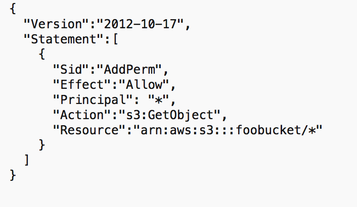

# AWS S3

 

## Giới thiệu về AWS S3

**[Amazon S3](https://aws.amazon.com/s3/)** (Amazon Simple Storage Service) là dịch vụ lưu trữ dữ liệu đơn giản của Amazon cung cấp. Amazon S3 cung cấp khả nẳng mở rộng, tính khả dụng của dữ liệu, bảo mật cao.

### S3 Buckets và Object trong AWS

Amazon S3 cho phép người dùng có thể lưu trữ Objects (files) trong Buckets (directories).

- **Bucket**: 
  - Là một container để lưu trữ dữ liệu. 
  - Mỗi bucket có tên duy nhất trên toàn cầu và có thể chứa một số lượng không giới hạn các object. 
  - Bucket có scope là region, khi tạo bucket cần chọn region.
  - Quy tắc đặt tên: 
    - Tên bucket phải có độ dài từ 3 đến 63 ký tự.
    - Tên bucket chỉ được chứa các ký tự chữ thường, số, dấu gạch ngang (-) và dấu chấm (.).
    - Tên bucket phải được bắt đầu bằng ký tự chữ thường hoặc số.
    - Không được có format địa chỉ IP.

- **Object**: 
  - Là một file được lưu trữ trong bucket. 
  - Object có Key chính là path tên object trong bucket. Key có thể là kết hợp của: prefix + object_name (vd: `path_1/path_2/file.txt`).
  - Object value là nội dung của body. Object size tối đa là 5TB. Nếu muốn upload nhiều hơn 5GB, cần dùng "multi-path upload" để chia nhỏ upload nhiều phần.

- **S3 versioning**: 
  - Chúng ta có thể tạo các version của file.
  - Tính năng này được enable ở "bucket level".
  - Khi 1 file có chung key, version sẽ tự động tạo ra.
  - Khi đánh version cho 1 file, chúng ta có thể dễ dàng phục hồi các version của 1 file.

  Luu ý: Nếu enable versioning của một bucket thì những file đã tồn tại trước đó sẽ có version ID = null.

## Mã hóa dữ liệu trong S3

### S3 Encryption trong AWS

Để tránh việc lưu trữ dữ liệu dưới dạng thô, Amazon S3 cung cấp phương thức mã hóa dữ liệu. Cách thức hoạt động của mã hóa là dùng **key** và **thuật toán (algorithm)** để biến dữ liệu ban đầu thành dữ liệu được mã hóa. Vậy nên, vấn đề cần quan tâm là lưu trữ key ở đâu. 

Trong S3 có 2 cách chính để mã hóa.

- Server-side encryption: Mã hóa phía server (S3).
- Client-side encryption: Mã hóa phía client (dùng các libs để mã hóa) rồi upload dữ liệu được mã hóa lên S3 Amazon S3 cung cấp 4 phương thức mã hóa object:
  - SSE-S3: Mã hóa S3 objects sử dụng key quản lý bởi AWS.
  - SSE-KMS: Sử dụng AWS Key Management Service (KMS) để quản lý encryption keys.
  - SSE-C: Sử dụng khi bạn muốn quản lý encryption keys riêng của mình.
  - Client Side Encryption.

#### SSE-S3 trong AWS

- Mã hóa sử dụng key quản lý bởi Amazon S3.
- Object được mã hóa phía server side.
- Phương thức mã hóa: AES-256.
- Phải set header: "x-amz-server-side-encryption":"AES256".

---

#### SSE-KMS trong AWS

- Mã hóa sử dụng key quản lý bởi AWS Key Management Service (KMS).
- Object được mã hóa phía server side.
- Phải set header: "x-amz-server-side-encryption":"aws:kms".

---

#### SSE-C trong AWS

- Là server-side encryption sử dụng key cung cấp bởi khách hàng (AWS không quản lý key này).
- **Phải dùng HTTPS**.
- Encryption key phải được cung cấp trong HTTPS headers trong mỗi request.

---

#### Client Side Encryption trong AWS

- Mã hóa phía client trước khi upload lên S3.
- Sử dụng client libs chẳng hạn như: Amazon S3 Encryption Client.
- Khi đọc dữ liệu trả về cần decrypt chúng.

## Bảo mật trong S3

### S3 Security trong AWS

S3 security là quản lý quyền truy cập dữ liệu trong Amazon S3. Chúng ta có 3 phương thức để quản lý truy cập, đó là:

- IAM policies: Cấp quyền truy cập cho user nhất định.
- ACLs:
  - Bucket ALC: Quản lý cấp độ bucket.
  - Objects ALC: Quản lý cấp độ Objects.
- Bucket policies: Có thể add/deny quyền truy cập một cách linh hoạt được đinh nghĩa trong file JSON.

---

### S3 Bucket Policies trong AWS

- S3 bucket policies được định nghĩa dưới dạng file JSON.
- Resource: Tài nguyên thực thi (Bucket hoặc Objects).
- Effect: Allow hoặc Deny.
- Principal: Account hay user được apply (* là tất cả user).
- Action: Quền thực thi (GetObject, Put, Delete...).

Ví dụ như trên hình vẽ đang định nghĩa policy: Tất cả user có thể đọc được tất cả object trong bucket foobucket.

Sử dụng S3 bucket policies thường cho:

- Cấp quyền truy cập đến bucket, object.
- Bắt buộc object cần được mã hóa trước khi upload lên S3.
- Cấp quyền truy cập cho account khác (cross account).