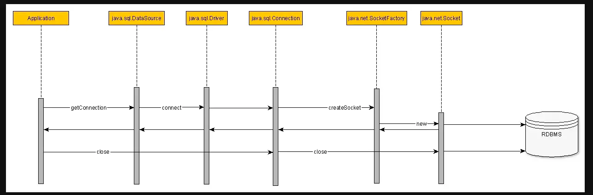

# Chương 1: Database Connection

 

## Mục lục

- [I. Tổng quan](#i-tổng-quan)
  - [1. Hiểu đơn giản về Database Connection](#1-hiểu-đơn-giản-về-database-connection)
  - [2. Vì sao Database Connection lại tốn kém?](#2-vì-sao-database-connection-lại-tốn-kém)
- [II. Chi tiết chi phí của một Database Connection](#ii-chi-tiết-chi-phí-của-một-database-connection)
  - [1. Tầng Mạng (Network Layer): Nút thắt cổ chai về độ trễ](#1-tầng-mạng-network-layer-nút-thắt-cổ-chai-về-độ-trễ)
    - [a. Bắt tay 3 bước TCP (TCP 3-way Handshake)](#a-bắt-tay-3-bước-tcp-tcp-3-way-handshake)
    - [b. Bắt tay bảo mật TLS/SSL (TLS Handshake)](#b-bắt-tay-bảo-mật-tlsssl-tls-handshake)
  - [2. Tầng Database Engine: Xác thực và Khởi tạo Session](#2-tầng-database-engine-xác-thực-và-khởi-tạo-session)
    - [a. Xác thực (Authentication)](#a-xác-thực-authentication)
    - [b. Khởi tạo trạng thái phiên (Session State Initialization)](#b-khởi-tạo-trạng-thái-phiên-session-state-initialization)
  - [3. Tầng Hệ điều hành (OS Layer): Bộ nhớ và Context Switching](#3-tầng-hệ-điều-hành-os-layer-bộ-nhớ-và-context-switching)
    - [a. PostgreSQL: Kiến trúc Process-per-connection (Mỗi kết nối là một Tiến trình)](#a-postgresql-kiến-trúc-process-per-connection-mỗi-kết-nối-là-một-tiến-trình)
    - [b. MySQL: Kiến trúc Thread-per-connection (Mỗi kết nối là một Luồng)](#b-mysql-kiến-trúc-thread-per-connection-mỗi-kết-nối-là-một-luồng)
    - [c. Cơn ác mộng Context Switching (Chuyển đổi ngữ cảnh)](#c-cơn-ác-mộng-context-switching-chuyển-đổi-ngữ-cảnh)
- [III. Tổng kết](#iii-tổng-kết)

---

## I. Tổng quan

### 1. Hiểu đơn giản về Database Connection
Bất kì ứng dụng phần mềm nào cũng cần lưu data ở Database và để ứng dụng có thể tương tác với 1 database server thì chúng ta cần **Database Connection**.

Ví dụ: Để tạo ra 1 kết nối từ Java application đến database server, ứng dụng cần trải qua các bước chính:
1. **TCP Connection**: Bắt tay 3 bước (TCP 3-way Handshake).
2. **TLS/SSL Handshake**: Thỏa thuận kết nối bảo mật (nếu DB yêu cầu).
3. **Authentication**: Trao đổi thông tin tài khoản (user/password) với Database engine và khởi tạo phiên làm việc (Session).

### 2. Vì sao Database Connection lại tốn kém? 
Một **Database Connection** không đơn thuần là một "đường ống" (pipe) cắm từ Ứng dụng vào Database. Nó là một **phiên làm việc (session)** đòi hỏi sự phối hợp của **3 tầng**: Mạng (Network), Hệ điều hành (OS), và Database Engine.

Sự "đắt đỏ" được đo lường bằng hai yếu tố chính:

- **Thời gian (Latency)**: Độ trễ do phải trao đổi nhiều gói tin qua lại (Round-trip Time - RTT) trước khi có thể gửi câu lệnh SQL đầu tiên.
- **Tài nguyên (Resource)**: Chu kỳ CPU (CPU Cycles) để xử lý mã hóa/giải mã, và bộ nhớ (RAM) phải cấp phát vĩnh viễn cho phiên làm việc cho đến khi kết nối đóng lại.

Quá trình tạo connection đến Database trải qua nhiều bước nên là hoạt động đắt đỏ và tốn thời gian. Nếu ứng dụng của bạn tăng trưởng về người dùng và bạn mở connection mới ở mỗi request, số connection được tạo đồng thời tại một thời điểm tăng lên sẽ làm tăng CPU, RAM, khiến Database có thể bị nghẽn (Hang) hoặc sập (Crash).

---

## II. Chi tiết chi phí của một Database Connection

Khi ứng dụng Java của bạn gọi `DriverManager.getConnection()` hoặc yêu cầu một kết nối mới, hệ thống không hề trả về kết quả ngay lập tức. Đằng sau đó là một chuỗi các thao tác cực kỳ tiêu tốn tài nguyên (CPU, RAM) và thời gian (Latency). 

Chúng ta sẽ bóc tách chi phí này qua 3 tầng chính: Mạng (Network), Database Engine và Hệ điều hành (OS).

### 1. Tầng Mạng (Network Layer): Nút thắt cổ chai về độ trễ
Một kết nối database bản chất là một kết nối mạng [TCP/IP (Transmission Control Protocol/Internet Protocol)](https://vienthongxanh.vn/mo-hinh-mang-tcp-ip-la-gi/). Để hai máy (App Server và DB Server) nói chuyện được với nhau, chúng phải trải qua các thủ tục sau:

#### a. Bắt tay 3 bước TCP (TCP 3-way Handshake)
> Tìm hiểu quy trình bắt tay 3 bước TCP (TCP 3-way Handshake) ở [đây](https://vienthongxanh.vn/quy-trinh-bat-tay-3-buoc-tcp/)
* Trước khi gửi bất kỳ dữ liệu SQL nào, App Server gửi gói `SYN`, DB Server phản hồi `SYN-ACK`, và App Server xác nhận lại bằng `ACK`.
* Quá trình này tiêu tốn ít nhất **1.5 RTT (Round Trip Time)**. Nếu database của bạn đặt ở một Data Center khác và Ping (RTT) là 20ms, bạn mất đứt 30ms chỉ để "chào hỏi" mà chưa làm được gì.

#### b. Bắt tay bảo mật TLS/SSL (TLS Handshake)
* Các hệ thống hiện đại thường bắt buộc mã hóa đường truyền bằng SSL/TLS để tránh bị nghe lén (Packet Sniffing).
* Quá trình TLS Handshake đòi hỏi trao đổi chứng chỉ (Certificates), thỏa thuận thuật toán mã hóa (Cipher suites) và tạo khóa đối xứng (Symmetric key). 
* Bước này tốn thêm từ **1 đến 2 RTT** nữa, cộng thêm **chi phí CPU** khá lớn ở cả hai phía để thực hiện các phép toán mã hóa bất đối xứng.

### 2. Tầng Database Engine: Xác thực và Khởi tạo Session
Sau khi kênh truyền tải an toàn được thiết lập, App và DB mới bắt đầu quá trình xác thực.

#### a. Xác thực (Authentication)
* App gửi thông tin `username` và `password` (đã được băm/mã hóa).
* Database engine phải tra cứu user trong bảng hệ thống, kiểm tra quyền truy cập (ACL - Access Control List), và tính toán lại mã băm để so khớp. 

#### b. Khởi tạo trạng thái phiên (Session State Initialization)
Khi xác thực thành công, Database không đưa kết nối cho bạn ngay. Nó phải setup một "không gian làm việc" riêng cho connection này:
* Đọc và áp dụng các thông số mặc định: `timezone`, `character_set`, `transaction_isolation_level`.
* Cấp phát các vùng nhớ đệm tạm thời (Session-level buffers) để chuẩn bị cho việc nhận câu lệnh.

### 3. Tầng Hệ điều hành (OS Layer): Bộ nhớ và Context Switching
Đây là nơi tiêu tốn tài nguyên phần cứng lớn nhất, tùy thuộc vào kiến trúc của loại Database bạn đang dùng.

#### a. PostgreSQL: Kiến trúc Process-per-connection (Mỗi kết nối là một Tiến trình)
* Khi có một kết nối mới đến, PostgreSQL `postmaster` (tiến trình cha) sẽ gọi lệnh hệ thống `fork()` để nhân bản ra một **tiến trình (Process) con hoàn toàn mới** trên OS để phục vụ kết nối đó.
* **Chi phí tạo Process (`fork`):** Rất đắt. HĐH phải cấp phát một không gian bộ nhớ ảo (Virtual Memory) hoàn toàn riêng biệt.
* **Memory Footprint (Dấu chân bộ nhớ):** Mỗi process nhàn rỗi (idle) của Postgres tiêu tốn vài MB RAM (chưa tính vùng nhớ cấp phát thêm khi chạy các truy vấn nặng như `work_mem` để sort). Nếu bạn mở 1000 kết nối, bạn có thể mất vài GB RAM chỉ để duy trì kết nối.

#### b. MySQL: Kiến trúc Thread-per-connection (Mỗi kết nối là một Luồng)
* MySQL nhẹ nhàng hơn. Nó sử dụng mô hình luồng (Thread). Khi có kết nối mới, OS không cần tạo Process mới mà chỉ tạo một **Thread** bên trong process hiện tại của MySQL.
* Chi phí tạo Thread rẻ hơn tạo Process, HĐH cấp phát chung không gian bộ nhớ. Tuy nhiên, nó vẫn tốn bộ nhớ cho Thread Stack (thường từ 256KB - 1MB cho mỗi luồng).

#### c. Cơn ác mộng Context Switching (Chuyển đổi ngữ cảnh)
Dù là Process (Postgres) hay Thread (MySQL), HĐH đều phải đối mặt với **Context Switching**.
* Nếu CPU của bạn có 8 nhân (Cores), nó chỉ có thể xử lý thực sự 8 luồng cùng một micro-second. 
* Nếu bạn mở 500 active connections, HĐH phải liên tục "tạm dừng" luồng này, lưu trạng thái (register, program counter), và "tải" trạng thái của luồng khác vào CPU để chạy. 
* Quá trình bốc xếp này cực kỳ tốn thời gian (CPU cycle). Khi số lượng connection quá lớn, CPU dành phần lớn thời gian để **chuyển đổi luồng thay vì thực thi câu lệnh SQL**. Đây gọi là hiện tượng *Thread Thrashing*.

---

## III. Tổng kết
Việc mở một kết nối tiêu tốn: **Băng thông mạng + CPU (mã hóa & context switch) + RAM (cấp phát vùng nhớ)**. 

Đó là lý do tại sao nếu mỗi request của người dùng (HTTP Request) đều tự mở một connection mới rồi đóng lại, hệ thống của bạn sẽ sập (Crash) hoặc nghẽn (Hang) ngay khi có khoảng vài trăm người truy cập cùng lúc.

Giải pháp tất yếu ra đời chính là **Connection Pooling**: Tạo sẵn một số lượng kết nối tối ưu lúc khởi động ứng dụng, tái sử dụng chúng, và tuyệt đối không để số lượng này vượt quá sức chịu đựng của CPU (dựa vào công thức tối ưu hóa kích thước Pool).

> **Đọc tiếp**: Tìm hiểu Connection Pool ở Chương 2