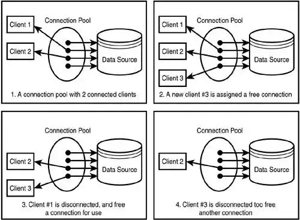

# Chương 2: Connection Pool

 

## Mục lục

- [I. Tổng quan](#i-tổng-quan)
  - [1. Connection Pool là gì?](#1-connection-pool-là-gì)
  - [2. Tại sao cần Connection Pool?](#2-tại-sao-cần-connection-pool)
  - [3. Tại sao nó lại quan trọng?](#3-tại-sao-nó-lại-quan-trọng)
  - [4. Nếu không có Connection Pool thì sao?](#4-nếu-không-có-connection-pool-thì-sao)
- [II. Các thông số cấu hình quan trọng (Best Practices)](#ii-các-thông-số-cấu-hình-quan-trọng-best-practices)
  - [1. Kích thước Pool (Pool Size)](#1-kích-thước-pool-pool-size)
  - [2. Timeouts (Hết thời gian chờ)](#2-timeouts-hết-thời-gian-chờ)
    - [Connection Timeout](#connection-timeout)
    - [Idle Timeout](#idle-timeout)
    - [Best Practices](#best-practices)
- [III. HikariCP - "ông vua" của Connection Pool](#iii-hikaricp-ông-vua-của-connection-pool)
  - [1. HikariCP là gì?](#1-hikaricp-là-gì)
  - [2. Tại sao HikariCP lại được yêu thích?](#2-tại-sao-hikaricp-được-yêu-thích)
  - [3. Cách sử dụng HikariCP](#3-cách-sử-dụng-hikaricp)
  - [4. Cách debug và tối ưu hóa HikariCP](#4-cách-debug-và-tối-ưu-hóa-hikaricp)
  - [5. Các lỗi thường gặp và cách khắc phục](#5-các-lỗi-thường-gặp-và-cách-khắc-phục)
  - [6. HikariCP trong Spring Boot](#6-hikaricp-trong-spring-boot)
  - [7. Ví dụ cụ thể](#7-ví-dụ-cụ-thể)
  - [8. Tài liệu tham khảo](#8-tài-liệu-tham-khảo)
- [V. Tổng kết](#v-tổng-kết)

## I. Tổng quan

### 1. Connection Pool là gì?
**Connection Pool** (Hồ chứa kết nối) là một phương pháp để làm tăng hiệu năng của hệ thống cho vấn đề khởi tạo Database Connection. Nó là một tập hợp các **Database Connection**, có thể được tạo trước khi mà application được khởi chạy và chia sẻ Connection khi Application cần truy cập vào Database.

Giống như một **bộ đệm (cache)** chứa sẵn các kết nối Database đã được tạo sẵn và sẵn sàng để tái sử dụng. Thay vì phải tốn 200-500ms để bắt tay với Database cho mỗi yêu cầu (như mô tả ở Chương 1), ứng dụng sẽ **mượn** một kết nối từ Pool, sử dụng nó để truy vấn dữ liệu, sau đó **trả lại** Pool ngay lập tức.



### 2. Tại sao cần Connection Pool?
- Database Connection được khởi tạo với chi phí đắt đỏ, nên thay vì tạo chúng ở mỗi request thì ta sẽ khởi tạo trước và gọi đến bất cứ khi nào cần truy cập vào Database.
- Database là tài nguyên được chia sẻ, do đó việc tạo 1 pool của connections và chia sẻ chúng trên tất cả các transaction là điều hợp lý.
- Datatabase Connection Pool thì giới hạn lượng truy cập vào Database tại 1 thời điểm giúp giảm thiểu việc Database Server bị treo.

### 3. Tại sao nó lại quan trọng?
- Giảm độ trễ (Latency): Bỏ qua bước khởi tạo kết nối và bắt tay TCP/TLS tốn kém.
- Tiết kiệm tài nguyên CPU/RAM: DB không phải gồng mình lên để quản lý hàng nghìn lượt login/logout mỗi giây.
- Kiểm soát lưu lượng: Giới hạn số lượng kết nối tối đa để tránh làm sập Database (Database Crash).

### 4. Nếu không có Connection Pool thì sao?
Ví dụ so sánh:
- Với pooling: Một kết nối chỉ mất 0.1ms để lấy từ pool.
- Không có pooling: Một kết nối mới mất 20-50ms để khởi tạo.

Giả sử bạn tắt connection pooling bằng Pooling=false. Khi đó:
- Mỗi lần gọi new SqlConnection(), một kết nối mới sẽ được tạo.
- Khi đóng connection, nó sẽ bị hủy hoàn toàn thay vì được tái sử dụng.
- Điều này làm tốn CPU, bộ nhớ, và gây chậm hệ thống vì phải mở kết nối mới liên tục.
- Trong hệ thống lớn với hàng ngàn request mỗi giây, đây là công thức cho một thảm họa hiệu năng.

## II. Các thông số cấu hình quan trọng (Best Practices)

### 1. Kích thước Pool (Pool Size)
- **Minimum Idle**: Số kết nối tối thiểu được giữ trong Pool. Khi ứng dụng khởi động, Pool sẽ tạo ra số lượng kết nối này để sẵn sàng sử dụng ngay lập tức.
- **Maximum Pool Size**: Số kết nối tối đa được phép trong Pool. Khi Pool đạt đến số này, các yêu cầu mới sẽ phải chờ đến khi có kết nối được trả về.

```yaml
# Số kết nối tối thiểu được giữ trong Pool
spring.datasource.hikari.minimum-idle= 10

# Số kết nối tối đa được phép trong Pool
spring.datasource.hikari.maximum-pool-size=100
```

### 2. Timeouts (Hết thời gian chờ)
#### Connection Timeout
Thời gian tối đa mà một yêu cầu có thể chờ để lấy được kết nối từ Pool. Nếu vượt quá thời gian này, yêu cầu sẽ bị từ chối (throw error).
Tùy theo mục đích sử dụng, có thể config lớn hơn (đợi lâu hơn, nhưng có thể trả về kết quả) hoặc nhỏ hơn (trả về lỗi nhưng không phải đợi quá lâu). Tùy theo từng trường hợp.

```yaml
# Thời gian tối đa mà một yêu cầu có thể chờ để lấy được kết nối từ Pool
spring.datasource.hikari.connection-timeout= 30000
```

#### Idle Timeout
Khi 1 connections không được sử dụng, nó chuyển sang trạng thái Idle, nếu số lượng connections hiện tại lớn hơn nó sẽ được xóa khỏi pool sau 1 khoảng thời gian để giảm thiểu số lượng connections trong pool.

```yaml
# Thời gian tối đa mà một kết nối có thể nằm im trong Pool
spring.datasource.hikari.idle-timeout= 600000
```

#### Best Practices
✅ Monitor hikaricp metrics, alert khi connections.pending > 0
✅ maximum-pool-size = (cores × 2) là starting point, tune theo profiling
✅ connection-timeout ≤ 5000ms (fail fast)
✅ leak-detection-threshold để catch connection leaks sớm
✅ JDBC batch_size = 50 cho bulk insert/update
❌ Không để default pool size cho production
❌ Không tăng max_connections của database vô tội vạ

```yaml
spring:
  datasource:
    url: jdbc:postgresql://localhost:5432/mydb?prepareThreshold=5&preparedStatementCacheQueries=256
    username: ${DB_USERNAME}
    password: ${DB_PASSWORD}
    hikari:
      maximum-pool-size: 20       # Ước tính: (CPU cores * 2)
      minimum-idle: 5
      connection-timeout: 5000    # Fail fast sau 5 giây (không phải 30!)
      idle-timeout: 300000        # 5 phút
      max-lifetime: 1200000       # 20 phút (< DB connection timeout)
      keepalive-time: 30000       # Ping mỗi 30 giây
      connection-test-query: SELECT 1
      validation-timeout: 2000
      leak-detection-threshold: 10000  # Cảnh báo nếu connection giữ > 10 giây
      pool-name: MyApp-DB-Pool

```

## III. HikariCP - "ông vua" của Connection Pool

### 1. HikariCP là gì?
[HikariCP](https://github.com/brettwooldridge/hikaricp) là JDBC connection pool có hiệu năng cao, rất nhẹ (chỉ khoảng 130kb), được phát triển bởi Brett Wooldridge (năm 2012) và vẫn đang được cập nhật liên tục. HikariCP có nhiều tính năng mà chính tác giả cũng đã ca ngợi:

- Kiểm tra các kết nối tại chính method `getConnection()`
- Đóng gói các internal pool query (bao gồm test query và initSQL query) trong transaction của chúng
- Theo dõi và đóng các đối tượng `Statement` (đã hết sử dụng) tại `Connection.close()`
- Thực hiện `rollback()` trên các `Connection` được trả về trong pool
- Xóa SQL warning trước khi trả một `Connection` về cho client
- Thiết lập mặc định `auto-commit`, mức cô lập cho `transaction`, `catalog` và trạng thái chỉ đọc (`read-only`)
- Kiểm tra các đối tượng `SQLException` để tìm ra các lỗi mất kết nối