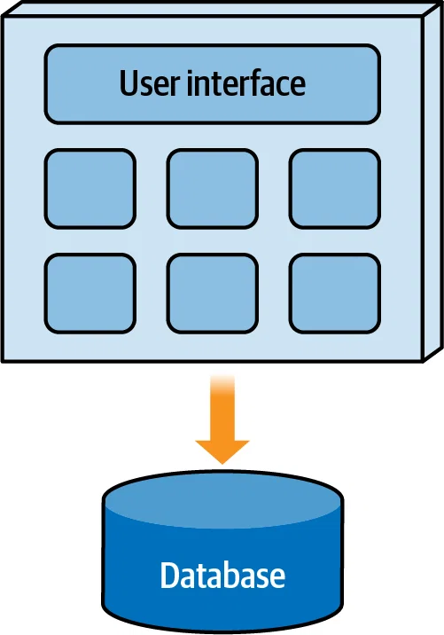
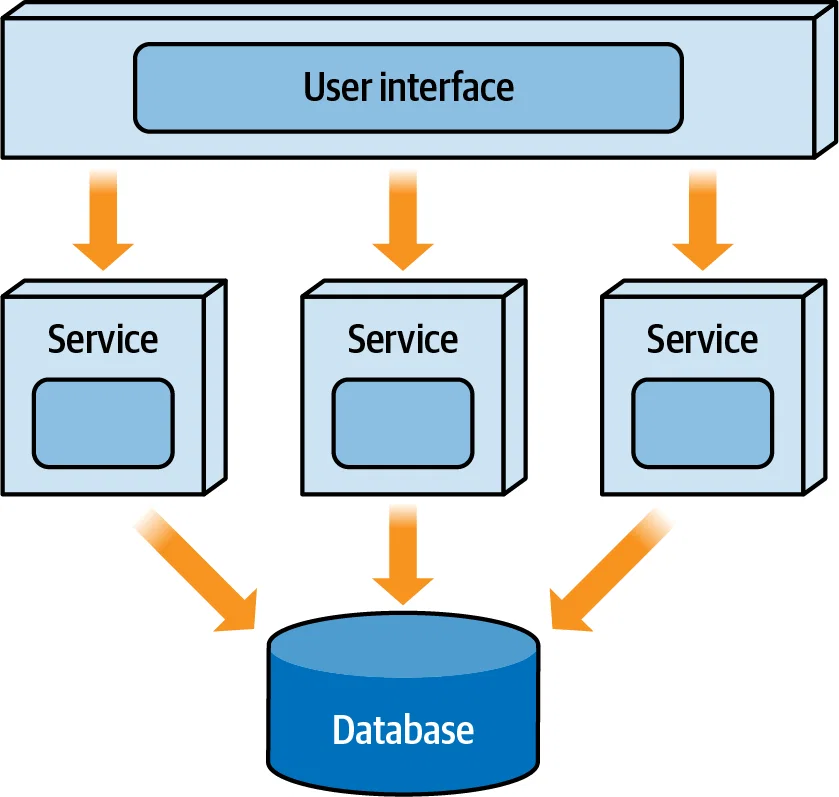
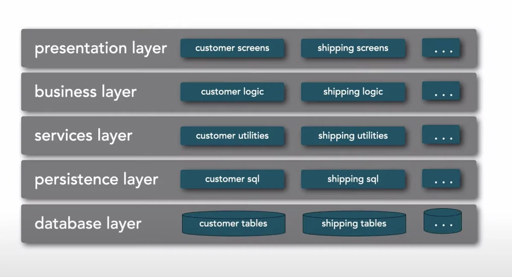
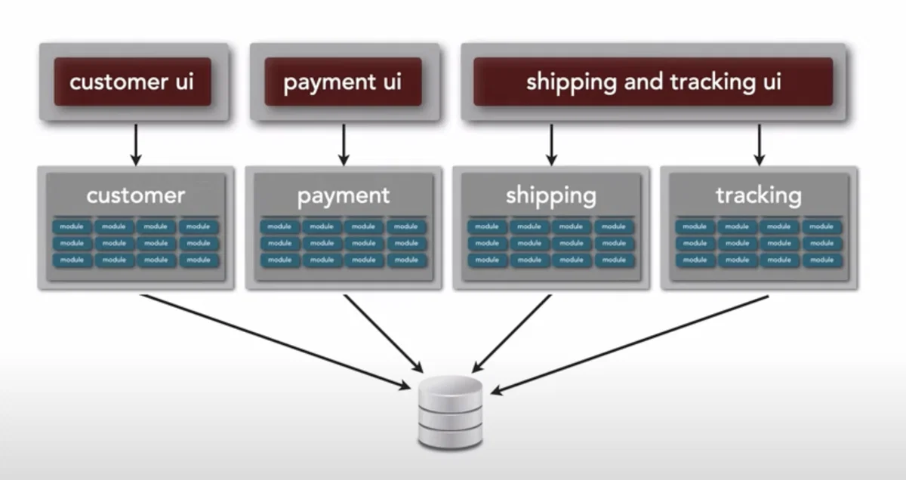
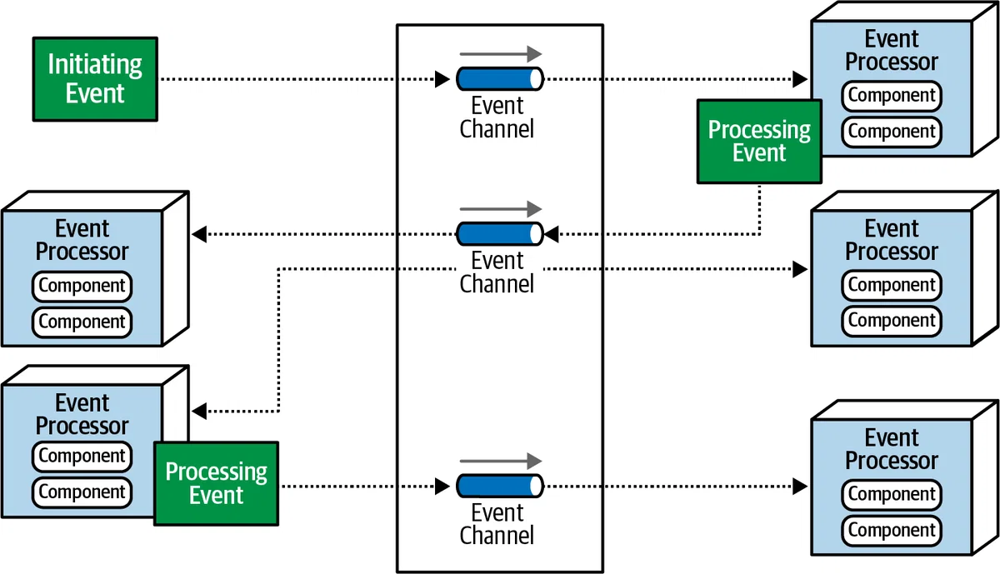
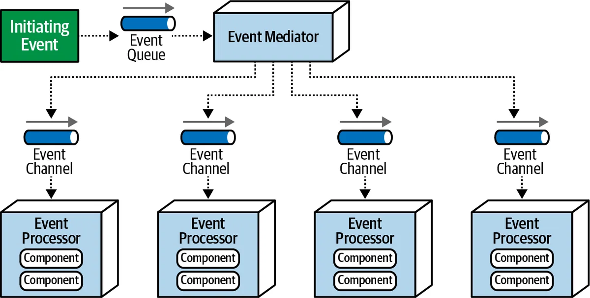
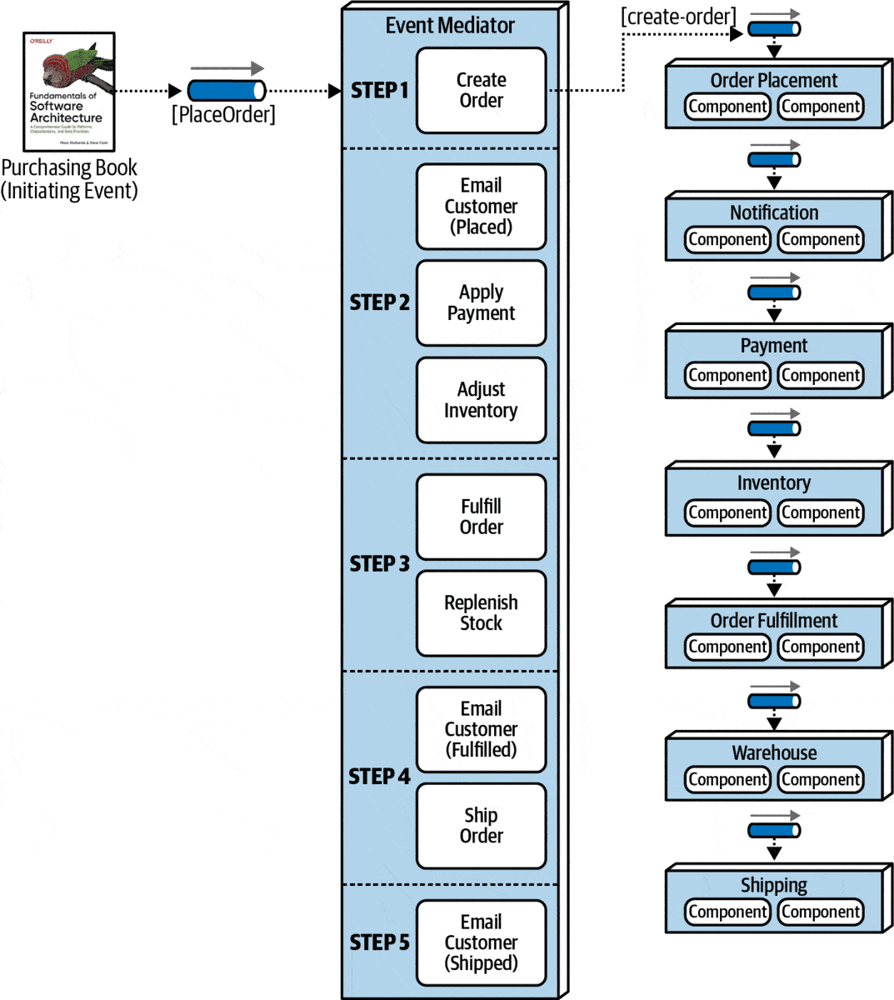

# ARCHITECTURE PATTERN

## Mục lục

## Phần 1: Các cách phân loại kiến trúc phần mềm

### 1. Cách phân loại phổ biến

Các mẫu kiến trúc phần mềm thường được chia thành hai loại chính:
- Kiến trúc nguyên khối (*Monolithic Architecture*)
- Kiến trúc phân tán (*Distributed Architecture*)

#### 1.1 Kiến trúc nguyên khối (Monolithic Architecture)

**Kiến trúc nguyên khối** (*Monolithic architecture*) được triển khai trên một đơn vị duy nhất (single deployment unit). Ví dụ, trên một server, bạn có thể cài một database và một service. Ở đây, chúng ta có hai đơn vị triển khai.

**Ưu điểm:**
- Thiết kế đơn giản và triển khai, vận hành dễ dàng.
- Dễ dàng test và debug.
- Hiệu suất cao trong các ứng dụng ít phức tạp.

**Nhược điểm:**
- Khó khăn khi scale ứng dụng.
- Độ tin cậy thấp.
- Thiếu linh hoạt với thay đổi.

**Các mẫu kiến trúc phầm mềm nằm trong nhóm kiến trúc nguyên khối:**
- Kiến trúc phân lớp (*Layered architecture*)
- Kiến trúc client-server
- Kiến trúc đường ống (*Pipeline architecture*)
- Kiến trúc vi nhân (*Microkernel architecture*)

#### 1.2 Kiến trúc phân tán (Distributed Architecture)

**Kiến trúc phân tán** (*Distributed architecture*) được triển khai trên nhiều đơn vị (multiple deployment units) làm việc cùng nhau để thực hiện một số loại chức năng business gắn kết.

**Ưu điểm:**
- **Khả năng chịu lỗi**: Nếu một dịch vụ bị lỗi, các dịch vụ khác có thể tiếp tục thực hiện các yêu cầu dịch vụ như thể không có lỗi nào xảy ra. 
- **Khả năng thích ứng**: Dễ dàng xác định vị trí và áp dụng thay đổi hơn, phạm vi thử nghiệm được giảm xuống chỉ còn dịch vụ bị ảnh hưởng và rủi ro triển khai giảm đáng kể vì thường chỉ triển khai dịch vụ bị ảnh hưởng.

**Nhược điểm:**
- Chịu ảnh hưởng lớn bởi [8 sai lầm trong tính toán phân tán](https://en.wikipedia.org/wiki/Fallacies_of_distributed_computing).
- Quản lý các giao dịch phân tán, tính nhất quán cuối cùng, quản lý quy trình làm việc, xử lý lỗi, đồng bộ hóa dữ liệu.

**Các mẫu kiến trúc phầm mềm nằm trong nhóm kiến trúc phân tán:**
- Kiến trúc hướng sự kiện (*Event-driven architecture*)
- Kiến trúc microservice (*Microservices architecture*)
- Kiến trúc hướng không gian (*Space-based architecture*)
- Kiến trúc hướng dịch vụ (*Service-oriented architecture*)

### 2. Cách phân loại khác

Ngoài cách phân loại trên, các mẫu kiến trúc phần mềm cũng có thể được phân loại theo cách chia cấu trúc tổng thể của hệ thống. Theo cách chia này, chúng ta có hai loại chính là:

- Phân vùng kỹ thuật (*Technically partitioned*)
- Phân vùng theo domain (*Domain partitioned*)

#### 2.1 Phân vùng kỹ thuật (Technically partitioned)

Trong phân vùng kỹ thuật, các component của hệ thống được tổ chức theo cách sử dụng kỹ thuật (technical usage). Ở ví dụ dưới sử dụng kiến trúc phân tầng.

**Ưu điểm:**
- Phù hợp với các team được tổ chức phân nhóm theo vai trò. Ví dụ: nhóm BE, nhóm FE, nhóm designer, ...
- Khi mã nguồn của bạn được tổ chức độc lập với nhau. Sự thay đổi của một layer sẽ không ảnh hưởng tới layer khác.
- Testing dễ dàng khi chỉ cần viết test cho từng layer và tạo mock test cho các layer còn lại.

**Nhược điểm:**
- Nếu chúng ta sửa business thì khả năng cao sẽ phải sửa lại tất cả các tầng do không có sự phân tách business giữa các tầng.

#### 2.2 Phân vùng theo domain (Domain partitioned)

Trong phân vùng theo domain (*Domain partitioned*), các component của hệ thống được tổ chức theo domain.

**Ưu điểm:**
- Nếu business có thay đổi thì chỉ ảnh hưởng tới những service chứa domain đó.
- Phù hợp với các nhóm đa chức năng có chuyên môn (cross-functional team). Mỗi nhóm sẽ phụ trách một domain riêng biệt.

**Nhược điểm:**
- Viết unit test không dễ dàng do logic của các tầng phục vụ cho cùng một domain nên viết end-to-end test sẽ phù hợp hơn và dễ dàng hơn là unit test.

### 3. Tổng kết

- Hiện nay, có 2 cách phân loại kiến trúc phần mềm: cách phân loại phổ biến và cách phân loại dựa trên cách chia cấu trúc hệ thống.
- Các phân loại phổ biến chia kiến trúc phần mềm ra làm hai loại chính là *kiến trúc nguyên khối* và *kiến trúc phân tán*.
- Ngoài ra, có cách phân loại khác dựa trên cách chia cấu trúc của hệ thống bao gồm *phân vùng kỹ thuật* và *phân vùng theo domain*.
- Mỗi loại kiến trúc phần mềm đều có ưu điểm và nhược điểm riêng, do vậy, tuỳ yêu cầu của bài toán, chúng ta cần cân nhắc lựa chọn cho phù hợp.

## Phần 2: Kiến trúc hướng sự kiện (Event-driven-architecture)

### 1. Kiến trúc hướng sự kiện là gì?

**Kiến trúc hướng sự kiện** (*Event-driven architecture - EDA*) là một mô hình kiến trúc phần mềm trong đó các thành phần hoặc dịch vụ của hệ thống giao tiếp với nhau chủ yếu thông qua việc sản xuất và tiêu thụ các sự kiện.

Các "sự kiện" (event) này có thể là các hành động người dùng, cập nhật dữ liệu, hoặc các thông báo từ các hệ thống khác. EDA giúp tạo ra các hệ thống linh hoạt, mở rộng và dễ tích hợp.

### 2. Phân loại kiến trúc hướng sự kiện

EDA được phân loại dựa trên cấu trúc liên kết (topology) giữa các component trong hệ thống với nhau, bao gồm hai mô hình phổ biến là **Broker topology** và **Mediator topology**.

Giờ chúng ta sẽ cùng tìm hiểu về hai mô hình này cũng như các trường hợp nên và không nên sử dụng chúng.

#### 2.1 Broker topology

Trong Broker topology, luồng tin nhắn sẽ phân phối đều tới các event processor qua messsage broker mà không cần tới một trung tâm điều phối event.

##### 2.1.1 Các thành phần chính của broker topology

Các thành phần chính của Broker topology bao gồm:

- **Initiating event**: sự kiện ban đầu bắt đầu toàn bộ luồng sự kiện
- **Event channel**: được sử dụng để lưu trữ các sự kiện được tạo ra và phân phối các sự kiện đó đến một service phản hồi chúng. Event channel có thể ở dạng topic hoặc queue.
- **Event broker**: chứa các event channel tham gia vào một luồng sự kiện.
- **Event processor**: service chịu trách nhiệm xử lý sự kiện
- **Processing event**: là sự kiện được tạo khi trạng thái của một số service thay đổi và gửi thông báo cho phần còn lại của hệ thống về sự thay đổi trạng thái đó. Event này được gửi theo cơ chế *fire-and-forget broadcasting*, tức là gửi và sau đó không cần xác nhận việc gửi có thành công hay không.

##### 2.1.2 Luồng tin nhắn trong broker topology

Luồng tin nhắn trong broker topology hoạt động theo thứ tự sau:

- Một initiating event được gửi tới một event channel nằm trong event broker để xử lý.
- Một event processor lấy event đó về từ event channel để xử lý và thực hiện nhiệm vụ cụ thể liên quan đến việc xử lý event đó.
- Khi xử lý xong, event processor gửi một processing event tới event channel nhằm thông báo rằng event đã xử lý xong.
- Các event processor khác sẽ lắng nghe processing event này và phản ứng lại bằng cách tạo ra event processing khác. Quá trình này lặp lại cho tới khi event processor cuối xử lý xong.

Hãy để ý trong luồng tin nhắn, khi xử lý xong event, event processor sẽ luôn gửi tới broker một processing event để thông báo đã xử lý xong dù chúng có được tiêu thụ hay không. Nếu một event không có ai lắng nghe thì nó sẽ bị bỏ qua.

Điều này tưởng chừng là lãng phí tài nguyên, tuy nhiên, trong thực tế, đây là thiết kế đảm bảo khả năng mở rộng hệ thống. Lý do là nếu hệ thống phát sinh nghiệp vụ mới, cần tới event này thì bạn chỉ cần cho Event Processor lắng nghe thay vì phải sửa logic trong code.

##### 2.1.3 Trường hợp nên dùng broker topology

- **Cần giảm sự phụ thuộc lẫn nhau (loose coupling)**: Đối với các hệ thống mà các thành phần cần hoạt động độc lập, không cần biết về nhau, broker topology cung cấp khả năng tách rời cần thiết.
- **Định tuyến đơn giản**: các event processor giao tiếp với nhau bằng event mà không cần thông qua một trung gian quản lý nào nên phù hợp với hệ thống có định tuyến đơn giản, không cần đảm bảo đúng trình tự.

##### 2.1.4 Trường hợp không nên dùng broker topology

- **Xử lý logic phức tạp giữa các thành phần**: Nếu hệ thống yêu cầu xử lý logic phức tạp, biến đổi dữ liệu, hoặc điều phối quy trình làm việc giữa các nhà sản xuất và người tiêu dùng, broker topology có thể không đủ linh hoạt. mediator topology thường phù hợp hơn trong trường hợp này.
- **Tích hợp và chuẩn hóa dữ liệu từ nhiều nguồn**: Trong trường hợp cần tích hợp dữ liệu từ nhiều nguồn khác nhau với các định dạng và giao thức không đồng nhất, Broker Topology có thể không cung cấp đủ khả năng xử lý và chuẩn hóa dữ liệu cần thiết.
- **Cần kiểm soát trung tâm và quản lý workflow**: Nếu hệ thống cần một mức độ kiểm soát trung tâm cao đối với luồng sự kiện và quản lý luồng, Broker topology có thể không phù hợp. Mediator Topology, với khả năng điều phối và quản lý trung tâm, có thể là lựa chọn tốt hơn trong trường hợp này.

#### 2.2 Meditator topology

Trong Meditator topology có một thành phần trung gian, thường được gọi là "mediator", được sử dụng để điều phối và quản lý luồng sự kiện giữa các service hoặc component khác nhau trong hệ thống.

##### 2.2.1 Các thành phần chính của Meditator topology bao gồm:

- **Initiating event**: sự kiện ban đầu bắt đầu toàn bộ luồng sự kiện
- **Event queue**: lưu trữ các sự kiện ban đầu, đảm bảo chúng không bị mất mát trong quá trình xử lý. Queue giúp xử lý các sự kiện tuần tự, đảm bảo tính nhất quán trước khi event được chuyển tới Meditator.
- **Event meditator**: nơi điều phối và quản lý luồng sự kiện, là trung tâm của mô hình Meditator.
- **Event channel**: tương tự broker topology
- **Event processor**: tương tự broker topology

##### 2.2.2 Cách hoạt động của Meditator topology được mô tả thông qua ví dụ về hệ thống bán lẻ sau:

##### 2.2.3 Trường hợp nên dùng meditator topology

- **Cần quản lý tập trung**: Phù hợp với các hệ thống cần quản lý tập trung, cần sự tích hợp chặt chẽ để đảm bảo các sự kiện được điều phối và xử lý theo đúng trình tự. Nếu hệ thống yêu cầu kiểm soát chặt chẽ về quyền truy cập và bảo mật dữ liệu, mediator topology có thể cung cấp một lớp kiểm soát bổ sung.
- **Cần xử lý logic phức tạp**: Khi hệ thống yêu cầu xử lý logic nâng cao hoặc biến đổi sự kiện trước khi chúng được gửi đến người tiêu dùng cuối cùng. Mediator có thể thực hiện các tác vụ như lọc, biến đổi dữ liệu, hoặc ánh xạ sự kiện.
- **Tích hợp hệ thống đa dạng**: Khi cần tích hợp nhiều hệ thống khác nhau với các giao thức và định dạng tin nhắn không đồng nhất, mediator topology cho phép biến đổi và chuẩn hóa dữ liệu giữa các hệ thống.

##### 2.2.4 Trường hợp không nên dùng meditator topology

- **Yêu cầu hiệu suất cao và độ trễ thấp**: Mediator Topology có thể tạo ra độ trễ bổ sung do xử lý trung gian. Trong các hệ thống cần xử lý tin nhắn cực kỳ nhanh và độ trễ thấp, việc thêm một mediator có thể không phù hợp.
- **Cần tính đơn giản và dễ mở rộng**: Nếu mục tiêu là xây dựng một hệ thống đơn giản, dễ hiểu và dễ mở rộng, việc thêm một mediator có thể làm tăng độ phức tạp không cần thiết.
- **Tách biệt và độc lập giữa các thành phần**: Trong các hệ thống yêu cầu mức độ tách biệt cao giữa các thành phần, việc sử dụng mediator có thể tạo ra sự phụ thuộc trung tâm, làm giảm khả năng tách biệt và độc lập của các thành phần.
- **Khả năng chịu lỗi và phục hồi**: Mediator trở thành điểm trung tâm có thể gây ra sự cố. Nếu mediator gặp sự cố, toàn bộ hệ thống có thể bị ảnh hưởng. Trong các hệ thống cần khả năng chịu lỗi cao, việc phụ thuộc vào một điểm trung tâm có thể không phải là lựa chọn tốt nhất.

### 3. Xử lý mất dữ liệu trong EDA

