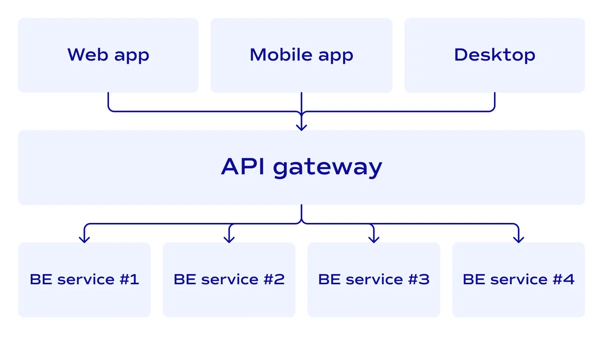
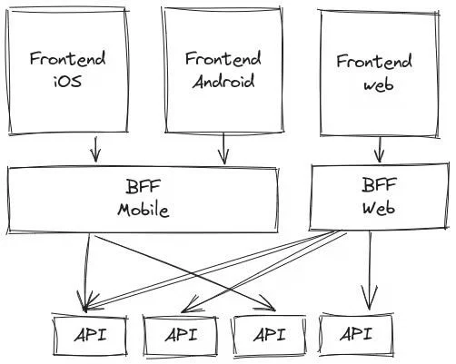

# BACKEND FOR FRONTEND (BFF)

 

## Mục lục

- [BFF là gì?](#bff-là-gì)
- [Tại sao nên sử dụng BFF?](#tại-sao-nên-sử-dụng-bff)
  - [Tối ưu, tăng trải nghiệm người dùng](#tối-ưu-tăng-trải-nghiệm-người-dùng)
  - [Tăng tốc độ phát triển](#tăng-tốc-độ-phát-triển)
  - [Dễ dàng quản lý logic riêng biệt](#dễ-dàng-quản-lý-logic-riêng-biệt)
- [BFF hoạt động như thế nào?](#bff-hoạt-động-như-thế-nào)
- [Khi nào nên sử dụng BFF?](#khi-nào-nên-sử-dụng-bff)
  - [Kiến trúc Microservices](#kiến-trúc-microservices)
  - [Cần phải tối ưu hóa hiệu suất của ứng dụng](#cần-phải-tối-ưu-hóa-hiệu-suất-của-ứng-dụng)
- [Hạn chế khi áp dụng BFF](#hạn-chế-khi-áp-dụng-bff)
  - [Đồng bộ dữ liệu](#đồng-bộ-dữ-liệu)
  - [Tăng khối lượng bảo trì](#tăng-khối-lượng-bảo-trì)
  - [Hiệu suất của BFF](#hiệu-suất-của-bff)
- [So sánh API Gateway và BFF](#so-sánh-api-gateway-và-bff)
- [Vậy khi nào nên sử dụng API Gateway và BFF?](#vậy-khi-nào-nên-sử-dụng-api-gateway-và-bff)
  - [API Gateway](#api-gateway)
  - [BFF](#bff)
  - [Nhưng trong nhiều trường hợp, có thể lựa chọn kết hợp sử dụng cả API Gateway và BFF để tận dụng ưu điểm của cả hai](#nhưng-trong-nhiều-trường-hợp-có-thể-lựa-chọn-kết-hợp-sử-dụng-cả-api-gateway-và-bff-để-tận-dụng-ưu-điểm-của-cả-hai)
- [Kết luận](#kết-luận)

## BFF là gì?

Backend for Frontend (BFF) là kiến trúc trong đó bạn tạo ra các backend riêng biệt cho từng loại frontend cụ thể. Thay vì sử dụng một API chung cho tất cả các giao diện người dùng, bạn xây dựng các backend được tùy chỉnh để đáp ứng nhu cầu riêng của từng loại giao diện.

Một ví dụ dễ hiểu thế này: giả sử bạn đang dev một ứng dụng thương mại điện tử có trên cả web và mobile. Trên web, người dùng có thể xem chi tiết sản phẩm, đọc đánh giá, và nhiều tính năng khác. Trong khi đó, trên mobile, người dùng chỉ cần xem thông tin cơ bản và mua hàng một cách nhanh chóng.

Nếu bạn sử dụng chung API cho cả hai giao diện, mobile có thể phải tải nhiều dữ liệu không cần thiết, làm chậm trải nghiệm người dùng. Với BFF, bạn tạo ra hai backend riêng:

- Backend cho web: cung cấp đầy đủ thông tin chi tiết, hình ảnh độ phân giải cao, video,... 
- Backend cho mobile: chỉ cần cung cấp thông tin cần thiết như: tên sản phẩm, giá, và hình ảnh vừa đủ với kích thước mobile.

## Tại sao nên sử dụng BFF?

### Tối ưu, tăng trải nghiệm người dùng

Mỗi thiết bị có khả năng và hạn chế riêng. Mobile thường người dùng mong muốn tốc độ tải nhanh. Bằng cách tùy chỉnh backend cho mobile, bạn sẽ giảm được dung lượng dữ liệu cần tải, giúp ứng dụng chạy mượt mà hơn.

Ví dụ:  Facebook đã từng gặp vấn đề với ứng dụng mobile vì họ sử dụng chung API với web, dẫn đến thời gian tải lâu và trải nghiệm kém. Sau khi áp dụng BFF, họ tạo ra backend riêng cho mobile, cải thiện đáng kể hiệu suất và sự hài lòng của người dùng.

### Tăng tốc độ phát triển

Khi mỗi giao diện có backend riêng, các nhóm dev có thể làm việc song song mà không ảnh hưởng đến nhau. Nhóm mobile có thể thay đổi backend của họ mà không lo lắng về việc phá vỡ chức năng của web, và ngược lại.

### Dễ dàng quản lý logic riêng biệt

Một số logic chỉ áp dụng cho một giao diện cụ thể. Ví dụ, trên mobile, bạn có thể muốn thêm tính năng push notification, trong khi trên web thì không cần. Với BFF, bạn có thể dễ dàng tích hợp các logic này vào backend.

## BFF hoạt động như thế nào?

- Yêu cầu từ Client: Ứng dụng frontend gửi yêu cầu đến BFF của nó.
- Xử lý tại BFF: BFF nhận yêu cầu, gọi đến các microservice cần thiết, xử lý dữ liệu và định dạng kết quả phù hợp.
- Phản hồi đến Client: BFF gửi dữ liệu đã được tùy chỉnh trở lại cho ứng dụng frontend.

Frontend riêng biệt (iOS, Android, web) đều có backend riêng (BFF Mobile và BFF Web) để tương tác với các API. Mỗi BFF sẽ chỉ lấy và xử lý những dữ liệu cần thiết từ các API để phục vụ cho frontend cụ thể.

## Khi nào nên sử dụng BFF?

### Kiến trúc Microservices

Trong hệ thống microservices, BFF có thể đóng vai trò như nơi tổng hợp, kết hợp dữ liệu từ nhiều dịch vụ khác nhau. Điều này giúp giảm tải cho frontend và tránh việc frontend phải gọi nhiều API.

### Cần phải tối ưu hóa hiệu suất của ứng dụng

Khi hiệu suất là yếu tố quan trọng, đặc biệt trên mobile, việc giảm thiểu dữ liệu truyền tải và số lượng API request là rất quan trọng.

## Hạn chế khi áp dụng BFF

### Đồng bộ dữ liệu

Nếu không cẩn thận, dữ liệu trả về từ các BFF khác nhau có thể không nhất quán. Để tránh điều này:

- Đảm bảo rằng các thay đổi trong microservices được phản ánh đồng bộ trong các BFF.
- Đảm bảo các BFF tuân thủ cùng một tiêu chuẩn dữ liệu.

### Tăng khối lượng bảo trì

Có nhiều backend đồng nghĩa với việc bạn cần bảo trì nhiều hơn. Để quản lý điều này, bạn có thể:

- Sử dụng các công cụ như Docker và Kubernetes để triển khai và quản lý các dịch vụ.
- Đặt ra các tiêu chuẩn chung: về coding, logging, và monitoring để dễ dàng quản lý.

### Hiệu suất của BFF

BFF có thể trở thành điểm tắc nghẽn nếu phải xử lý quá nhiều. Bạn có thể áp dụng các giải pháp sau:

- Caching: lưu trữ các kết quả để giảm tải.
- Load Balancing: phân phối yêu cầu qua nhiều instance của BFF.

## So sánh API Gateway và BFF

| | API Gateway | BFF |
| --- | --- | --- |
| Mục đích | - Cung cấp một điểm truy cập duy nhất cho tất cả API.  - Thực hiện các chức năng như xác thực, giám sát, cân bằng tải và quản lý lưu lượng truy cập. | - Cung cấp backend riêng biệt, tùy chỉnh cho từng frontend cụ thể (mobile, web, IoT...). - Xử lý logic và định dạng dữ liệu theo nhu cầu của từng loại ứng dụng. |
| Phạm vi | Thường áp dụng cho toàn bộ hệ thống, tất cả microservices sẽ được truy cập thông qua API Gateway. | Tập trung vào từng giao diện cụ thể. Mỗi frontend sẽ có BFF riêng để kết nối và tối ưu hóa dữ liệu. |
| Chức năng chính | - **Routing**: định tuyến yêu cầu đến microservice tương ứng. - **Xác thực và an ninh**: tích hợp với hệ thống xác thực và phân quyền. - **Quản lý lưu lượng**: áp dụng rate limiting, caching, logging... | - **Aggregation**: kết hợp dữ liệu từ nhiều microservice theo nhu cầu của một frontend cụ thể. - **Logic nghiệp vụ**: xử lý logic và định dạng lại dữ liệu dành riêng cho từng giao diện. - **Tối ưu hóa dữ liệu**: giảm tải các trường không cần thiết cho frontend. |
| Tối ưu hóa | Tối ưu ở mức độ hệ thống, cung cấp cơ chế đảm bảo an toàn và ổn định cho tất cả các loại yêu cầu | Tối ưu hóa theo nhu cầu của mỗi loại frontend, giúp cải thiện hiệu năng và trải nghiệm người dùng một cách chuyên sâu. |
| Độ linh hoạt | Thay đổi cấu hình và routing trong API Gateway có thể ảnh hưởng đến tất cả các ứng dụng truy cập API. | Mỗi BFF hoạt động độc lập. Thay đổi trong BFF này sẽ không ảnh hưởng đến BFF khác và frontend khác. |
| Cách tiếp cận | **Tập trung (Centralized):** tất cả các yêu cầu được gửi tới một điểm duy nhất (API Gateway), sau đó được định tuyến đến các dịch vụ backend phù hợp. | **Phân tán (Distributed):** mỗi loại frontend có một backend riêng. Tất cả BFF tương tác trực tiếp với các microservice hoặc thông qua API Gateway tùy theo kiến trúc. |
| Logic nghiệp vụ | API Gateway thường không xử lý nhiều logic nghiệp vụ phức tạp. Nó chủ yếu tập trung vào routing và các chức năng cross-cutting. | BFF thường tích hợp logic nghiệp vụ chuyên biệt cho từng frontend, định dạng lại dữ liệu và xử lý các yêu cầu phức tạp. |
| Quản lý và bảo trì | Một lớp gateway duy nhất dễ quản lý, nhưng có thể trở thành điểm tập trung duy nhất có nguy cơ gây tắc nghẽn. | Mỗi BFF yêu cầu bảo trì riêng, tăng khối lượng quản lý nhưng lại linh hoạt hơn trong phát triển tính năng cho từng giao diện. |

## Vậy khi nào nên sử dụng API Gateway và BFF?

### API Gateway

- Khi bạn chỉ cần một điểm truy cập duy nhất cho tất cả các microservice.
- Khi bạn cần các chức năng chung cho tất cả các dịch vụ như xác thực, logs, rate limiting.
- Khi hệ thống microservices của bạn phức tạp và cần tách biệt hoàn toàn logic routing và liên lạc với các dịch vụ backend.

### BFF

- Khi bạn xây dựng ứng dụng đa nền tảng (mobile, web, IoT) với nhu cầu xử lý và dữ liệu khác nhau.
- Khi bạn muốn tối ưu hóa trải nghiệm người dùng và hiệu suất cho từng nền tảng cụ thể.
- Khi bạn có logic nghiệp vụ phức tạp chỉ dành riêng cho một frontend.

### Nhưng trong nhiều trường hợp, có thể lựa chọn kết hợp sử dụng cả API Gateway và BFF để tận dụng ưu điểm của cả hai

- API Gateway có thể đứng trước, quản lý luồng truy cập, xác thực và routing đến các BFF hoặc trực tiếp đến microservice.
- BFF ở phía sau Gateway, hoạt động như một lớp service đặc biệt phục vụ riêng cho các frontend.

Cách tiếp cận này giúp duy trì sự nhất quán trong việc xác thực và bảo mật (thông qua API Gateway), đồng thời cho phép từng frontend có sự tùy chỉnh backend riêng (BFF).

## Kết luận

Áp dụng kiến trúc Backend for Frontend (BFF) có thể mang lại nhiều lợi ích cho dự án của bạn, từ việc tối ưu hóa trải nghiệm người dùng đến tăng tốc độ phát triển và dễ dàng quản lý. Mặc dù có một số thách thức, nhưng với kế hoạch và chiến lược đúng đắn, bạn có thể triển khai BFF.