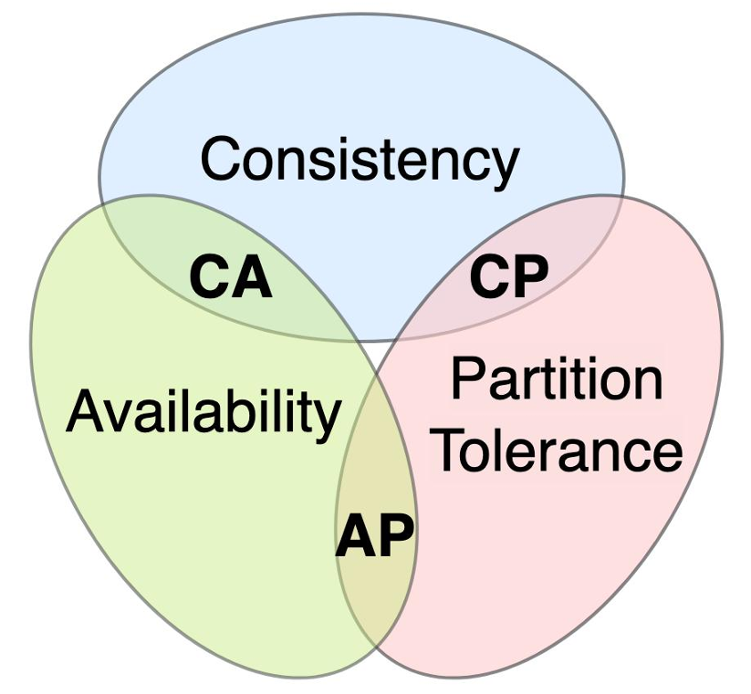

# SYSTEM DESIGN NOTE

 

System Design cho người mới bắt đầu.
Những kiến thức cơ bản giúp bạn phỏng vấn hiệu quả.

> **Lưu ý:** Đây là tài liệu ghi chép, tổng hợp và tóm tắt lại kiến thức cá nhân của tôi trong quá trình đọc Ebook về System Design.
>
> **© Bản quyền gốc thuộc về:** Tác giả **Nguyễn Thế Huy** (https://huynt.dev). Mọi trích dẫn và nội dung cốt lõi đều nhằm mục đích học tập và lưu trữ kiến thức.

---

## Mục lục

### [Lời mở đầu](#lời-mở-đầu-1)

### [Giới thiệu](#giới-thiệu-1)

- [System Design Interview là gì?](#system-design-interview-là-gì)
- [Tại sao vòng phỏng vấn này quan trọng?](#tại-sao-vòng-phỏng-vấn-này-quan-trọng)
- [Những khó khăn mà người mới thường gặp](#những-khó-khăn-mà-người-mới-thường-gặp)
- [Các kỹ năng mà nhà tuyển dùng mong muốn](#các-kỹ-năng-mà-nhà-tuyển-dùng-mong-muốn)

### [Các khái niệm nền tảng trong Thiết kế hệ thống](#các-khái-niệm-nền-tảng-trong-thiết-kế-hệ-thống-1)

- [Latency (Độ trễ)](#latency-độ-trễ)
- [Throughput (Thông lượng)](#throughput-thông-lượng)
- [Scalability (Khả năng mở rộng)](#scalability-khả-năng-mở-rộng)
- [Availability (Tính khả dụng)](#availability-tính-khả-dụng)
- [Reliability (Độ tin cậy)](#reliability-độ-tin-cậy)
- [High-Level Architecture (Kiến trúc cấp cao)](#high-level-architecture-kiến-trúc-cấp-cao)
- [Các thành phần phổ biến trong hệ thống](#các-thành-phần-phổ-biến-trong-hệ-thống)
    - [Web Server (Máy chủ Web)](#web-server-máy-chủ-web)
    - [Application Server (Máy chủ ứng dụng)](#application-server-máy-chủ-ứng-dụng)
    - [Database (Cơ sở dữ liệu)](#database-cơ-sở-dữ-liệu)
    - [Load Balancer (Bộ cân bằng tải)](#load-balancer-bộ-cân-bằng-tải)
    - [Cache (Bộ nhớ đệm)](#cache-bộ-nhớ-đệm)
    - [CDN (Mạng phân phối nội dung)](#cdn-mạng-phân-phối-nội-dung)
    - [Message Queue (Hàng đợi thông điệp)](#message-queue-hàng-đợi-thông-điệp)

### [Tính nhất quán và khả dụng trong System Design](#tính-nhất-quán-và-khả-dụng-trong-system-design-1)

- [Giới thiệu](#giới-thiệu-2)
- [Tính nhất quán và tính khả dụng](#tính-nhất-quán-và-tính-khả-dụng)
- [Các mô hình nhất quán (Consistency Models)](#các-mô-hình-nhất-quán-consistency-models)
    - [Nhất quán mạnh (Strong Consistency)](#nhất-quán-mạnh-strong-consistency)
    - [Nhất quán cuối cùng (Eventual Consistency)](#nhất-quán-cuối-cùng-eventual-consistency)
    - [Nhất quán yếu (Weak Consistency)](#nhất-quán-yếu-weak-consistency)
- [Cơ chế đảm bảo tính nhất quán và khả dụng](#cơ-chế-đảm-bảo-tính-nhất-quán-và-khả-dụng)
    - [Nhân bản dữ liệu (Replication)](#nhân-bản-dữ-liệu-replication)
    - [Chuyển đổi dự phòng (Failover)](#chuyển-đổi-dự-phòng-failover)
    - [Quorum (Đa số phiếu)](#quorum-đa-số-phiếu)
- [Định lý CAP và các đánh đổi kinh điển](#định-lý-cap-và-các-đánh-đổi-kinh-điển)
- [Cách trình bày về nhất quán và khả dụng khi phỏng vấn](#cách-trình-bày-về-nhất-quán-và-khả-dụng-khi-phỏng-vấn)

### [Lựa chọn Cơ sở dữ liệu, Sharding và Tối ưu hóa lưu trữ](#lựa-chọn-cơ-sở-dữ-liệu-sharding-và-tối-ưu-hóa-lưu-trữ-1)

- [SQL vs NoSQL: Lựa chọn cơ sở dữ liệu phù hợp](#sql-vs-nosql-lựa-chọn-cơ-sở-dữ-liệu-phù-hợp)
- [Phân mảnh dữ liệu (Sharding/Partitioning)](#phân-mảnh-dữ-liệu-shardingpartitioning)
- [Chỉ mục (Index): Tối ưu hóa truy vấn](#chỉ-mục-index-tối-ưu-hóa-truy-vấn)
- [Cân nhắc khi chọn kiểu lưu trữ cho hệ thống lớn](#cân-nhắc-khi-chọn-kiểu-lưu-trữ-cho-hệ-thống-lớn)
- [Dữ liệu phân tán và tính nhất quán (Consistency)](#dữ-liệu-phân-tán-và-tính-nhất-quán-consistency)
- [Gợi ý trình bày phần thiết kế Database khi phỏng vấn](#gợi-ý-trình-bày-phần-thiết-kế-database-khi-phỏng-vấn)

### [Mở rộng hệ thống và tối ưu hiệu suất](#mở-rộng-hệ-thống-và-tối-ưu-hiệu-suất-1)

- [Cân bằng tải (Load Balancer)](#cân-bằng-tải-load-balancer)
    - [Load Balancer là gì và vai trò của nó?](#load-balancer-là-gì-và-vai-trò-của-nó)
    - [Cách hoạt động và các thuật toán phân phối](#cách-hoạt-động-và-các-thuật-toán-phân-phối)
    - [Load Balancer tầng 4 vs tầng 7 (Layer 4 vs Layer 7)](#load-balancer-tầng-4-vs-tầng-7-layer-4-vs-layer-7)
    - [Khi nào cần sử dụng Load Balancer?](#khi-nào-cần-sử-dụng-load-balancer)
- [Bộ nhớ đệm (Caching)](#bộ-nhớ-đệm-caching)
    - [Cache là gì và có lợi ích gì?](#cache-là-gì-và-có-lợi-ích-gì)
    - [Các vị trí có thể đặt cache](#các-vị-trí-có-thể-đặt-cache)
    - [Các chiến lược cập nhật cache (Cache update strategies)](#các-chiến-lược-cập-nhật-cache-cache-update-strategies)
    - [Gợi ý khi phỏng vấn về Caching](#gợi-ý-khi-phỏng-vấn-về-caching)
- [Hàng đợi thông điệp (Message Queue)](#hàng-đợi-thông-điệp-message-queue)
    - [Khái niệm hàng đợi thông điệp & xử lý bất đồng bộ](#khái-niệm-hàng-đợi-thông-điệp--xử-lý-bất-đồng-bộ)
    - [Khi nào nên dùng hàng đợi](#khi-nào-nên-dùng-hàng-đợi)
    - [Một số hệ thống Message Queue phổ biến](#một-số-hệ-thống-message-queue-phổ-biến)
    - [Mô hình Producer - Queue - Consumer](#mô-hình-producer---queue---consumer)
    - [Cơ chế backpressure (phản áp lực) trong hàng đợi](#cơ-chế-backpressure-phản-áp-lực-trong-hàng-đợi)
    - [Ví dụ minh họa sử dụng Message Queue](#ví-dụ-minh-họa-sử-dụng-message-queue)
    - [Gợi ý khi phỏng vấn về Message Queue](#gợi-ý-khi-phỏng-vấn-về-message-queue)

### [Idempotency và cơ chế khóa trong hệ thống phân tán](#idempotency-và-cơ-chế-khóa-trong-hệ-thống-phân-tán-1)

- [Pessimistic Locking (Khóa bi quan)](#pessimistic-locking-khóa-bi-quan)
- [Optimistic Locking (Khóa lạc quan)](#optimistic-locking-khóa-lạc-quan)
- [Khi nào dùng & lựa chọn](#khi-nào-dùng--lựa-chọn)

### [Các phương thức giao tiếp và thiết kế API](#các-phương-thức-giao-tiếp-và-thiết-kế-api-1)

- [HTTP: Giao thức request/response phổ biến nhất](#http-giao-thức-requestresponse-phổ-biến-nhất)
- [TCP: Giao thức kết nối tin cậy](#tcp-giao-thức-kết-nối-tin-cậy)
- [UDP: Giao thức "gửi là quên"](#udp-giao-thức-gửi-là-quên)
- [RPC: Gọi thủ tục từ xa như gọi hàm nội bộ](#rpc-gọi-thủ-tục-từ-xa-như-gọi-hàm-nội-bộ)
- [REST: Phong cách thiết kế API rõ ràng, thống nhất](#rest-phong-cách-thiết-kế-api-rõ-ràng-thống-nhất)

### [Đảm bảo khả năng chịu lỗi và phục hồi hệ thống](#đảm-bảo-khả-năng-chịu-lỗi-và-phục-hồi-hệ-thống-1)

- [Khả năng chịu lỗi là gì và tại sao quan trọng?](#khả-năng-chịu-lỗi-là-gì-và-tại-sao-quan-trọng)
- [Các sự cố phổ biến trong hệ thống phân tán](#các-sự-cố-phổ-biến-trong-hệ-thống-phân-tán)
- [Chiến lược tăng độ bền vững (resilience) cho hệ thống](#chiến-lược-tăng-độ-bền-vững-resilience-cho-hệ-thống)
- [Phân biệt High Availability và Fault Tolerance](#phân-biệt-high-availability-và-fault-tolerance)
- [Đánh giá độ tin cậy: Uptime, SLA, MTTR, MTBF](#đánh-giá-độ-tin-cậy-uptime-sla-mttr-mtbf)
- [Gợi ý trình bày chiến lược phục hồi sự cố trong phỏng vấn](#gợi-ý-trình-bày-chiến-lược-phục-hồi-sự-cố-trong-phỏng-vấn)

### [Bảo mật và phân quyền](#bảo-mật-và-phân-quyền-1)

- [Vai trò của bảo mật trong hệ thống phân tán hiện đại](#vai-trò-của-bảo-mật-trong-hệ-thống-phân-tán-hiện-đại)
    - [Các khái niệm cơ bản](#các-khái-niệm-cơ-bản)
        - [Xác thực (Authentication)](#xác-thực-authentication)
        - [Phân quyền (Authorization)](#phân-quyền-authorization)
        - [Bảo mật API](#bảo-mật-api)
        - [Bảo vệ dữ liệu](#bảo-vệ-dữ-liệu)
        - [HTTPS, TLS và bảo mật cookie](#https-tls-và-bảo-mật-cookie)
    - [Ví dụ minh họa](#ví-dụ-minh-họa)
    - [Lời khuyên khi phỏng vấn về bảo mật trong System Design](#lời-khuyên-khi-phỏng-vấn-về-bảo-mật-trong-system-design)
- [Monitoring và Observability](#monitoring-và-observability)
    - [Monitoring là gì?](#monitoring-là-gì)
    - [Observability là gì?](#observability-là-gì)
    - [Trình bày về Monitoring và Observability trong buổi phỏng vấn](#trình-bày-về-monitoring-và-observability-trong-buổi-phỏng-vấn)

### [Lời kết](#lời-kết-1)

---

## Lời mở đầu

> "Chào bạn, và cám ơn bạn đã đọc ebook này của mình.
>
> Mình là Huy, hiện tại mình là một Technical Leader với trên 10 năm kinh nghiệm.
> Ebook này của mình nhằm cung cấp cho bạn những khái niệm cốt lõi, cũng như kinh nghiệm tham gia phỏng vấn System Design (thiết kế hệ thống).
>
> Dù bạn là người mới bắt đầu hay đã có kinh nghiệm, mình tin những kiến thức trong ebook này sẽ giúp bạn rất nhiều trong việc review lại kiến thức về thiết kế, cũng như chuẩn bị cho các cuộc phỏng vấn về System Design.
>
> Chúc bạn có những giây phút thú vị, bổ ích khi đọc ebook."

##  Giới thiệu

### System Design Interview là gì?

[System Design](https://roadmap.sh/system-design) Interview hay phỏng vấn thiết kế hệ thống là một vòng phỏng vấn kỹ thuật trong đó bạn được yêu cầu thiết kế kiến trúc cho một hệ thống phần mềm giả định nào đó, thay vì coding trực tiếp. Thông thường, người phỏng vấn sẽ đưa ra một bài toán mở.  

Nhiệm vụ của bạn là thảo luận và đề xuất một giải pháp kiến trúc tổng thể: bao gồm các thành phần chính của hệ thống, cách các thành phần này tương tác với nhau, và làm thế nào hệ thống đáp ứng được các yêu cầu đề ra.

Trong vòng phỏng vấn này, bạn sẽ không viết code chi tiết mà tập trung vào việc phác thảo và giải thích ý tưởng thiết kế. Người phỏng vấn thường quan sát cách bạn tiếp cận một bài toán lớn: từ việc làm rõ yêu cầu, đề xuất các thành phần kiến trúc, cho đến việc phân tích những điểm mạnh, điểm yếu của từng lựa chọn thiết kế. Mục đích là để đánh giá khả năng của bạn trong việc xây dựng một hệ thống phần mềm có tính mở rộng, ổn định và hiệu quả dựa trên yêu cầu đưa ra. 

Nói cách khác, cuộc phỏng vấn đề system design nhằm kiểm tra kỹ năng giải quyết vấn đề kỹ thuật phức tạp ở tầm kiến trúc của bạn: hiểu bài toán, đề ra hướng giải quyết, thảo luận các phương án và đưa ra quyết định phù hợp. 

### Tại sao vòng phỏng vấn này quan trọng?

Vòng phỏng vấn system design ngày càng trở thành yếu tố then chốt trong quy trình tuyển dụng kỹ sư phần mềm, đặc biệt tại các công ty công nghệ lớn. Lý do là bởi việc xây dựng và vận hành các hệ thống phần mềm quy mô lớn tiêu tốn rất nhiều nguồn lực, và các công ty muốn đảm bảo rằng những kỹ sư họ tuyển vào có thể nhanh chóng bắt tay vào thiết kế những hệ thống như vậy. Nói cách khác, họ dùng vòng phỏng vấn này như phương pháp chính để đánh giá liệu ứng viên có kiến thức và tư duy thiết kế hệ thống đủ mạnh hay không. 

Vòng phỏng vấn này đôi khi còn được đánh giá cao hơn vòng coding, đặc biệt trong thời kỳ AI thống trị, việc coding càng ngày càng được chuyển giao nhiều hơn cho trí tuệ nhân tạo. Coding interview thường chỉ kiểm tra khả năng giải thuật và coding ở quy mô nhỏ, trong khi thiết kế hệ thống kiểm tra tư duy chiến lược hơn: bạn hiểu bức tranh toàn cảnh ra sao, bạn sẽ thiết kế hệ thống phục vụ hàng triệu người dùng như thế nào, và bạn ra quyết định kỹ thuật ra sao khi đối mặt với các ràng buộc thực tế (hiệu năng, chi phí, độ phức tạp, v.v.). Đó là lý do các công ty lớn rất coi trọng vòng này, họ muốn tuyển người không chỉ code giỏi, mà còn thiết kế hệ thống tinh gọn, linh hoạt và có thể mở rộng cho tương lai.

### Những khó khăn mà người mới thường gặp

- **Câu hỏi mở, không có đáp án cố định:** Các câu hỏi thiết kế hệ thống thường rất mở và không có một đáp án duy nhất đúng hẳn. Không có tiêu chí "đúng" hoặc "sai" rõ ràng như trong bài lập trình, nên bạn dễ cảm thấy lúng túng, không biết nên bắt đầu từ đâu và định hướng giải quyết vấn đề ra sao. Mỗi người có thể đưa ra một cách tiếp cận khác nhau cho cùng một bài toán thiết kế, miễn là đáp ứng được các yêu cầu cơ bản - do đó sẽ không có phương án nào được coi là hoàn toàn đúng hoặc hoàn toàn sai.

- **Thiếu kinh nghiệm thực tế về hệ thống lớn:** Nhiều lập trình viên trẻ chưa từng tham gia thiết kế hoặc vận hành những hệ thống lớn trong công việc thực tế. Điều này dẫn đến việc bạn thiếu kiến thức về các thành phần kiến trúc quan trọng (ví dụ: máy chủ ứng dụng, cơ sở dữ liệu phân tán, caching, message queue, load balancing, v.v.) và không biết cách áp dụng chúng trong thiết kế. Khi nhận một bài toán thiết kế, bạn có thể bối rối không rõ nên dùng công nghệ nào, module nào cho phù hợp, đơn giản vì bạn chưa từng làm việc với hệ thống tương tự quy mô đó. 

- **Áp lực thời gian và tâm lý:** Mỗi buổi phỏng vấn thiết kế hệ thống thường chỉ kéo dài khoảng 45 - 60 phút, đây không phải là nhiều thời gian để bạn trình bày một kiến trúc phức tạp. Bạn phải vừa tư duy giải pháp, vừa diễn đạt nó một cách mạch lạc dưới áp lực thời gian, nên rất dễ căng thẳng. Nhiều người mới có thể bị "khớp" khi đối diện với bảng trắng và một vấn đề lớn, hoặc phân bổ thời gian không hợp lý (ví dụ: mải mê vẽ chi tiết mà không kịp nói hết ý tưởng chính). Kết quả là bài thiết kế trình bày dang dở hoặc thiếu nhiều phần quan trọng. Rõ ràng, **kỹ năng quản lý thời gian** và **bình tĩnh xử lý tình huống áp lực** là một thách thức lớn ở vòng này. 

- **Chưa có phương pháp tiếp cận bài bản:** Thiết kế một hệ thống quy mô lớn là vấn đề phức tạp, đòi hỏi một phương pháp luận rõ ràng. Thực tế, đa số ứng viên thất bại ở vòng System Design là do thiếu một quy trình tư duy lặp lại được cho các câu hỏi mở. Nếu bạn không có sẵn cho mình một chiến lược (chẳng hạn: bước 1 hỏi rõ yêu cầu, bước 2 đề xuất thiết kế tổng quan, bước 3 phân tích chuyên sâu các thành phần...), bạn sẽ dễ bị lúng túng trước lượng thông tin và lựa chọn khổng lồ. Việc thiếu phương pháp cũng khiến bạn có thể bỏ sót những khía cạnh quan trọng của hệ thống. 

- **Ám ảnh về “giải pháp hoàn hảo”:** Không ít bạn lo lắng rằng mình phải đưa ra một thiết kế hoàn mỹ không có bất kỳ sai sót nào thì mới được đánh giá cao. Thực ra, người phỏng vấn không kỳ vọng một giải pháp 100% hoàn hảo từ bạn. Không hề có “đáp án đúng tuyệt đối” trong phỏng vấn thiết kế hệ thống, vì vậy điều quan trọng hơn là cách bạn tiếp cận vấn đề. Họ muốn thấy cách bạn đưa ra quyết định khi thông tin chưa đầy đủ, cách bạn xử lý các tình huống không chắc chắn, và liệu bạn có đủ linh hoạt để thích ứng khi yêu cầu thay đổi hay không. Hiểu được điều này sẽ giúp bạn tự tin hơn và tập trung vào quy trình giải quyết vấn đề thay vì cố tìm một đáp án hoàn hảo duy nhất. Hãy nhớ rằng phỏng vấn thiết kế hệ thống chủ yếu đánh giá tư duy và kỹ năng giao tiếp kỹ thuật của bạn, chứ không phải tìm kiếm một thiết kế hoàn chỉnh để đem triển khai ngay. 

### Các kỹ năng mà nhà tuyển dùng mong muốn

- **Kiến thức nền tảng vững chắc:** Bạn cần nắm vững các kiến thức cơ bản về thiết kế và kiến trúc hệ thống. Điều này bao gồm hiểu biết về các thành phần như máy chủ, cơ sở dữ liệu, hệ thống storage, networking, caching, load balancing, v.v. Bên cạnh đó, bạn cũng nên nắm các khái niệm như tính mở rộng (scalability), tính sẵn sàng (availability), độ trễ (latency), tính nhất quán (consistency)... Kiến thức nền tảng vững giúp bạn tự tin đề xuất các giải pháp phù hợp và giải thích được tại sao chọn thiết kế đó. 

- **Tư duy phân tích và giải quyết vấn đề:** Kỹ năng phân tích một bài toán lớn thành các phần nhỏ hơn là rất quan trọng. Nhà tuyển dụng muốn thấy bạn biết cách làm rõ yêu cầu bài toán (functional & non-functional requirements), biết đặt câu hỏi để bổ sung thông tin, và từ đó định hình được vấn đề cần giải quyết. Bạn cũng cần có tư duy hệ thống để xâu chuỗi các phần lại thành một giải pháp hoàn chỉnh. Khả năng xác định trọng tâm của vấn đề và giải quyết lần lượt từng khía cạnh (dữ liệu, giao tiếp giữa các dịch vụ, giao diện API, v.v.) cho thấy bạn có phương pháp làm việc rõ ràng và hiệu quả. 

- **Kỹ năng thiết kế hệ thống quy mô lớn:** Đây là khả năng hình dung và thiết kế một hệ thống có thể hoạt động tốt ở quy mô hàng triệu người dùng hoặc hơn. Bạn cần thể hiện được việc cân nhắc đến yếu tố tải cao. Đồng thời, kỹ năng này bao gồm việc thiết kế hệ thống có tính chịu lỗi (fault-tolerance): hệ thống vẫn tiếp tục hoạt động ngay cả khi một phần nào đó gặp sự cố. Nhà tuyển dụng muốn thấy rằng bạn biết nghĩ đến tương lai của hệ thống: cách hệ thống mở rộng khi lưu lượng tăng, cách sao lưu dữ liệu, cách xử lý khi một dịch vụ con bị hỏng, v.v. Đây là những yếu tố phân biệt một thiết kế tạm thời với một thiết kế tốt cho sản phẩm thực tế. 

- **Khả năng ra quyết định và cân bằng đánh đổi:** Trong thiết kế hệ thống, không có giải pháp nào là hoàn hảo toàn diện: mỗi lựa chọn đều đi kèm đánh đổi (trade-off). Người phỏng vấn sẽ đánh giá cao khả năng bạn đưa ra quyết định hợp lý và giải thích được lý do cho các lựa chọn thiết kế của mình. Họ muốn thấy bạn cân nhắc và cân bằng giữa các yếu tố đánh đổi: như hiệu năng vs. chi phí, tốc độ phát triển vs. khả năng mở rộng, độ phức tạp vs. tính linh hoạt, v.v.. Kỹ năng này thể hiện tư duy của một technical leader: biết lựa chọn hướng đi tối ưu dựa trên bối cảnh cụ thể của bài toán.

- **Kỹ năng giao tiếp và cộng tác:** Khả năng trình bày rõ ràng ý tưởng kỹ thuật của bạn là vô cùng quan trọng. Trong phỏng vấn thiết kế hệ thống, bạn cần giao tiếp mạch lạc để người phỏng vấn hiểu được kiến trúc bạn đề xuất. Điều này bao gồm việc dùng ngôn ngữ dễ hiểu, tổ chức ý tưởng có thứ tự, và minh họa bằng sơ đồ/trạng thái khi cần thiết. Bên cạnh đó, thái độ cởi mở và hợp tác cũng được đánh giá cao: người phỏng vấn có thể sẽ gợi ý hoặc đặt câu hỏi thử thách vào thiết kế của bạn, và họ muốn thấy bạn biết lắng nghe, trao đổi lại một cách tích cực, giống như khi làm việc nhóm thực sự. Việc truyền đạt ý tưởng rõ ràng và tương tác nhịp nhàng sẽ gây ấn tượng tốt rằng bạn có 
thể làm việc hiệu quả trong team. 

Tóm lại, để vượt qua vòng phỏng vấn thiết kế hệ thống, bạn cần kết hợp cả kiến thức kỹ thuật nền tảng lẫn kỹ năng mềm về phân tích, ra quyết định và giao tiếp. Nhà tuyển dụng tìm kiếm một người kỹ sư có thể nhìn toàn cảnh, thiết kế giải pháp phù hợp và thuyết phục được người khác về giải pháp đó.

## Các khái niệm nền tảng trong Thiết kế hệ thống

Chúng ta sẽ cùng khám phá những khái niệm nền tảng nhất trong thiết kế hệ thống. Đây là những viên gạch đầu tiên giúp bạn xây dựng tư duy System Design vững chắc.

### [Latency](https://cs.fyi/guide/latency-vs-throughput) (Độ trễ)

Độ trễ là thời gian từ lúc bạn bắt đầu gửi yêu cầu đến lúc bạn nhận được phản hồi. Ví dụ trong web: khi bạn nhấp vào một liên kết, độ trễ là thời gian từ lúc bạn nhấn chuột đến khi trang web hiển thị nội dung. Độ trễ thường được đo bằng mili giây (ms) - con số càng nhỏ thì phản hồi càng nhanh. 

Hãy tưởng tượng một tình huống đời thường: bạn gửi một bưu phẩm từ Hà Nội vào TP.Hồ Chí Minh. Thời gian từ lúc bạn gửi đến khi người nhận nhận được chính là “độ trễ” của việc vận chuyển. Tương tự, trong hệ thống máy tính, nếu máy chủ ở xa hoặc đường truyền chậm, độ trễ mạng sẽ cao - nghĩa là bạn phải chờ lâu để nhận kết quả. Ngược lại, máy chủ gần và đường truyền tốt sẽ giúp độ trễ thấp, bạn nhận được phản hồi nhanh hơn rất nhiều. 

Latency ảnh hưởng trực tiếp đến trải nghiệm người dùng. Ví dụ: một trang web có độ trễ cao (phản hồi chậm) sẽ làm người dùng khó chịu và có thể rời đi, trong khi trang web có độ trễ thấp (phản hồi gần như tức thì) sẽ tạo cảm giác mượt mà. Trong thiết kế hệ thống, chúng ta luôn cố gắng giảm độ trễ - bằng cách tối ưu đường truyền, đặt máy chủ gần người dùng, hoặc cải thiện tốc độ xử lý, để đem lại trải nghiệm tốt nhất. 

### [Throughput](https://cs.fyi/guide/latency-vs-throughput) (Thông lượng)

Thông lượng đo lường xem có bao nhiêu dữ liệu hoặc bao nhiêu yêu cầu được xử lý thành công mỗi giây (hoặc mỗi phút, mỗi giờ). Nôm na, đây là “sức tải” của hệ thống.

Hãy lấy ví dụ đời thường để hình dung: tưởng tượng bạn đang quản lý một trạm thu phí trên cao tốc. Độ trễ tương tự như thời gian một chiếc xe cần để qua trạm thu phí (mỗi xe qua nhanh hay chậm). Còn thông lượng là số lượng xe có thể qua trạm trong một phút. Một trạm thu phí có thể cho 60 xe qua mỗi phút thì có thông lượng cao hơn trạm chỉ cho 30 xe/phút. Trong hệ thống cũng vậy, một server xử lý được 1000 yêu cầu/giây có thông lượng cao hơn server chỉ xử lý 100 yêu cầu/giây. 

Throughput và latency có mối quan hệ nhưng không phải lúc nào cũng tỷ lệ thuận với nhau. Ví dụ: một hệ thống có thể có độ trễ thấp (phản hồi rất nhanh cho mỗi yêu cầu) nhưng nếu chỉ phục vụ được ít người dùng cùng lúc, thì thông lượng vẫn thấp. Ngược lại, hệ thống có thể phục vụ rất nhiều yêu cầu mỗi giây (thông lượng cao) nhưng mỗi yêu cầu lại mất nhiều thời gian (độ trễ cao cao) nếu hệ thống bị quá tải. Do đó, khi thiết kế hệ thống, chúng ta cần cân bằng cả hai yếu tố: vừa đảm bảo latency thấp để người dùng có phản hồi nhanh, vừa có throughput cao để phục vụ được nhiều người dùng đồng thời. 

### [Scalability](https://cs.fyi/guide/scalability-for-dummies) (Khả năng mở rộng)

Khả năng mở rộng là khả năng của hệ thống thích nghi và xử lý hiệu quả khi khối lượng công việc tăng lên. Nói cách khác, một hệ thống có khả năng mở rộng tốt sẽ “lớn lên” cùng với số lượng người dùng hoặc dữ liệu ngày càng tăng mà không bị suy giảm hiệu năng. Điều này đặc biệt quan trọng đối với các ứng dụng có tham vọng phục vụ hàng triệu 
người dùng. 

Hãy tưởng tượng bạn mở một quán phở nhỏ. Ban đầu quán chỉ có 5 bàn, phục vụ 20 khách mỗi sáng là tối đa. Nhưng nếu phở của bạn quá ngon và khách kéo đến ngày càng đông, bạn sẽ làm gì? Bạn có hai lựa chọn: 

**1. Mở rộng chiều dọc ([Vertical Scaling](https://www.geeksforgeeks.org/system-design/system-design-horizontal-and-vertical-scaling/)):** 

- Tăng công suất của quán hiện tại - thuê thêm đầu bếp giỏi hơn, nâng cấp nồi nấu to hơn, nguyên liệu nhiều hơn. Trong hệ thống, điều này tương tự với việc nâng cấp máy chủ hiện có (thêm CPU, thêm RAM, ổ cứng nhanh hơn). Quán phở phục vụ được nhiều khách hơn trên cùng một địa điểm, nhưng sẽ có giới hạn (một nồi phở to cỡ nào cũng có hạn chế, máy chủ cũng vậy). 

- **Ưu điểm:**
    - **Tăng dung lượng (Increased capacity):** Hiệu suất và khả năng quản lý các yêu cầu đến của máy chủ đều có thể được nâng cao bằng cách nâng cấp phần cứng.
    - **Quản lý dễ dàng hơn (Easier management):** Nâng cấp một máy chủ duy nhất thường là trọng tâm của việc mở rộng theo chiều dọc, điều này đơn giản hơn so với việc duy trì nhiều máy chủ.

- **Nhược điểm:**
    - **Khả năng mở rộng hạn chế (Limited scalability):** Mở rộng theo chiều dọc bị hạn chế bởi các giới hạn vật lý của phần cứng.
    - Một máy chủ sẽ nhận tất cả các request, do đó làm tăng khả năng xảy ra downtime trong trường hợp máy chủ gặp sự cố.
    - Scaling up thường yêu cầu khởi động lại hoặc thay thế máy, gây ra downtime.

**2. Mở rộng chiều ngang ([Horizontal Scaling](https://www.geeksforgeeks.org/system-design/system-design-horizontal-and-vertical-scaling/)):** 

- Mở thêm nhiều quán phở ở các địa điểm khác hoặc thêm nhiều nồi phở và đầu bếp hoạt động song song. Trong hệ thống, đây là việc thêm nhiều máy chủ vào hệ thống. Mỗi máy chủ mới sẽ chia sẻ gánh nặng xử lý, giống như có thêm chi nhánh phục vụ khách. Cách này thường linh hoạt và hiệu quả hơn: nếu một quán (hay một máy chủ) bận hoặc hỏng, quán khác vẫn phục vụ được.

- **Ưu điểm:**
    - **Tăng dung lượng (Increased capacity):** Nhiều máy chủ có thể xử lý số lượng request lớn hơn.
    - **Cải thiện hiệu suất (Improved performance):** Bằng cách phân phối tải trên nhiều máy chủ, khả năng một máy chủ bất kỳ nào đó bị quá tải sẽ giảm đi.
    - **Tăng khả năng chịu lỗi (Increased fault tolerance):** Các request có thể được gửi đến một máy chủ khác trong trường hợp máy chủ này bị lỗi, giảm khả năng xảy ra downtime.

- **Nhược điểm:**
    - Yêu cầu kiến ​​trúc phức tạp (bộ cân bằng tải, cơ sở dữ liệu phân tán, v.v.).
    - Khó duy trì tính nhất quán mạnh mẽ trên các máy chủ phân tán. Yêu cầu đồng bộ hóa, thông điệp hoặc nhân bản dữ liệu giữa các máy chủ.
    - Nhiều máy hơn -> cần nhiều mạng, điện năng (power) và bảo trì hơn.
    - Cần các công cụ điều phối (orchestration) (ví dụ: [Kubernetes](https://kubernetes.io/), [Ansible](https://docs.ansible.com/projects/ansible/latest/index.html)) để quản lý nhiều máy chủ.
    - Các sự cố có thể lan rộng trên nhiều máy chủ, khiến việc phân tích nguyên nhân gốc rễ trở nên khó khăn.
    - Giao tiếp giữa các nút làm tăng độ trễ và độ phức tạp.

Trong thiết kế hệ thống thực tế, mở rộng chiều ngang (thêm server) thường được ưu tiên vì nó tăng khả năng chịu tải và dự phòng lỗi tốt hơn. Tuy nhiên, triển khai mở rộng chiều ngang cần có cơ chế cân bằng tải (sẽ nói ở phần sau) để phân phối công việc giữa các máy chủ. Tóm lại, khả năng mở rộng đảm bảo rằng hệ thống của bạn có thể phình to khi cần thiết (và thậm chí thu nhỏ lại khi nhu cầu giảm) một cách trơn tru mà không làm gián đoạn dịch vụ hoặc giảm hiệu năng. 

### [Availability](https://www.geeksforgeeks.org/system-design/availability-in-system-design/) (Tính khả dụng)

Tính khả dụng thể hiện mức độ mà hệ thống luôn sẵn sàng để phục vụ: hay nói nôm na,hệ thống chạy “ổn định” được bao nhiêu phần trăm thời gian. Một hệ thống có tính khả dụng cao nghĩa là hầu như bất kỳ lúc nào người dùng cần, hệ thống đều hoạt động và đáp ứng. Ngược lại, nếu hệ thống hay downtime (ngừng hoạt động) thường xuyên, tính khả dụng sẽ thấp. 

Chúng ta thường nghe những con số “chín” huyền thoại như 99.9%, 99.99%... Ví dụ 99.99% thời gian hoạt động nghĩa là trong 10000 phút thì hệ thống chỉ được phép ngưng tối đa 1 phút. Những dịch vụ lớn đặt mục tiêu “năm số 9” (99.999%) tức downtime chỉ vài giây mỗi năm, tức là gần như không bao giờ “chết”. Tất nhiên, đạt được điều này không dễ, nhưng nó cho thấy tầm quan trọng của tính khả dụng. 

Trong thiết kế hệ thống, để tăng tính khả dụng, người ta thường sử dụng các giải pháp như dự phòng: có nhiều máy chủ chạy song song, nếu một máy hỏng sẽ có máy khác thay thế ngay. Load balancing (cân bằng tải) cũng giúp tăng khả dụng (vì có thể rút một máy ra sửa mà người dùng không bị ảnh hưởng). Ngoài ra còn có các kỹ thuật như triển khai ở nhiều trung tâm dữ liệu khác nhau (multi-zone, multi-region) để tránh sự cố ở một nơi làm sập toàn bộ hệ thống. Mục tiêu cuối cùng là hệ thống luôn “sẵn sàng” phục vụ bất kể hoàn cảnh.

### [Reliability](https://www.geeksforgeeks.org/system-design/reliability-in-system-design/) (Độ tin cậy)

Độ tin cậy thể hiện mức độ hệ thống vận hành ổn định và nhất quán trong thời gian dài, đảm bảo tính toàn vẹn của dữ liệu và dịch vụ. Một hệ thống tin cậy là hệ thống mà bạn có thể tin tưởng rằng nó sẽ không bị lỗi nghiêm trọng, không mất mát dữ liệu, và nếu có sự cố nhỏ thì hệ thống cũng tự phục hồi hoặc có cơ chế khôi phục mà không ảnh hưởng đến người dùng.

Ví dụ, trong một hệ thống thương mại điện tử hoặc ngân hàng, độ tin cậy là vô cùng quan trọng - mỗi giao dịch của khách hàng phải được lưu lại chắc chắn, không thể “mất giữa chừng” chỉ vì một server nào đó sập. Nếu một máy chủ xử lý giao dịch bị lỗi, một máy chủ khác phải tiếp quản ngay với đầy đủ dữ liệu (nhờ sao lưu thời gian thực), đảm bảo giao dịch không bị mất hoặc sai sót. 

Bạn có thể nghe người ta so sánh tính khả dụng và độ tin cậy. Hai khái niệm này liên quan nhưng không giống hệt nhau: một hệ thống có độ tin cậy cao thì gần như chắc chắn cũng khả dụng cao, vì nó hiếm khi gặp sự cố. Nhưng một hệ thống khả dụng cao (ít downtime) chưa chắc đã tin cậy về dữ liệu. Nói cách khác, reliability bao hàm cả high availability (khả dụng cao) nhưng còn thêm yếu tố toàn vẹn và đúng đắn của hoạt động. 

Trong thực tế, đạt được độ tin cậy tuyệt đối là rất khó, nên các kiến trúc sư thường tập trung vào tính khả dụng cao và giảm thiểu rủi ro mất dữ liệu đến mức thấp nhất có thể. Các kỹ thuật nâng cao độ tin cậy thường gồm: sao lưu và phục hồi dữ liệu, replication (nhân bản dữ liệu sang nhiều máy), thiết kế loại bỏ điểm lỗi đơn (single point of failure), v.v. 

Tóm lại, độ tin cậy giúp người dùng yên tâm rằng hệ thống của bạn “sống dai sống khỏe” và giữ gìn dữ liệu của họ an toàn. 

### [High-Level Architecture](https://faculty.sites.iastate.edu/tesfatsi/archive/tesfatsi/HLAIntro.RMcFarlane.pdf) (Kiến trúc cấp cao)

> Bạn có thể tìm hiểu thêm về [High-Level Design](https://www.geeksforgeeks.org/system-design/what-is-high-level-design-learn-system-design/).

Khi thiết kế hệ thống, trước khi đi vào chi tiết cụ thể, chúng ta thường vẽ ra kiến trúc cấp cao: một bức tranh tổng quát về hệ thống. 

Kiến trúc cấp cao là cái nhìn toàn cảnh về các thành phần chính của hệ thống và cách chúng tương tác với nhau, không đi sâu vào chi tiết. Nó giống như bản thiết kế tổng thể của một ngôi nhà trước khi bạn lo chi tiết từng phòng ốc, hay như bản đồ thành phố trước khi zoom vào từng con hẻm. 

Ví dụ, khi thiết kế một hệ thống mạng xã hội đơn giản, kiến trúc cấp cao có thể bao gồm: người dùng trên ứng dụng di động/website gửi yêu cầu lên máy chủ ứng dụng, máy chủ này đọc/ghi dữ liệu từ cơ sở dữ liệu, có thể gọi thêm một số dịch vụ phụ trợ khác (ví dụ dịch vụ lưu trữ hình ảnh, dịch vụ tìm kiếm), và tất cả được đặt sau một load balancer (cân bằng tải). 

Kiến trúc cấp cao có thể được vẽ dưới dạng sơ đồ các khối (boxes) và đường nối giữa chúng, mỗi khối là một thành phần (như web server, database, cache, v.v.). Mục đích của kiến trúc cấp cao là giúp bạn và đội ngũ của bạn cùng hiểu rõ cấu trúc tổng thể của hệ thống trước. Nhờ đó, ta xác định được các thành phần chính, mối quan hệ giữa chúng, điểm mạnh, điểm yếu và các điểm có thể là nút thắt cổ chai. 

Kiến trúc cấp cao tốt sẽ đơn giản, rõ ràng, tránh ôm đồm quá nhiều chi tiết, nhưng cũng phải đủ thành phần để đáp ứng yêu cầu. Trong các buổi phỏng vấn thiết kế hệ thống, người ta rất hay yêu cầu bạn phác thảo kiến trúc cấp cao trước - đây là kỹ năng quan trọng, giúp bạn trình bày ý tưởng một cách mạch lạc và có tổ chức. 

### Các thành phần phổ biến trong hệ thống

Bây giờ, chúng ta cùng điểm qua những thành phần phổ biến thường xuất hiện trong kiến trúc của một hệ thống lớn. Hiểu rõ vai trò của từng thành phần này sẽ giúp bạn rất nhiều khi phân tích hoặc thiết kế hệ thống: 

1. **[Web Server](https://www.geeksforgeeks.org/node-js/web-server-and-its-type/) (Máy chủ Web)**

Web server là thành phần chịu trách nhiệm tiếp nhận các yêu cầu HTTP từ client (trình duyệt hoặc ứng dụng) và phản hồi lại kết quả (thường là nội dung trang web hoặc dữ liệu API). Web server giống như lễ tân ở đầu hệ thống - mỗi khi có “khách” (request) đến gõ cửa, lễ tân này sẽ xem khách yêu cầu gì, sau đó quyết định sẽ đưa khách đó tới phòng ban nào (ví dụ đưa yêu cầu cho Application server xử lý) rồi nhận kết quả trả về cho khách. 

Các web server phổ biến hiện nay như [Apache](https://www.geeksforgeeks.org/linux-unix/what-is-apache-server/), [Nginx](https://www.geeksforgeeks.org/operating-systems/what-is-nginx-web-server-and-how-to-install-it/), hoặc IIS… không chỉ đơn thuần chuyển tiếp yêu cầu mà còn có thể phục vụ các nội dung tĩnh (static content) như hình ảnh, file CSS, JS trực tiếp cho client, hoặc thực hiện cân bằng tải đơn giản. Trong một số kiến trúc, web server và application server có thể tích hợp làm một (ví dụ nhiều framework tự nhúng server). Nhưng về khái niệm, web server là cửa ngõ giao tiếp giữa bên ngoài và hệ thống của bạn, quản lý phiên làm việc (session), bảo mật đầu vào ở mức cơ bản (như chặn một số request xấu) trước khi chuyển cho tầng xử lý bên trong. 

Ví dụ: Khi bạn gõ URL https://facebook.com vào trình duyệt, yêu cầu đó sẽ được gửi tới web server của Facebook trước. Web server sẽ kiểm tra bạn có đăng nhập chưa, bạn yêu cầu trang nào, sau đó mới chuyển tiếp yêu cầu đến các dịch vụ bên trong để lấy dữ liệu về trang Facebook cá nhân của bạn rồi gửi lại trình duyệt.

2. **[Application Server](https://www.geeksforgeeks.org/computer-networks/difference-between-web-server-and-application-server/) (Máy chủ ứng dụng)**

Nếu web server là lễ tân, thì application server chính là “phòng bếp” hoặc “đầu bếp” nơi thực sự xử lý yêu cầu và thực thi nghiệp vụ. Đây là nơi chứa logic chính của ứng dụng. Application server nhận các yêu cầu đã được web server “chuyển vào”, sau đó thực hiện các công việc như: kiểm tra thông tin người dùng, xử lý các tính toán, truy vấn hoặc cập nhật dữ liệu trong database, gọi tới các dịch vụ khác nếu cần, rồi tạo ra kết quả (ví dụ nội dung trang HTML, hoặc dữ liệu JSON) để trả về cho web server gửi lại người dùng. 

Application server có thể được xây dựng bằng nhiều ngôn ngữ và framework khác nhau - ví dụ Java với [Spring Boot](https://spring.io/projects/spring-boot), Python với [Django](https://www.djangoproject.com/)/[Flask](https://flask.palletsprojects.com/en/stable/), JavaScript/Node.js với [Express](https://expressjs.com/), C# với [.NET](https://dotnet.microsoft.com/en-us/download), v.v. Dù công nghệ gì thì vai trò chung của nó vẫn là thực thi logic nghiệp vụ (business logic). Trong hệ thống lớn, ta thường có nhiều application server chạy song song (đặt sau load balancer) để đảm bảo phục vụ lượng lớn người dùng. Mỗi application server thường giống nhau (cùng một ứng dụng được deploy), nhờ đó bất kỳ cái nào cũng có thể xử lý yêu cầu như nhau - việc này giúp dễ mở rộng và dự phòng. 

3. **[Database](https://www.geeksforgeeks.org/dbms/what-is-database/) (Cơ sở dữ liệu)**

Database (cơ sở dữ liệu) là thành phần đóng vai trò lưu trữ dữ liệu lâu dài cho hệ thống. Nếu coi hệ thống như một ứng dụng thì database chính là “bộ nhớ” của ứng dụng đó. Mọi thông tin cần được ghi nhớ và truy xuất sau này: từ tài khoản người dùng, bài viết, đơn hàng, tin nhắn… đều sẽ lưu trong database. 

Có nhiều loại database, nhưng phổ biến nhất trong hệ thống web là: 

- Database quan hệ (SQL): như [MySQL](https://www.mysql.com/), [PostgreSQL](https://www.postgresql.org/), [Oracle](https://www.oracle.com/), [Microsoft SQL Server](https://www.microsoft.com/en-us/sql-server/#tabs-pill-bar-oc2ce4_tab0),... Lưu dữ liệu thành bảng, có cấu trúc rõ ràng, và dùng ngôn ngữ truy vấn SQL. Thích hợp cho dữ liệu có cấu trúc chặt chẽ và cần các truy vấn phức tạp (như join nhiều bảng). 

- Database phi quan hệ (NoSQL): như [MongoDB](https://www.mongodb.com/?msockid=0af41d1827fe67273b750e8e23fe616c), [Cassandra](https://cassandra.apache.org/_/index.html), [Redis](https://redis.io/), [DynamoDB](https://docs.aws.amazon.com/amazondynamodb/latest/developerguide/Introduction.html),... Lưu dữ liệu dạng linh hoạt hơn (document, key-value, graph,...). Thích hợp cho dữ liệu không có cấu trúc cố định, hoặc cần hiệu năng cao, mở rộng dễ dàng. 

Trong một hệ thống lớn, database thường chạy trên một (hoặc nhiều) máy chủ cơ sở dữ liệu riêng, tách biệt với application server. Điều này cho phép ta mở rộng từng thành phần độc lập và đảm bảo hiệu năng. Đôi khi, để tăng khả năng đáp ứng, người ta còn triển khai replication (nhân bản cơ sở dữ liệu sang nhiều máy: một máy chính để ghi, nhiều máy phụ để đọc), giúp chia tải và tăng độ tin cậy.

4. **[Load Balancer](https://www.geeksforgeeks.org/system-design/what-is-load-balancer-system-design/) (Bộ cân bằng tải)**

Load balancer là thành phần đặc biệt có nhiệm vụ phân phối đều tải công việc đến nhiều máy chủ phía sau nó. Bạn có thể hình dung load balancer như một anh điều phối giao thông hoặc người gác cổng thông minh: mọi yêu cầu từ client thay vì đi thẳng đến một máy chủ cố định, sẽ đi qua load balancer trước. Load balancer sau đó quyết định gửi yêu cầu đó đến máy chủ nào đang rảnh rỗi hoặc phù hợp, đảm bảo không máy nào bị quá tải trong khi máy khác nhàn rỗi. 

Vai trò chính của load balancer gồm: 

- Phân phối tải: Ví dụ có 5 server ứng dụng, load balancer sẽ đảm bảo 5 server này mỗi cái nhận ~20% lượng request, không ai phải “gánh” 90% trong khi người khác chỉ 10%. Thuật toán phân phối có thể là round-robin (xoay vòng lần lượt), least connections (ưu tiên server nào đang ít kết nối), hoặc thông minh hơn tùy hệ thống. 
    > Có thể tìm hiểu thêm về [Load Balancing Algorithms](https://www.geeksforgeeks.org/system-design/load-balancing-algorithms/) tại đây.

- Tính dự phòng và khả dụng cao: Nếu một server phía sau bị sập, load balancer có thể loại server đó ra khỏi danh sách tạm thời và chuyển hướng request sang các server còn lại. Nhờ đó người dùng hầu như không nhận ra có sự cố. Khi server kia hoạt động lại, load balancer lại thêm vào. Điều này tăng tính khả dụng cho hệ thống (hệ thống vẫn phục vụ bình thường dù một máy hỏng). 

- Tính linh hoạt: Bạn có thể thêm server mới hoặc gỡ server cũ xuống để bảo trì dễ dàng mà không phải dừng toàn bộ dịch vụ: chỉ cần báo cho load balancer biết để điều chỉnh phân phối. 

Có các loại load balancer phần cứng (thiết bị chuyên dụng) hoặc phần mềm (ví dụ [HAProxy](https://www.haproxy.org/), [Nginx](https://www.geeksforgeeks.org/operating-systems/what-is-nginx-web-server-and-how-to-install-it/), hoặc các dịch vụ cloud load balancing). Đối với bạn phỏng vấn system design ở mức cơ bản, hiểu khái niệm là đủ: load balancer giúp mở rộng hệ thống theo chiều ngang và tránh điểm quá tải, điểm thất bại duy nhất. 

5. **[Cache](https://www.geeksforgeeks.org/system-design/caching-system-design-concept-for-beginners/) (Bộ nhớ đệm)**

Cache là thành phần dùng để lưu trữ tạm thời những dữ liệu thường xuyên được truy cập nhằm tăng tốc độ truy xuất. Cache thường là một bộ nhớ đệm siêu nhanh (ví dụ dùng RAM, hoặc các hệ thống lưu trữ tối ưu) nằm ở vị trí “gần” với nơi xử lý để khi cần dữ liệu có thể lấy ra ngay, thay vì lúc nào cũng phải tìm đến nguồn dữ liệu chậm hơn (như database trên đĩa, hoặc dịch vụ bên ngoài). 

Hãy tưởng tượng bạn có một tủ hồ sơ lưu hàng nghìn tài liệu. Mỗi lần cần tra cứu một tài liệu hay dùng, nếu lần nào bạn cũng đi tới tủ hồ sơ lục tìm thì rất mất thời gian. Thay vào đó, bạn photo vài bản và để ngay trên bàn làm việc: đó chính là cache. Khi cần, chỉ việc với tay lấy trên bàn, nhanh hơn nhiều so với việc đi đến tủ tìm bản gốc. Tuy nhiên, nếu tài liệu gốc cập nhật, bạn cũng nên thay đổi bản photo trên bàn cho đúng: đây chính là thách thức đồng bộ dữ liệu cache với dữ liệu gốc. (Có câu nói vui nổi tiếng: một trong những việc khó trong lập trình, đó là xử lý [invalidate cache](https://www.geeksforgeeks.org/system-design/cache-invalidation-and-the-methods-to-invalidate-cache/)). 

Trong hệ thống, cache có thể xuất hiện ở nhiều nơi: 
- Cache phía client: ví dụ trình duyệt web của người dùng cache các file hình ảnh, CSS, JavaScript để lần sau mở trang web nhanh hơn vì không phải tải lại những nội dung đó. 

- Cache phía server: ví dụ in-memory cache trên application server (như dùng thư viện cache của framework) để lưu tạm kết quả các truy vấn tốn thời gian, hoặc distributed cache (như [Redis](https://redis.io/), [Memcached](https://www.memcached.org/)) - một hệ thống cache riêng chạy trên RAM để các server khác có thể sử dụng chung. 

Sử dụng cache phải cân đối: đúng dữ liệu, đúng chỗ thì hệ thống tăng tốc đáng kể; nhưng dùng không cẩn thận có thể gây sai lệch (nếu dữ liệu cache đã cũ mà không cập nhật). Khi thiết kế, bạn nên chọn cache cho những dữ liệu đọc nhiều hơn ghi, và không yêu cầu lúc nào cũng phải mới nhất tuyệt đối. 

6. **[CDN](https://www.geeksforgeeks.org/websites-apps/what-is-cdn/) (Mạng phân phối nội dung)**

CDN (Content Delivery Network) là mạng lưới gồm nhiều máy chủ đặt tại nhiều vị trí địa lý khác nhau, giúp phân phối nội dung (thường là nội dung tĩnh như hình ảnh, video, file CSS/JS) đến người dùng từ máy chủ gần họ nhất. Mục tiêu của CDN là giảm độ trễ và tăng tốc độ tải nội dung cho người dùng trên toàn thế giới, đồng thời giảm tải cho máy 
chủ gốc của bạn. 

Bạn có thể hình dung CDN như hệ thống kho hàng và cửa hàng vệ tinh: Giả sử bạn bán một sản phẩm online từ Hà Nội, nếu gửi hàng cho khách trong Hà Nội thì rất nhanh, nhưng gửi cho khách ở Mỹ thì sẽ chậm. Nếu bạn thông minh, bạn có thể đặt kho hàng tại Mỹ với sẵn sản phẩm; khi khách Mỹ đặt mua, hàng sẽ được giao từ kho Mỹ, nhanh hơn nhiều. Tương tự, hình ảnh/video trên website của bạn có thể được đẩy lên các máy chủ CDN ở khắp nơi. Khi một người dùng ở Việt Nam truy cập, ảnh sẽ được lấy từ máy chủ CDN tại Việt Nam; người dùng ở châu Âu sẽ nhận ảnh từ máy chủ CDN ở châu Âu, v.v. Kết quả là ai cũng tải nhanh hơn vì nội dung không phải đi nửa vòng trái đất.

Trong thiết kế hệ thống, tích hợp một CDN (như [Cloudflare](https://www.cloudflare.com/), [Akamai](https://www.akamai.com/), Amazon CloudFront, v.v.) là giải pháp phổ biến để tăng tốc website và giảm áp lực lên server chính. CDN thường được dùng cho hình ảnh, video, file tĩnh... nhưng cũng có thể cache cả trang HTML tùy trường hợp. Đối với người dùng cuối, CDN hoạt động “vô hình” - họ chỉ cảm thấy website nhanh hơn, mượt hơn mà không cần biết chi tiết kỹ thuật phía sau. 

7. **[Message Queue](https://www.geeksforgeeks.org/system-design/message-queues-system-design/) (Hàng đợi thông điệp)**

Message Queue (hàng đợi thông điệp) là một thành phần cho phép các phần khác nhau của hệ thống giao tiếp gián tiếp với nhau thông qua việc gửi và nhận thông điệp không đồng bộ.

Ví dụ đời thường: bạn đến quán ăn gọi món phở đặc biệt. Quán đang đông nên anh phục vụ không thể đứng chờ bếp nấu xong tô phở của bạn rồi mới đi tiếp. Thay vào đó, anh ghi yêu cầu của bạn vào một phiếu gọi món và ghim vào hàng đợi trong bếp, sau đó anh tiếp tục đi phục vụ khách khác. Bên trong bếp, các đầu bếp sẽ lần lượt lấy các phiếu trong hàng đợi ra và nấu theo thứ tự. Khi nấu xong thì đưa ra quầy, anh phục vụ thấy phở đã xong sẽ mang đến cho bạn. Ở đây, phiếu gọi món chính là message và cái bảng ghim trong bếp là message queue. Nhờ có hàng đợi, quán có thể phục vụ nhiều khách hiệu quả: khách gọi món xong không phải đứng đợi bếp làm xong ngay trước mặt, bếp thì cứ làm tuần tự, ai làm xong việc gì lại lấy phiếu mới. 

Trong hệ thống phần mềm, message queue (như [RabbitMQ](https://www.rabbitmq.com/), [Kafka](https://kafka.apache.org/), [ActiveMQ](https://activemq.apache.org/), Amazon SQS, v.v.) cho phép tách các tiến trình thành phần thành các service độc lập hoạt động không đồng bộ. Một service có thể gửi thông điệp (nhiệm vụ) vào queue, service khác nhận và xử lý khi có thể: 

- Điều này rất hữu ích cho xử lý tác vụ nền (background processing): ví dụ sau khi người dùng đăng ký tài khoản, hệ thống gửi một email xác nhận. Thay vì bắt người dùng chờ cho đến khi gửi email xong (làm tăng độ trễ cho hành động đăng ký), application server sẽ đẩy một thông điệp vào hàng đợi “Gửi email xác nhận”. Một service khác chuyên gửi email sẽ đọc thông điệp này và thực hiện gửi email. Người dùng thì có thể tiếp tục sử dụng ứng dụng ngay sau khi đăng ký, không phải chờ việc gửi cùng email. 

- Message queue cũng giúp điều hòa tải: nếu lúc cao điểm có quá nhiều nhiệm vụ, chúng xếp hàng trong queue và xử lý dần dần, hệ thống không bị sập do cố làm tất cả lúc. Khi tải giảm, hàng đợi sẽ trống dần. 

Tóm lại, hàng đợi thông điệp giúp hệ thống của bạn linh hoạt hơn, chịu tải tốt hơn và rời rạc hơn (các thành phần không phụ thuộc chặt thời gian thực vào nhau). Trong thiết kế hệ thống, khi thấy một tác vụ nào không cần kết quả tức thì cho người dùng, bạn có thể nghĩ đến việc đưa nó vào hàng đợi để xử lý bất đồng bộ.

---

Trên đây chúng ta đã đi qua những khái niệm cốt lõi của thiết kế hệ thống, từ các chỉ số hiệu năng như độ trễ, thông lượng; các tính chất hệ thống như khả năng mở rộng, tính khả dụng, độ tin cậy; cho đến kiến trúc tổng quan và các thành phần cơ bản thường gặp. Ở các chương tiếp theo, chúng ta sẽ xây dựng dựa trên nền tảng này để đi sâu hơn vào cách thiết kế một hệ thống lớn hoàn chỉnh. Hãy nhớ, mọi hệ thống lớn đều được tạo nên từ những ý tưởng và thành phần cơ bản như trên: nắm vững chúng chính là chìa khóa để bạn chinh phục những buổi phỏng vấn thiết kế hệ thống khó nhằn.

## Tính nhất quán và khả dụng trong System Design

### Giới thiệu

Khi thiết kế hệ thống phân tán, hai khái niệm tính nhất quán (consistency) và tính khả dụng (availability) luôn xuất hiện như một cặp “bài trùng”. Đặc biệt trong các buổi phỏng vấn thiết kế hệ thống, người phỏng vấn thường quan tâm bạn hiểu cách đánh đổi giữa hai yếu tố này ra sao. Chương này sẽ giúp bạn nắm vững khái niệm về nhất quán và khả dụng một cách đơn giản nhất. Chúng ta cũng sẽ tìm hiểu các mô hình nhất quán khác nhau (mạnh (**strong**), cuối cùng (**eventual**), yếu (**weak**)), các cơ chế kỹ thuật như nhân bản dữ liệu (**replication**), chuyển đổi dự phòng (**failover**), **quorum**, và định lý nổi tiếng **CAP**. 

Quan trọng không kém, chương này nhấn mạnh những đánh đổi phải chấp nhận trong thiết kế hệ thống - bạn không thể có mọi thứ hoàn hảo, cũng như gợi ý bạn vài cách trình bày khéo léo về chủ đề này khi phỏng vấn. 

Hãy cùng bắt đầu bằng việc hiểu rõ hai khái niệm nền tảng: nhất quán và khả dụng.

### Tính nhất quán và tính khả dụng

[Tính nhất quán (Consistency)](https://www.geeksforgeeks.org/system-design/consistency-in-system-design/) trong ngữ cảnh hệ thống phân tán được hiểu là mọi nút (node) hoặc mọi thành phần trong hệ thống đều nhìn thấy cùng một dữ liệu tại một thời điểm. Nói cách khác, sau khi một dữ liệu được cập nhật ở một nơi, tất cả các nơi khác cũng phải có dữ liệu mới đó ngay lập tức để đảm bảo hệ thống “nhất quán”. Nếu đọc dữ liệu từ nhiều máy khác nhau mà kết quả luôn như nhau (đặc biệt là luôn là giá trị mới nhất vừa được cập nhật), thì hệ thống được coi là nhất quán mạnh. Ví dụ đơn giản: bạn và một người bạn cùng mở một tài liệu chung; nếu bạn chỉnh sửa nội dung và ngay lập tức người bạn thấy thay đổi đó, nghĩa là hệ thống chia sẻ tài liệu của bạn đã duy trì tính nhất quán rất cao. 

[Tính khả dụng (Availability)](https://www.geeksforgeeks.org/system-design/availability-in-system-design/) thể hiện khả năng hệ thống luôn sẵn sàng phục vụ mỗi khi có yêu cầu. Một hệ thống khả dụng cao là hệ thống luôn phản hồi mọi yêu cầu hợp lệ từ người dùng một cách nhanh chóng, không bị “đơ” hay từ chối dù có một số thành phần bị lỗi. Hiểu nôm na, khả dụng đồng nghĩa với thời gian hoạt động (uptime) gần như liên tục và người dùng luôn có thể truy cập dịch vụ. 

Ví dụ quen thuộc: một máy ATM ngân hàng luôn hoạt động 24/7 để rút tiền: đó là tính khả dụng (dù đôi khi máy ATM có thể hiển thị số dư cũ nếu hệ thống bên dưới chưa kịp đồng bộ, nhưng nó vẫn phục vụ rút tiền, tức là ưu tiên khả dụng). 

Trong thiết kế hệ thống phân tán, nhất quán và khả dụng thường mâu thuẫn ở mức độ nào đó. Để duy trì dữ liệu nhất quán tuyệt đối, đôi khi hệ thống phải hy sinh tính khả dụng (ví dụ: tạm ngừng dịch vụ để đồng bộ dữ liệu). Ngược lại, để hệ thống luôn sẵn sàng, ta có thể phải chấp nhận dữ liệu chưa hoàn toàn cập nhật (nhất quán giảm đi). Nhiệm vụ của kỹ sư thiết kế hệ thống là tìm ra điểm cân bằng phù hợp giữa hai yếu tố này dựa trên yêu cầu cụ thể của ứng dụng. 

Sau đây, chúng ta sẽ đi sâu hơn vào các mô hình nhất quán dữ liệu thông dụng, từ mạnh đến yếu, kèm ví dụ minh họa để hiểu rõ hơn sự đánh đổi. 

### Các mô hình nhất quán (Consistency Models)

Trong hệ thống phân tán, có nhiều mô hình (cấp độ) nhất quán khác nhau. Chúng quyết định cách dữ liệu được cập nhật và nhìn thấy giữa các thành phần của hệ thống. Chúng ta sẽ tìm hiểu ba mô hình phổ biến theo thứ tự từ chặt chẽ nhất đến linh hoạt hơn: nhất quán mạnh, nhất quán cuối cùng, và nhất quán yếu. Mỗi mô hình sẽ có ví dụ minh họa và tình huống ứng dụng phù hợp. 

1. **[Nhất quán mạnh (Strong Consistency)](https://www.geeksforgeeks.org/system-design/strong-consistency-in-system-design/)**

Nhất quán mạnh đảm bảo rằng ngay sau khi một thao tác ghi (cập nhật dữ liệu) hoàn tất, tất cả các lần đọc sau đó đều sẽ nhận được dữ liệu vừa cập nhật. Nói cách khác, hệ thống không cho phép đọc ra dữ liệu cũ sau khi đã có cập nhật mới. Điều này thường đòi hỏi cơ chế khóa hoặc đồng bộ chặt chẽ giữa các nút dữ liệu - mọi cập nhật phải được phân phối đến tất cả các nút gần như đồng thời trước khi cho phép bất kỳ ai đọc tiếp. 

Ví dụ thực tế: Hãy hình dung một hệ thống đặt vé máy bay. Giả sử chỉ còn 1 ghế trống duy nhất cho chuyến bay và có hai đại lý đang bán vé. Với tính nhất quán mạnh, ngay khi đại lý A bán chiếc ghế đó cho khách hàng của mình, toàn bộ hệ thống sẽ lập tức cập nhật rằng không còn ghế trống. Nếu ngay sau đó đại lý B kiểm tra, họ sẽ thấy ghế đã hết và không thể bán trùng. Hệ thống đã đảm bảo mọi nơi đều thấy cùng một sự thật (ghế đã bán) ngay lập tức. Điều này ngăn chặn trường hợp bán hai vé cho cùng một chỗ ngồi: một lỗi nghiêm trọng. 

Tương tự, trong ngân hàng, khi bạn rút tiền từ ATM, hệ thống ngân hàng sử dụng nhất quán mạnh để đảm bảo số dư cập nhật ngay tức thì trên toàn hệ thống: bạn rút tiền ở ATM thì ứng dụng mobile banking của bạn cũng phải hiển thị số dư giảm ngay, tránh bạn tiêu xài “khống” số tiền không còn.

Khi nào chọn nhất quán mạnh: Mô hình này phù hợp cho các hệ thống tài chính, ngân hàng, đặt chỗ hoặc các ứng dụng yêu cầu dữ liệu chính xác tuyệt đối tại mọi thời điểm. Bất kỳ sự sai lệch hoặc trễ nào trong dữ liệu đều không chấp nhận được trong những lĩnh vực này. Tuy nhiên, đánh đổi lớn nhất là độ trễ - hệ thống có thể phải chậm lại một chút để bảo đảm mọi bản sao dữ liệu đồng bộ, và nếu một nút không cập nhật kịp, hệ thống có thể phải chờ hoặc ngừng phục vụ nút đó (giảm khả dụng). Trong ví dụ đặt vé máy bay, hệ thống nhất quán mạnh có thể khiến đại lý B phải chờ khóa dữ liệu trong vài giây khi đại lý A đang xử lý giao dịch, nhưng đổi lại, đảm bảo không xảy ra lỗi double-booking. 

2. **[Nhất quán cuối cùng (Eventual Consistency)](https://www.geeksforgeeks.org/system-design/eventual-consistency-in-distributive-systems-learn-system-design/)**

Nhất quán cuối cùng (eventual consistency) cho phép hệ thống tạm thời có dữ liệu không đồng bộ giữa các nút, miễn là về lâu dài (sau một khoảng thời gian) mọi nút cuối cùng sẽ đồng bộ và thấy dữ liệu giống nhau. Nói cách khác, sau khi một cập nhật diễn ra, có thể một số lần đọc ngay sau đó vẫn thấy dữ liệu cũ, nhưng nếu không có cập nhật mới nào nữa, toàn bộ hệ thống sẽ dần dần hợp nhất về trạng thái mới nhất. Đây là một dạng của nhất quán yếu, chấp nhận độ trễ trong đồng bộ nhằm đổi lấy tính khả dụng cao hơn và hiệu suất tốt hơn. 

Ví dụ thực tế: Để dễ hiểu khái niệm này, hãy tưởng tượng bạn có thói quen lưu ảnh vào cả laptop cá nhân và một ổ cứng di động để dự phòng. Mỗi tối thứ Sáu, bạn đồng bộ (sao lưu) laptop sang ổ cứng. Giả sử tối thứ Bảy bạn chụp thêm nhiều ảnh mới lưu trên laptop, nhưng chưa kịp sao lưu sang ổ cứng. Chủ Nhật, bạn của bạn mượn ổ cứng di động để xem ảnh. Vì ổ cứng chưa được cập nhật từ tối thứ Sáu, nên ảnh mới chụp hôm Thứ Bảy sẽ không có trên ổ cứng: đó là dữ liệu cũ (không nhất quán vào thời điểm đó). Tuy nhiên, đến tối Chủ Nhật bạn cắm ổ cứng vào laptop và đồng bộ, tất cả ảnh mới sẽ được chép sang ổ cứng. Lúc này, ổ cứng “bắt kịp” laptop và dữ liệu lại nhất quán giữa hai nơi. Đây chính là tính nhất quán cuối cùng: dữ liệu sẽ nhất quán vào “cuối cùng”, sau một độ trễ nhất định. 

Một ví dụ khác trong thế giới phần mềm là mạng xã hội. Khi bạn cập nhật ảnh đại diện (avatar), có thể mất vài giây để ảnh mới hiển thị khắp mọi nơi. Ngay sau khi bạn đổi ảnh, một số máy chủ hoặc bạn bè của bạn có thể tạm thời vẫn thấy ảnh cũ (do bộ nhớ đệm cache chưa hết hạn hoặc server chưa đồng bộ). Tuy nhiên, sau một thời gian ngắn, ảnh mới của bạn sẽ xuất hiện với tất cả mọi người. Hệ thống chấp nhận việc hiển thị thông tin cũ trong thời gian ngắn để đổi lại việc trang web luôn tải nhanh và không bị “khựng”. Đối với một mạng xã hội, điều này chấp nhận được vì ảnh đại diện hiển thị chậm vài giây không gây hậu quả nghiêm trọng. Đó chính là eventual consistency - cuối cùng dữ liệu sẽ cập nhật, chỉ là không nhất thiết ngay lập tức. 

Khi nào chọn nhất quán cuối cùng: Mô hình này được dùng rộng rãi trong các hệ thống ưu tiên hiệu năng cao, khả năng mở rộng và chịu tải, nơi một chút độ trễ trong đồng bộ dữ liệu là chấp nhận được. Ví dụ: các cơ sở dữ liệu NoSQL phân tán như Cassandra, DynamoDB thường tuân theo eventual consistency nhằm đạt tốc độ ghi/đọc nhanh hơn và khả dụng cao hơn. Các dịch vụ mạng xã hội, hệ thống nội dung (như cache web, CDN) cũng chấp nhận eventual consistency, miễn là sau một thời gian ngắn dữ liệu đúng sẽ đến nơi. Lựa chọn này hy sinh tính nhất quán tức thì để đổi lấy khả dụng và hiệu năng. Dĩ nhiên, ta chỉ nên chọn khi yêu cầu ứng dụng cho phép dữ liệu cũ tồn tại trong thời gian ngắn mà không gây hậu quả lớn. Nếu dữ liệu yêu cầu chính xác tuyệt đối tại mọi thời điểm (như số dư ngân hàng), ta không nên dùng mô hình này.

3. **[Nhất quán yếu (Weak Consistency)](https://www.geeksforgeeks.org/system-design/weak-consistency-in-system-design/)**

Nhất quán yếu là thuật ngữ chung chỉ các hệ thống không đảm bảo tính nhất quán mạnh. Trên thực tế, eventual consistency chính là một dạng của nhất quán yếu. Trong mô hình nhất quán yếu, hệ thống có thể cho phép những giai đoạn dữ liệu không đồng bộ kéo dài hơn, hoặc thậm chí không đảm bảo tất cả các bản sao sẽ đồng bộ hoàn toàn nếu không có điều kiện nhất định. Nói một cách đơn giản, nhất quán yếu chấp nhận việc đọc có thể trả về dữ liệu cũ và không hứa hẹn một thời hạn cụ thể nào để dữ liệu trở nên nhất quán giữa các node. 

Ví dụ thực tế: Một ví dụ gần gũi về nhất quán yếu là hệ thống cache dữ liệu không được cập nhật thường xuyên. Giả sử trang web của bạn hiển thị danh sách sản phẩm và để tăng tốc độ, bạn lưu cache danh sách này trong 60 giây. Khi thêm một sản phẩm mới vào cơ sở dữ liệu, hệ thống có thể mất tối đa 60 giây để cache hết hạn và người dùng thấy sản phẩm mới. Trong khoảng thời gian đó, một số người dùng thấy danh sách cũ (thiếu sản phẩm mới), dữ liệu họ thấy không nhất quán với thực tế hiện tại. Đây là chấp nhận một mức độ nhất quán yếu vì ưu tiên việc trang web tải nhanh. Khác với eventual consistency (đảm bảo cuối cùng sẽ thấy dữ liệu đúng khi đồng bộ xong), ví dụ cache 60s này kỹ thuật mà nói cũng là eventual (sau 60s sẽ nhất quán), nhưng ta có thể tưởng tượng trường hợp cache không có hạn (hoặc rất lâu mới cập nhật) thì hệ thống gần như không đảm bảo khi nào dữ liệu mới được thấy. Đó là tình huống cực đoan của nhất quán yếu: dữ liệu có thể rất lâu mới đồng bộ, hoặc chỉ đồng bộ một phần. 

Một trường hợp khác: trong một game trực tuyến, bảng xếp hạng điểm số của người chơi có thể không cập nhật ngay theo thời gian thực. Điểm số của bạn bè có thể chỉ làm mới mỗi vài phút. Nếu bạn đạt điểm cao mới, bạn bè có thể chưa thấy điểm đó ngay trong bảng xếp hạng lúc này - hệ thống game ưu tiên xử lý trò chơi mượt mà (khả dụng) hơn là cập nhật điểm liên tục. Mô hình này cũng chấp nhận nhất quán yếu ở mức độ ứng dụng cho phép. 

Lưu ý: Thực tế, phần lớn hệ thống eventual consistency cũng được xếp vào loại nhất quán yếu, nên hai khái niệm này thường đi đôi. Hiếm khi một hệ thống chấp nhận “yếu” hơn eventual (vì eventual ít nhất có đảm bảo cuối cùng đồng bộ). Tuy nhiên, thuật ngữ “nhất quán yếu” nhắc chúng ta rằng còn nhiều mô hình nhất quán khác giữa hai thái cực mạnh và yếu. Ví dụ: nhất quán theo phiên (session consistency) đảm bảo trong phiên làm việc của một người dùng, họ thấy dữ liệu nhất quán với chính họ; hoặc nhất quán đọc sơ bộ ([read-your-writes](https://www.geeksforgeeks.org/system-design/read-your-writes-consistency-in-system-design/)) đảm bảo sau khi bạn ghi dữ liệu, bạn sẽ đọc thấy ngay dữ liệu đó (dù người khác có thể chưa thấy). Những biến thể này đều nằm trong phổ “nhất quán yếu hơn mạnh”. Tùy hệ thống mà kiến trúc sư sẽ chọn mức độ phù hợp. 

Tổng kết lại về các mô hình nhất quán: 

- Mạnh: Dữ liệu luôn cập nhật mới nhất mọi nơi, nhưng đòi hỏi chờ đồng bộ, có thể giảm tốc độ hoặc ngưng phục vụ tạm thời để đảm bảo nhất quán. 

- Cuối cùng: Dữ liệu sẽ cập nhật đồng bộ đến tất cả, nhưng có độ trễ. Hệ thống chạy nhanh hơn, luôn sẵn sàng nhưng chấp nhận tạm thời không đồng bộ. 

- Yếu: Dữ liệu có thể không đồng bộ trong khoảng thời gian dài, thậm chí không có đảm bảo chặt chẽ sẽ đồng bộ hoàn toàn nếu không có cơ chế bổ sung. Thường chỉ chọn khi yêu cầu nhất quán không cao. 

Việc lựa chọn mô hình nào phụ thuộc vào bài toán cụ thể. Hiểu rõ các mức nhất quán giúp chúng ta thiết kế hệ thống phù hợp yêu cầu: chỗ nào cần chính xác cao, chỗ nào có thể “mềm dẻo” để đổi lấy hiệu suất.

### Cơ chế đảm bảo tính nhất quán và khả dụng

Để xây dựng một hệ thống vừa đáp ứng mức nhất quán dữ liệu mong muốn, vừa đảm bảo khả dụng cao, các kỹ sư thường sử dụng nhiều cơ chế kỹ thuật. Dưới đây là một số cơ chế phổ biến và cách chúng ảnh hưởng đến nhất quán/khả dụng.

1. **[Nhân bản dữ liệu (Replication)](https://www.geeksforgeeks.org/system-design/database-replication-and-their-types-in-system-design/)**

Nhân bản dữ liệu (replication) là quá trình sao chép dữ liệu từ nơi này sang nơi khác (ví dụ từ một máy chủ chính sang nhiều máy chủ phụ) nhằm cải thiện tính khả dụng và khả năng chịu lỗi của hệ thống. Khi dữ liệu được nhân bản ra nhiều bản, hệ thống có bản dự phòng khi một máy gặp sự cố, và cũng có thể phục vụ nhiều người dùng hơn (do các máy phụ chia tải đọc dữ liệu). 

Ví dụ dễ hình dung: bạn có một cuốn sổ ghi chép quan trọng. Để phòng trường hợp mất sổ, bạn photo thêm vài bản và đặt ở nhiều nơi. Nếu lỡ một bản bị thất lạc, bạn vẫn còn bản khác - đây là khả dụng (bạn luôn có sổ để đọc). Tương tự, trong hệ thống, nếu một máy chủ dữ liệu bị hỏng, vẫn còn các máy chủ khác có dữ liệu để phục vụ người dùng. 

Tuy nhiên, nhân bản đặt ra thách thức về tính nhất quán. Vì có nhiều bản sao dữ liệu, làm sao để đảm bảo tất cả bản sao đều giống nhau? Mỗi khi dữ liệu thay đổi, ta phải cập nhật các bản sao. Có hai cách tiếp cận chính: 

- Đồng bộ chặt (Strong replication): Dữ liệu được cập nhật tới tất cả các bản sao ngay lập tức trước khi chấp nhận kết quả. Cách này đảm bảo nhất quán mạnh (mọi bản sao y hệt nhau mọi lúc) nhưng có thể làm chậm hệ thống, vì phải chờ cập nhật xong hết mọi nơi. 

- Đồng bộ lỏng (Asynchronous replication): Dữ liệu được cập nhật trên một bản chính trước, sau đó lan tỏa dần sang các bản sao khác. Cách này nhanh hơn, hệ thống phản hồi ngay cho người dùng sau khi ghi vào bản chính, cải thiện khả dụng và hiệu năng. Nhưng đổi lại, trong thời gian ngắn, các bản sao chưa kịp cập nhật sẽ bị lệch (đây chính là eventual consistency mà ta nói ở trên). 

Thông thường, các hệ thống hiện đại kết hợp replication với lựa chọn mô hình nhất quán phù hợp. Ví dụ: Hệ thống ngân hàng có thể dùng replication đồng bộ (các chi nhánh ngân hàng luôn cập nhật tức thì giao dịch mới), còn hệ thống mạng xã hội dùng replication bất đồng bộ (bài đăng mới có thể vài giây sau mới xuất hiện ở mọi nơi). Nhân bản dữ liệu rõ ràng tăng khả dụng (vì không phụ thuộc một máy), nhưng nhất quán cao hay thấp tùy thuộc vào chiến lược đồng bộ mà bạn thiết kế.

2. **[Chuyển đổi dự phòng (Failover)](https://www.geeksforgeeks.org/system-design/failover-patterns-system-design/)**

Chuyển đổi dự phòng (failover) là cơ chế đảm bảo hệ thống tự động chuyển sang thành phần dự phòng khi thành phần chính gặp sự cố. Thông thường, ta có một máy chủ chính (primary) đang phục vụ và một hoặc nhiều máy chủ dự phòng (secondary/backup) sẵn sàng. Khi máy chính bị hỏng hoặc ngừng hoạt động, hệ thống sẽ failover - chuyển tiếp các yêu cầu sang máy dự phòng để tiếp tục cung cấp dịch vụ. Quá trình này thường diễn ra nhanh và tự động để người dùng hầu như không nhận ra gián đoạn. 

Ví dụ: Bạn quản lý một website. Bạn có 2 server đặt ở hai nơi khác nhau, một server đang chạy, server kia ở trạng thái chờ. Đột nhiên server chính gặp sự cố mất điện, server dự phòng ngay lập tức được kích hoạt để thay thế vai trò server chính. Người dùng truy cập website có thể chỉ thấy chậm một chút rồi lại tiếp tục sử dụng bình thường - đó là nhờ cơ chế failover. 

Failover chủ yếu liên quan đến khả dụng: nó giúp hệ thống luôn sẵn sàng phục vụ ngay cả khi có lỗi. Về nhất quán, failover đòi hỏi dữ liệu của máy dự phòng phải được cập nhật kịp thời so với máy chính (thường kết hợp với cơ chế replication ở trên). Nếu máy dự phòng tụt hậu dữ liệu quá xa máy chính, khi failover xảy ra người dùng có thể thấy dữ liệu cũ - đây là điều cần tránh. Vì vậy, trong thiết kế failover, người ta cố gắng đảm bảo đồng bộ dữ liệu thường xuyên giữa primary và secondary (ví dụ như mô hình master-slave trong cơ sở dữ liệu). 

Tóm lại, failover giúp tăng tính khả dụng, và để giữ tính nhất quán khi failover, cần kết hợp với chiến lược đồng bộ dữ liệu phù hợp.

3. **[Quorum (Đa số phiếu)](https://www.geeksforgeeks.org/system-design/quorum-in-system-design/)**

Quorum trong hệ thống phân tán nghĩa là một số lượng tối thiểu các nút phải đồng ý thì một thao tác mới được chấp nhận. Ý tưởng “đa số phiếu” này thường được áp dụng trong việc đọc/ghi dữ liệu trên các cụm máy chủ để cân bằng giữa nhất quán và khả dụng. 

Hãy hình dung một nhóm 5 người đang quyết định thời gian họp. Nếu áp dụng nguyên tắc quorum với yêu cầu ít nhất 3 người đồng ý, thì chỉ khi nào 3/5 người thống nhất thời gian, quyết định mới được chấp nhận. Tương tự, trong một hệ thống có nhiều bản sao dữ liệu (ví dụ 5 bản sao), ta có thể quy định một ngưỡng quorum cho phép: 

- Một thao tác ghi dữ liệu phải được xác nhận bởi ít nhất **W** bản sao (ví dụ **W = 3** trong 5 bản sao). 

- Một thao tác đọc dữ liệu phải đọc từ ít nhất **R** bản sao (ví dụ **R = 3**). 

Miễn sao **W + R > N** (trong đó **N** là tổng số bản sao, ở ví dụ trên **N = 5** thì cần **W + R > 5**), ta đảm bảo rằng tập các bản sao tham gia đọc và viết luôn chồng chéo lên nhau. Nhờ đó, bất kỳ dữ liệu mới nào được ghi cũng sẽ có ít nhất một bản sao nằm trong tập được đọc, đảm bảo người đọc thấy dữ liệu mới nhất. Đây chính là nguyên tắc giúp đạt nhất quán mạnh hơn mà vẫn cho phép hệ thống hoạt động phân tán. 

Ví dụ kỹ thuật: Hệ thống cơ sở dữ liệu NoSQL như Cassandra cho phép ta cấu hình thông số **W** và **R** này (gọi là mức độ nhất quán có thể điều chỉnh, tunable consistency). Nếu ta chọn **W = R = (N/2 + 1)**(tức hơn một nửa số node), thì hệ thống sẽ yêu cầu đa số node cập nhật/lấy dữ liệu, nhờ đó đạt độ nhất quán cao (gần với strong consistency). Ngược lại, ta có thể chọn **W** nhỏ hơn để tốc độ ghi nhanh hơn (ít node cần xác nhận) hoặc **R** nhỏ hơn để đọc nhanh hơn: đánh đổi là nhất quán sẽ yếu hơn (có thể đọc phải node chưa kịp cập nhật). 

Tóm lại, quorum là cách để “điều chỉnh” giữa hai thái cực nhất quán và khả dụng. Bằng cách chọn ngưỡng bao nhiêu node phải đồng thuận, ta có thể tăng nhất quán (yêu cầu nhiều phiếu hơn) hoặc tăng tốc và khả dụng (yêu cầu ít phiếu hơn). Quorum thường đi kèm với các thuật toán đồng thuận ([consensus algorithms](https://www.geeksforgeeks.org/operating-systems/consensus-algorithms-in-distributed-system/)) và được dùng trong các hệ thống phân tán cần độ tin cậy cao. 

### [Định lý CAP](https://www.geeksforgeeks.org/system-design/cap-theorem-in-system-design/) và các đánh đổi kinh điển

Khi bàn về nhất quán và khả dụng, không thể không nhắc đến định lý CAP - một nguyên lý kinh điển trong thiết kế hệ thống phân tán. Định lý CAP phát biểu rằng một hệ thống phân tán không thể đảm bảo đồng thời cả ba yếu tố: tính nhất quán (Consistency), tính khả dụng (Availability) và khả năng chịu phân vùng (Partition tolerance). Nói cách khác, bạn chỉ có thể chọn tối đa hai trong ba thuộc tính đó trong một hệ thống phân tán thực tế. 

- Consistency (C) - Tính nhất quán: Mọi lần đọc đều nhận được dữ liệu mới nhất hoặc thông báo lỗi (nếu dữ liệu chưa kịp cập nhật). 

- Availability (A) - Tính khả dụng: Mọi yêu cầu nhận được một phản hồi (không lỗi), dù liệu có thể không phải mới nhất. 

- Partition tolerance (P) - Khả năng chịu phân vùng: Hệ thống tiếp tục hoạt động bình thường kể cả khi các kết nối mạng giữa các node bị gián đoạn (một dạng sự cố phân vùng mạng).

Trong môi trường phân tán, lỗi phân vùng mạng (ví dụ: đứt kết nối giữa các datacenter, hoặc một node bị mất liên lạc tạm thời) sớm muộn gì cũng xảy ra. Khi phân vùng mạng xảy ra, hệ thống buộc phải đánh đổi giữa C và A: 

- Lựa chọn C (nhất quán): Hệ thống sẽ từ chối một số thao tác hoặc trả về lỗi thay vì cho phép dữ liệu sai lệch. Tức là ngừng phục vụ tạm thời (giảm khả dụng) đối với các yêu cầu không thể đảm bảo nhất quán. (Ví dụ: trong trường hợp hai trung tâm dữ liệu mất kết nối, tạm ngừng cho phép cập nhật ở một bên cho đến khi kết nối phục hồi để giữ dữ liệu thống nhất). 

- Lựa chọn A (khả dụng): Hệ thống vẫn tiếp tục phục vụ tất cả yêu cầu dù các node không thể giao tiếp với nhau trọn vẹn. Điều này giữ cho dịch vụ không gián đoạn, nhưng có nguy cơ dữ liệu không đồng bộ tạm thời giữa các phần của hệ thống. (Ví dụ: hai trung tâm dữ liệu vẫn cho phép cập nhật độc lập khi mất kết nối; người dùng mỗi bên vẫn thao tác được, nhưng dữ liệu có thể xung đột hoặc lệch nhau cho đến khi đồng bộ lại).

Định lý CAP về bản chất nhấn mạnh: trong trường hợp có sự cố phân vùng, bạn không thể có cả tính nhất quán và tính khả dụng 100% cùng lúc. Bạn phải hy sinh một thứ nào đó. Nếu bạn không chấp nhận hy sinh tính khả dụng (muốn hệ thống luôn phục vụ), thì bạn phải chấp nhận dữ liệu có thể không nhất quán (khi mất kết nối mạng giữa các node). Ngược lại, nếu bạn muốn dữ liệu luôn nhất quán tuyệt đối, thì khi mất kết nối, hệ thống sẽ phải từ chối hoặc trì hoãn một số yêu cầu, tức là người dùng sẽ thấy hệ thống tạm thời không sẵn sàng.

Chú ý: Khả năng chịu lỗi phân vùng (P) thường được xem như một điều kiện bắt buộc trong hệ thống phân tán hiện đại - bởi lẽ không có hệ thống nào tránh được hoàn toàn nguy cơ phân vùng mạng. Do đó, thực tế triển khai, các kỹ sư thường coi P luôn phải có, và vì thế lựa chọn thường là giữa CP (Consistency + Partition tolerance) hoặc AP (Availability + Partition tolerance), tùy theo mục tiêu hệ thống:

- Hệ thống CP: Ưu tiên nhất quán, chấp nhận giảm khả dụng khi lỗi mạng. Ví dụ: các dịch vụ ngân hàng, hoặc các cơ sở dữ liệu SQL truyền thống thường nghiêng về CP - nếu không đảm bảo cập nhật đồng bộ giữa các node thì tạm dừng giao dịch và trả lỗi còn hơn là để sai lệch dữ liệu. 

- Hệ thống AP: Ưu tiên khả dụng, chấp nhận dữ liệu không đồng nhất tạm thời giữa các node. Nhiều hệ thống NoSQL (BASE) hoặc mạng xã hội lựa chọn AP - họ chấp nhận eventual consistency để đổi lấy việc hệ thống luôn online phục vụ.

Hãy xem một tình huống đời thường để hiểu CAP: Bạn có hai cửa hàng (hai chi nhánh) bán chung một kho hàng. Đột nhiên đường truyền mạng giữa hai cửa hàng bị mất (phân vùng). Lúc này: 

- Nếu bạn muốn dữ liệu kho nhất quán giữa hai bên, bạn buộc phải ngừng bán ở một chi nhánh (giảm khả dụng) cho đến khi mạng nối lại và kho hàng được đồng bộ. Khách đến cửa hàng đó phải chờ hoặc quay lại sau - cửa hàng tạm thời mất doanh thu nhưng đảm bảo không bán quá số hàng có thực. 

- Nếu bạn muốn tiếp tục bán bình thường ở cả hai nơi (khả dụng cao), mỗi bên sẽ tạm thời hoạt động với dữ liệu kho riêng (vì không liên lạc được với nhau). Khả năng xảy ra là có thể bán trùng một số sản phẩm - ví dụ chi nhánh A và B cùng bán chiếc laptop cuối cùng, dẫn đến dữ liệu không nhất quán (tổng số bán ra nhiều hơn số hàng thật). Sau khi mạng phục hồi, bạn sẽ phải giải quyết sự chênh lệch này (ví dụ xin lỗi khách hoặc nhập thêm hàng). 

Không giải pháp nào hoàn hảo - hoặc mất doanh thu tạm thời nhưng dữ liệu an toàn, hoặc phục vụ trơn tru nhưng đối mặt rủi ro sai lệch. Đây chính là sự đánh đổi CAP trong thực tế.

### Cách trình bày về nhất quán và khả dụng khi phỏng vấn

Khi vào phòng phỏng vấn thiết kế hệ thống, rất có thể bạn sẽ được hỏi về việc đảm bảo dữ liệu nhất quán hoặc xử lý tình huống mất kết nối, downtime. Dưới đây là một số gợi ý giúp bạn trình bày khéo léo và đầy đủ về chủ đề nhất quán vs khả dụng: 

- Bắt đầu bằng việc xác định yêu cầu ([Functional Requirement](https://www.geeksforgeeks.org/software-engineering/functional-vs-non-functional-requirements/)): Hãy làm rõ với người phỏng vấn rằng bài toán đang hướng tới điều gì. Nếu họ hỏi “Làm sao để đảm bảo tính nhất quán dữ liệu trong hệ thống X?”, trước hết bạn nên xác nhận xem trong hệ thống X, mức nhất quán nào thực sự cần thiết. Bạn có thể nói: “Trước tiên, cho phép tôi xác nhận: đối với hệ thống X, ta ưu tiên dữ liệu chính xác tuyệt đối (nhất quán mạnh) hay chấp nhận một độ trễ cập nhật (nhất quán cuối cùng) để có hiệu năng tốt hơn?”. Việc đặt câu hỏi này thể hiện bạn hiểu về trade-off và muốn làm rõ yêu cầu. 

- Nhấn mạnh việc không thể có “mọi thứ”: Thể hiện sự hiểu biết của bạn về định lý CAP bằng cách giải thích ngắn gọn rằng trong một hệ thống phân tán, không thể đồng thời đạt 100% nhất quán, 100% khả dụng khi xảy ra sự cố mạng. Ví dụ, bạn có thể nói: “Em biết trong hệ thống phân tán luôn phải đánh đổi giữa tính nhất quán và tính sẵn sàng. Với hệ thống này, nếu ta chọn dữ liệu luôn đúng mọi lúc, có thể phải hy sinh chút uptime khi có sự cố, và ngược lại.” Cách trình bày này cho thấy bạn nắm kiến thức nền và biết áp dụng vào thực tế. 

- Đưa ra giải pháp cụ thể kèm lý do: Tùy vào yêu cầu đã xác định, bạn đề xuất giải pháp thiết kế phù hợp. Nếu phỏng vấn viên muốn nhất quán cao, bạn có thể đề xuất: “Em sẽ sử dụng cơ chế quorum cho các thao tác ghi/đọc, đảm bảo đa số node xác nhận một cập nhật trước khi coi là thành công. Điều này giúp dữ liệu các node đồng bộ hơn, đạt gần như strong consistency. Ngoài ra, em sẽ thiết kế một leader để serial hóa các cập nhật, tránh xung đột.” Ngược lại, nếu chấp nhận eventual consistency, bạn có thể nói: “Ta có thể dùng mô hình [master-slave replication](https://www.geeksforgeeks.org/system-design/difference-between-master-slave-replication-and-peer-to-peer-replication/) bất đồng bộ. Mọi ghi vào master được phản hồi ngay (tăng tốc độ), sau đó dữ liệu sẽ lan sang các slave. Với kiểu thiết kế này, người dùng luôn ghi được dữ liệu (hệ thống rất sẵn sàng), chỉ có điều có thể mất vài giây để tất cả các máy thấy dữ liệu mới.” Quan trọng là bạn giải thích tại sao chọn giải pháp đó dựa trên ưu tiên của hệ thống (nhanh vs chính xác).

- Đề cập đến các cơ chế hỗ trợ: Khi nói về giải pháp, nhớ lồng ghép các từ khóa kỹ thuật như đã học trong chương này: replication, failover, quorum, cache... Ví dụ: “Để cải thiện khả dụng, em sẽ triển khai failover giữa hai server đặt ở hai trung tâm dữ liệu khác nhau. Nếu một bên gặp sự cố, bên kia sẽ tiếp quản ngay - người dùng không bị gián đoạn.” Hoặc: “Em sẽ cân nhắc dùng cache với TTL ngắn để giảm tải database, nhưng vẫn đảm bảo eventual consistency - dữ liệu cache sẽ làm mới sau mỗi 5 phút để không lệch quá lâu.” Việc nêu ra các thuật ngữ này một cách đúng chỗ cho thấy bạn hiểu bức tranh tổng thể và biết áp dụng nhiều công cụ để đạt mục tiêu thiết kế. 

- Sử dụng ví dụ đơn giản nếu cần thiết: Đôi khi, để đảm bảo người phỏng vấn hiểu rõ ý bạn (và cũng để bạn ghi điểm về kỹ năng truyền đạt), bạn có thể đưa một ví dụ ngắn. Chẳng hạn: “Ta có thể hình dung hệ thống như một nhóm người: nếu tất cả đều phải đồng ý mới quyết định (quorum toàn bộ) thì rất nhất quán nhưng sẽ chậm ra kết quả; nếu chỉ cần một vài người đồng ý (quorum nhỏ) thì quyết định nhanh hơn nhưng có khi không phản ánh ý kiến của tất cả - hệ thống phân tán cũng vậy.” Một ví dụ đời thường, ngắn gọn sẽ giúp lời giải thích của bạn thêm ấn tượng và dễ hiểu. Tuy nhiên, hãy chắc chắn ví dụ đó phục vụ cho việc làm rõ ý chứ không lan man. 

- Thể hiện sự linh hoạt và tập trung vào người dùng: Nhấn mạnh rằng lựa chọn nhất quán vs khả dụng phải phù hợp với nhu cầu người dùng. Bạn có thể kết luận phần trả lời bằng cách nói: “Tóm lại, em sẽ ưu tiên giải pháp phù hợp với trải nghiệm người dùng - với tính năng quan trọng như giao dịch tiền, em chọn nhất quán mạnh; còn với tính năng bảng thông báo hay tin tức, em chọn eventual consistency để người dùng tải nhanh hơn. Luôn có đánh đổi, và em sẽ giải thích rõ cho team biết để ra quyết định đúng”. Lời kết này vừa cho thấy bạn nắm vững kiến thức, vừa chứng tỏ bạn biết đặt người dùng và yêu cầu thực tế lên hàng đầu. 

Nhìn chung, khi thảo luận về Consistency vs Availability trong phỏng vấn, hãy nhớ ba điều: hiểu nhu cầu, biết đánh đổi, và giải thích mạch lạc. 

## Lựa chọn Cơ sở dữ liệu, Sharding và Tối ưu hóa lưu trữ

Trong một hệ thống lớn, dữ liệu đóng vai trò trung tâm. Việc lựa chọn cách lưu trữ và tổ chức dữ liệu phù hợp có thể quyết định thành bại của thiết kế hệ thống. Chương này sẽ tập trung vào các khía cạnh chính trong thiết kế data cho phỏng vấn System Design, bao gồm: chọn SQL hay NoSQL, mô hình phân mảnh dữ liệu (sharding), chiến lược indexing cơ bản, các yếu tố cân nhắc khi chọn kiểu lưu trữ, mối quan hệ giữa dữ liệu phân tán và tính nhất quán, và cuối cùng là một số gợi ý cách trình bày về phần database design khi đi phỏng vấn. Văn phong sẽ gần gũi, kèm ví dụ minh họa để bạn - những kỹ sư junior đến middle - dễ dàng tiếp cận.

### [SQL](https://www.geeksforgeeks.org/sql/what-is-sql/) vs [NoSQL](https://www.geeksforgeeks.org/dbms/introduction-to-nosql/): Lựa chọn cơ sở dữ liệu phù hợp

Cơ sở dữ liệu quan hệ (SQL) và NoSQL là hai lựa chọn phổ biến nhất để lưu trữ dữ liệu ứng dụng. Mỗi loại có đặc điểm riêng, phù hợp với những trường hợp khác nhau: 

- SQL (Relational Database): 

    Dữ liệu được lưu trong bảng (table) có dòng và cột cố định, các bảng có thể liên kết với nhau bằng khóa. CSDL SQL yêu cầu schema chặt chẽ (cấu trúc bảng phải được định nghĩa trước) và thường tuân thủ các nguyên tắc ACID để đảm bảo tính toàn vẹn dữ liệu. SQL hỗ trợ các JOIN phức tạp giữa bảng, phù hợp để lưu trữ dữ liệu có mối quan hệ chặt chẽ và cần tính nhất quán cao. 

    Ví dụ, hệ thống ngân hàng hoặc cửa hàng trực tuyến thường dùng SQL vì dữ liệu có cấu trúc rõ ràng và cần độ chính xác tuyệt đối. 

    Nhược điểm: SQL truyền thống khó mở rộng ngang (scale-out) - thường phải nâng cấp máy chủ (scale-up) khi dữ liệu lớn dần, và việc thay đổi schema có thể phức tạp. 

- NoSQL (Non-relational Database): 

    Dữ liệu được lưu trữ dưới nhiều hình thức linh hoạt như document JSON, key-value, column-family hoặc graph. NoSQL không đòi hỏi schema cố định, cho phép lưu dữ liệu bán cấu trúc hoặc không có cấu trúc một cách linh hoạt. Hệ thống NoSQL thường hy sinh một phần thuộc tính ACID (đặc biệt là tính nhất quán ngay lập tức) để đạt hiệu năng và khả năng mở rộng cao hơn. 

    Ưu điểm: dễ dàng mở rộng horizontally bằng cách thêm máy (scale-out), phù hợp với dữ liệu lớn và yêu cầu tốc độ cao. Ví dụ, mạng xã hội, hệ thống quản lý nội dung hoặc log sự kiện thường dùng NoSQL để lưu những dữ liệu đa dạng, schema linh hoạt và có thể chịu được việc dữ liệu nhất quán cuối cùng (eventual consistency). 

    Nhược điểm: hạn chế trong việc thực hiện các truy vấn phức tạp và JOIN giữa các tập dữ liệu, đồng thời lập trình viên phải tự đảm bảo một số tính toàn vẹn nếu cần. 

Khi nào chọn SQL, khi nào chọn NoSQL? Không có câu trả lời tuyệt đối, nhưng vài gợi ý chung: Nếu ứng dụng của bạn có dữ liệu quan hệ chặt chẽ, schema rõ ràng, cần giao dịch (transaction) đảm bảo tính nhất quán cao (ví dụ ứng dụng tài chính, ngân hàng) - SQL là lựa chọn phù hợp. Ngược lại, nếu dữ liệu linh hoạt, không có cấu trúc cố định, có khả năng mở rộng nhanh chóng, hoặc không đòi hỏi tất cả thao tác phải nhất quán tức thì (ví dụ mạng xã hội, hệ thống phân tích dữ liệu, logging), NoSQL có thể là lựa chọn tốt. Trong thực tế, nhiều hệ thống kết hợp cả hai - dùng SQL cho phần cốt lõi cần tính toán chính xác, và NoSQL cho phần mở rộng, lưu trữ dữ liệu lớn hoặc caching. 

Ví dụ gần gũi: Hãy hình dung bạn xây dựng một ứng dụng quản lý chi tiêu cá nhân. Dữ liệu người dùng, số dư, giao dịch tiền tệ - những thứ cần tính đúng đắn và ACID có thể lưu trong SQL (như PostgreSQL hoặc MySQL). Nhưng ứng dụng của bạn cũng cần lưu nhật ký hoạt động, hoặc thông tin để gợi ý khuyến mãi (vốn không quan trọng nếu mất vài bản ghi hoặc không cần cấu trúc cố định) - bạn có thể sử dụng một NoSQL (như MongoDB) để lưu những thông tin này, tận dụng khả năng ghi nhanh và mở rộng linh hoạt của NoSQL. Việc kết hợp đúng công cụ với đặc thù dữ liệu sẽ giúp hệ thống của bạn vừa chặt chẽ ở lõi quan trọng, vừa linh hoạt và scalable ở các phần khác.

### Phân mảnh dữ liệu ([Sharding](https://www.geeksforgeeks.org/system-design/database-sharding-a-system-design-concept/)/[Partitioning](https://www.geeksforgeeks.org/system-design/data-partitioning-techniques/))

Khi dữ liệu và lượng người dùng tăng lên, một máy chủ cơ sở dữ liệu đơn lẻ có thể trở thành điểm nghẽn (bottleneck). Phân mảnh dữ liệu (data sharding) là kỹ thuật chia nhỏ cơ sở dữ liệu thành nhiều phần độc lập (gọi là shard hoặc partition) và phân bổ chúng trên nhiều máy chủ khác nhau. Mỗi máy chứa một phần dữ liệu, nhờ đó hệ thống có thể xử lý nhiều yêu cầu song song, cải thiện thông lượng và giảm tải cho từng máy. Phân mảnh cũng giúp tránh sự cố toàn hệ thống - nếu một shard gặp trục trặc, các shard khác vẫn hoạt động, hệ thống không bị sập hoàn toàn. 

Có nhiều chiến lược sharding khác nhau, phổ biến nhất gồm:

- Sharding theo phạm vi (Range-based): 

    Chia dữ liệu dựa trên khoảng giá trị của một khóa. Ví dụ: nếu ta shard theo ID khách hàng, có thể quy định shard 1 chứa các ID từ 1-1,000,000, shard 2 chứa ID 1,000,001-2,000,000, v.v. Hoặc shard theo alphabet: tên từ A-I vào shard A, J-S vào shard B, T-Z vào shard C. 

    Ưu điểm của cách này là dễ hiểu, dễ truy vấn theo khoảng (ví dụ lấy tất cả users tên từ A đến I rất thuận tiện nếu chúng cùng shard). Tuy nhiên, nhược điểm là dữ liệu có thể phân bố không đều - một shard có thể quá nhiều dữ liệu hoặc tải nặng hơn shard khác nếu phạm vi không đồng đều (ví dụ shard chứa tên A-I có thể đông khách hàng hơn shard T-Z). 

- Sharding theo băm (Hash-based): 

    Sử dụng một hàm băm (hash function) trên khóa (ví dụ userID, tên người dùng) để quyết định dữ liệu thuộc shard nào. Hàm băm sẽ chuyển khóa thành một số (giá trị băm) và dùng số đó phân bổ vào các shard (ví dụ hash(id) mod 4 để chọn 1 trong 4 shard). Cách này thường giúp phân bố dữ liệu đồng đều hơn giữa các shard, tránh trường hợp một shard quá nóng. 

    Hạn chế: do dữ liệu được chia không theo ý nghĩa liên tục, việc thêm một node mới (tăng số shard) đòi hỏi tính toán lại hàm băm hoặc sử dụng kỹ thuật băm nhất quán (consistent hashing) để hạn chế ảnh hưởng. 

    Ngoài ra, sharding băm làm cho việc truy vấn theo khoảng (range query) khó khăn hơn, vì dữ liệu liên tiếp theo giá trị có thể nằm trên nhiều shard khác nhau. 

- Sharding theo danh mục khóa (Directory/Key-based): 

    Còn gọi là phân mảnh thư mục, phương pháp này dùng một bảng tra cứu (lookup table) để quyết định dữ liệu thuộc shard nào. 

    Ví dụ: một dịch vụ có thể quy định tất cả khách hàng loại Doanh nghiệp ở shard A, Cá nhân ở shard B; hoặc một ứng dụng e-commerce có thể lưu sản phẩm điện tử ở shard X, thời trang ở shard Y. Bảng ánh xạ này đóng vai trò như directory - nhập giá trị thuộc tính, trả về chỉ mục shard tương ứng. 

    Ưu điểm: rất linh hoạt, ta có thể quyết định phân chia theo bất kỳ tiêu chí nào phù hợp với truy vấn (theo loại sản phẩm, theo nhóm khách hàng, v.v.). Nhược điểm: nếu bảng tra cứu bị lỗi hoặc phân loại không hợp lý, có thể gây nhầm lẫn và mất cân bằng dữ liệu giữa các shard. Việc duy trì bảng tra cứu cũng phức tạp khi hệ thống thay đổi tiêu chí sharding. 

- Sharding theo địa lý (Geo-based): 

    Chia dữ liệu theo vùng địa lý nhằm phục vụ người dùng tốt hơn ở các khu vực khác nhau. Thường dùng cho các hệ thống toàn cầu: ví dụ dữ liệu người dùng Châu Âu nằm trên cụm máy chủ EU, người dùng Châu Á nằm trên cụm máy chủ Asia. Điều này giúp giảm độ trễ (latency) vì người dùng truy cập máy chủ gần họ hơn.
 
    Geo-sharding cũng hỗ trợ tuân thủ quy định địa phương (như dữ liệu khách hàng EU lưu trong EU để tuân thủ GDPR). Tuy nhiên, tương tự range partition, phương pháp này có thể dẫn đến phân bố không đồng đều - nếu một khu vực có quá nhiều người dùng so với khu vực khác, cụm đó sẽ chịu tải lớn hơn. Mặt khác, thiết kế theo địa lý đòi hỏi cân nhắc về đồng bộ dữ liệu giữa các vùng. 

Lưu ý: Dù chọn chiến lược sharding nào, điều quan trọng là xác định khóa phân mảnh (shard key) phù hợp. Khóa này nên là một thuộc tính dùng thường xuyên trong truy cập dữ liệu, có khả năng phân tán tương đối đều. Chọn sai shard key có thể tạo điểm nóng (hot spot) - ví dụ shard chứa quá nhiều dữ liệu hoặc quá nhiều truy cập so với shard khác. Khi thiết kế hệ thống lớn, bạn nên thảo luận xem liệu cần sharding hay chưa. Ban đầu, giải pháp đơn giản (một database) có thể đủ cho MVP. Nhưng hãy thể hiện rằng bạn biết cách sharding khi quy mô dữ liệu vượt ngưỡng - đây là điểm cộng trong phỏng vấn System Design.

Ví dụ minh họa: Giả sử bạn thiết kế một hệ thống quản lý người dùng toàn cầu. Ban đầu, một database SQL duy nhất chứa tất cả user có thể chạy tốt. Nhưng khi đạt 10 triệu người dùng khắp thế giới, server bắt đầu quá tải. Bạn đề xuất: phân mảnh theo địa lý - người dùng Châu Mỹ trên cụm US, Châu Âu trên cụm EU, Châu Á trên cụm APAC. Mỗi cụm là một shard độc lập. Nhờ đó, truy vấn đăng nhập của user châu Âu sẽ đến thẳng cụm EU gần họ, nhanh hơn so với việc tất cả truy vấn dồn về một nơi. Đồng thời, bạn kết hợp phân mảnh băm trong từng cụm nếu một cụm vẫn quá lớn (ví dụ, trong cụm US, hash theo userID để chia nhỏ tiếp). Cách trình bày này cho thấy bạn biết áp dụng nhiều chiến lược sharding phối hợp để đạt hiệu quả tối đa. 

### Chỉ mục ([Index](https://www.geeksforgeeks.org/dbms/indexing-in-databases-set-1/)): Tối ưu hóa truy vấn

Trong cơ sở dữ liệu, index (chỉ mục) giống như mục lục của cuốn sách - thay vì đọc tuần tự từng trang để tìm thông tin, ta tra mục lục để nhảy thẳng đến trang cần tìm. Tương tự, index là một cấu trúc dữ liệu bổ sung giúp truy vấn dữ liệu nhanh hơn bằng cách cho phép hệ quản trị CSDL định vị nhanh các hàng cần thiết, thay vì quét toàn bộ bảng. 

Cách hoạt động cơ bản: Khi tạo index trên một hoặc nhiều cột, CSDL sẽ xây dựng một cấu trúc (thường là B-Tree) sắp xếp các giá trị của cột đó cùng với con trỏ tới vị trí lưu trữ tương ứng. Nhờ được sắp xếp, việc tìm kiếm một giá trị cụ thể, hoặc tìm theo khoảng (>, <, BETWEEN) sẽ nhanh hơn rất nhiều so với duyệt tuần tự từng dòng. Một số hệ quản trị cũng hỗ trợ Hash index (chỉ hữu ích cho so sánh bằng = hoặc !=, vì hash không sắp xếp thứ tự), nhưng phổ biến nhất vẫn là B-Tree do tính đa năng (hỗ trợ cả so sánh lớn hơn/nhỏ hơn, LIKE, ORDER BY, v.v. trên cột được index). 

Chiến lược sử dụng index hiệu quả: Dù index giúp tăng tốc truy vấn đọc, nhưng không nên lạm dụng - vì index tiêu tốn thêm không gian và làm chậm ghi dữ liệu (mỗi lần INSERT/UPDATE/DELETE phải cập nhật index liên quan). Dưới đây là một số hướng dẫn cơ bản:

- Chỉ tạo index khi cần thiết: Thường với các bảng dữ liệu trung bình đến lớn (ví dụ trên ~100k bản ghi) và cột được truy vấn thường xuyên. Nếu bảng rất nhỏ, scanning toàn bảng có khi còn nhanh hơn dùng index (do overhead của index). 

- Index các cột hay dùng trong truy vấn: Các cột xuất hiện trong mệnh đề WHERE, các cột thường JOIN giữa các bảng, hoặc cột hay dùng để ORDER BY/GROUP BY nên được đánh index. Điều này giúp những truy vấn lọc/sắp xếp dựa trên các cột đó chạy nhanh hơn nhiều. Ví dụ: bảng users(name, email, age, city) nếu ứng dụng thường tìm user theo email hoặc tên, hãy tạo index trên các cột email và name. 

- Hạn chế index các cột có độ phân biệt thấp: Nếu một cột chỉ có vài giá trị lặp đi lặp lại (ví dụ cột gender chỉ có “Male”/“Female”), việc index ít hiệu quả vì DB vẫn phải quét nhiều kết quả giống nhau. Tương tự, cột thường xuyên NULL hoặc dạng Boolean ít giá trị unique cũng không nên index. 

- Sử dụng index nhiều cột (composite index) cho các truy vấn kết hợp. Ví dụ, nếu hay tìm kiếm user theo (country, name) cùng nhau, có thể tạo index kết hợp (country, name). Lưu ý: thứ tự cột trong composite index rất quan trọng - index (country, name) có thể phục vụ truy vấn theo country hoặc country+name, nhưng sẽ không hiệu quả cho truy vấn chỉ theo name (bỏ qua country). Hãy đặt cột nào thường được dùng để lọc trước trong index. 

- Nhớ rằng Primary key thường tự động có index. Khi tạo khóa chính cho bảng SQL, hệ quản trị sẽ tạo index B-Tree cho khóa đó. Tương tự, các cột khai báo UNIQUE hay khóa ngoại thường cũng được index tự động để đảm bảo nhanh chóng truy cập và kiểm tra tính duy nhất hoặc liên kết. Do đó, bạn không cần (và không nên) tạo trùng lặp index trên các cột đã là khóa chính/khóa ngoại. 

- Xóa bỏ các index không còn cần: Thỉnh thoảng, ứng dụng thay đổi logic, có những index được tạo ra trước đây nhưng giờ ít dùng - index thừa sẽ làm chậm ghi và tốn dung lượng. Hãy soát lại và loại bỏ index không cần thiết để tối ưu hiệu năng tổng thể.

Ví dụ: Hãy tưởng tượng một bảng products (id, name, category, price, description) với hàng triệu sản phẩm. Ứng dụng thường có trang tìm kiếm sản phẩm theo tên và lọc theo danh mục. Rõ ràng, bạn nên tạo index trên cột name (để tìm kiếm text nhanh hơn) và có thể trên cột category (để lọc theo danh mục). Tuy nhiên, cột description (mô tả sản phẩm) dạng text dài, bạn không nên index toàn bộ vì sẽ rất nặng và ít tác dụng - nếu cần tìm trong mô tả thì có thể dùng giải pháp tìm kiếm khác (như ElasticSearch) thay vì index trong SQL. Thêm nữa, nếu bạn nhận thấy truy vấn hay kết hợp cả category và price (ví dụ lấy các sản phẩm giá thấp trong danh mục Điện tử), một composite index (category, price) có thể hữu ích để vừa lọc danh mục vừa sắp xếp theo giá nhanh chóng. Việc trình bày hiểu biết về index như vậy trong phỏng vấn cho thấy bạn biết cách tối ưu truy vấn cho hệ thống lớn, không chỉ dừng ở việc lưu dữ liệu.

### Cân nhắc khi chọn kiểu lưu trữ cho hệ thống lớn

### Dữ liệu phân tán và tính nhất quán (Consistency)

### Gợi ý trình bày phần thiết kế Database khi phỏng vấn

## Mở rộng hệ thống và tối ưu hiệu suất

### Cân bằng tải (Load Balancer)

1. **Load Balancer là gì và vai trò của nó?**

2. **Cách hoạt động và các thuật toán phân phối**

3. **Load Balancer tầng 4 vs tầng 7 (Layer 4 vs Layer 7)**

4. **Khi nào cần sử dụng Load Balancer?**

### Bộ nhớ đệm (Caching)

1. **Cache là gì và có lợi ích gì?**

2. **Các vị trí có thể đặt cache**

3. **Các chiến lược cập nhật cache (Cache update strategies)**

4. **Gợi ý khi phỏng vấn về Caching**

### Hàng đợi thông điệp (Message Queue)

1. **Khái niệm hàng đợi thông điệp & xử lý bất đồng bộ**

2. **Khi nào nên dùng hàng đợi**

3. **Một số hệ thống Message Queue phổ biến**

4. **Mô hình Producer - Queue - Consumer**

5. **Cơ chế backpressure (phản áp lực) trong hàng đợi**

6. **Ví dụ minh họa sử dụng Message Queue**

7. **Gợi ý khi phỏng vấn về Message Queue**

## Idempotency và cơ chế khóa trong hệ thống phân tán

### Pessimistic Locking (Khóa bi quan)

### Optimistic Locking (Khóa lạc quan)

### Khi nào dùng & lựa chọn

## Các phương thức giao tiếp và thiết kế API

### HTTP: Giao thức request/response phổ biến nhất

### TCP: Giao thức kết nối tin cậy

### UDP: Giao thức "gửi là quên"

### RPC: Gọi thủ tục từ xa như gọi hàm nội bộ

### REST: Phong cách thiết kế API rõ ràng, thống nhất

## Đảm bảo khả năng chịu lỗi và phục hồi hệ thống

### Khả năng chịu lỗi là gì và tại sao quan trọng?

### Các sự cố phổ biến trong hệ thống phân tán

### Chiến lược tăng độ bền vững (resilience) cho hệ thống

### Phân biệt High Availability và Fault Tolerance

### Đánh giá độ tin cậy: Uptime, SLA, MTTR, MTBF

### Gợi ý trình bày chiến lược phục hồi sự cố trong phỏng vấn

## Bảo mật và phân quyền

### Vai trò của bảo mật trong hệ thống phân tán hiện đại

1. **Các khái niệm cơ bản**
    - **Xác thực (Authentication)**
    - **Phân quyền (Authorization)**
    - **Bảo mật API**
    - **Bảo vệ dữ liệu**
    - **HTTPS, TLS và bảo mật cookie**

2. **Ví dụ minh họa**

3. **Lời khuyên khi phỏng vấn về bảo mật trong System Design**

### Monitoring và Observability

1. **Monitoring là gì?**

2. **Observability là gì?**

3. **Trình bày về Monitoring và Observability trong buổi phỏng vấn**

## Lời kết